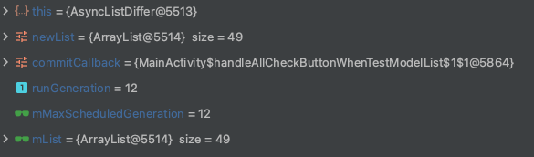

## DiffUtil, ListAdapter, AsyncListDiffer

최근 안드로이드 강의를 들으면서 알게된 ListAdapter, DiffUtil에 대해서 정리하고자 합니다. 각각 DiffUtil, ListAdapter, AsyncListDiffer이 무엇인지, 어떻게 동작하는지, RecyclerView와 함께 어떻게 사용하는지 등에 대해서 알아봅니다. 

## DiffUtil

diffUtil은 두 목록의 차이를 계산하고 목록에서 변경된 아이템만 갱신할 수 있도록 도와주는 유틸 클래스입니다. DiffUtil은 RecyclerView를 갱신할 시 성능을 개선하고 쉽게 목록을 업데이트 할 수 있게 합니다. 목록의 사이즈가 크면 계산하는 시간에 많은 비용이 들기 때문에 백그라운드 스레드에서 차이를 계산해야합니다. 

## ListAdapter, AsyncListDiffer

ListAdapter와 AsyncListDiffer는 백그라운드 스레드에서 DiffUtil 사용을 단순화합니다. ListAdapter는 RecyclerView.Adapter를 상속하고 리스트 항목 액세스 및 두 목록 간의 차이 계산을 편하게 해주는 AsyncListDiffer를 매핑 한 어댑터 클래스입니다. ListAdapter가 AsyncListDiffer를 매핑했기 때문에 RecyclerView의 어댑터 클래스는 ListAdapter를 상속하여 구현하는 것만으로 DiffUtil을 쉽게 사용할 수 있습니다.   

## ListAdapter를 상속하여 Adapter구현하기

DiffUtil을 RecyclerView에 사용하기 위해서는 

1. DiffUtil.Callback을 상속받는 DiffCallback클래스를 만들고 adapter클래스에서 사용하는 방법
2. ListAdapter를 상속받아 사용하는 방법

두 가지 방법이 있습니다. 첫 번째 방법은 아래 `RecyclerView DiffUtil로 성능 향상하기` 포스팅을 참고하시면 좋을 것 같습니다. 

이 글에서는 두 번째 방법을 소개하려고 합니다. ListAdapter를 상속받아 구현하는 것은 일반 RecyclerView.Adapter를 상속받아 구현하는 것과 비슷합니다. 기존 Adapter클래스와 차이가 있는 부분은 ListAdapter의 경우 생성자에 `DiffUtil.ItemCallback`을 받는 것입니다. 기본 구현은 다음과 같습니다.

```kotlin 
class TestAdapter : androidx.recyclerview.widget.ListAdapter<TestModel, ViewHolder>(diffUtil) {

    inner class ViewHolder(private val binding: ItemCheckListBinding) :
        ...
    }

    override fun onCreateViewHolder(parent: ViewGroup, viewType: Int): ViewHolder {
        return ViewHolder(...)
    }

    override fun onBindViewHolder(holder: ViewHolder, position: Int) {
        ...
    }

    companion object {
        val diffUtil = object : DiffUtil.ItemCallback<TestModel>() {
            override fun areItemsTheSame(oldItem: TestModel, newItem: TestModel): Boolean {
                return oldItem.id == newItem.id
            }

            override fun areContentsTheSame(oldItem: TestModel, newItem: TestModel): Boolean {
                return oldItem == newItem
            }

        }
    }
}

```
```kotlin 
data class TestModel(
    val id :Int,
    val title:String,
    var check:Boolean = false
)
```

DiffUtil.ItemCallback에서는 다음 두 개의 메서드를 오버라이드하여 구현해야합니다. 

1. areItemsTheSame : 이전 아이템과 새로운 아이템이 같은 아이템인지 확인합니다.
2. areContentsTheSame : 이전 아이템과 새로운 아이템의 내용이 같은지 확인합니다. 

내부적으로 먼저 areItemsTheSame이 호출되고 이 메서드에서 true를 반환한다면 areContentsTheSame을 호출하여 추가적으로 비교하여 리스트를 갱신합니다. 자세한 동작에 대해서는 [태환님의 블로그](https://thdev.tech/kotlin/2020/09/22/kotlin_effective_03/)를 참고하시면 좋을 것 같습니다. 일반적으로 areItemsTheSame에서는 아이템의 고유 아이디를 비교합니다.

또 다른 차이점으로 ListAdapter를 상속받아 Adapter클래스를 구현할 경우 데이터 리스트를 생성자 또는 메소드를 통해 받아올 필요가 없습니다. ListAdapter는 submitList()메소드를 통해 받은 리스트를 이전의 리스트와 비교하고 새롭게 구성된 리스트를 내부에 갖고 있기 때문입니다. 이러한 리스트는 getCurrentList()메소드를 통해 접근할 수 있습니다. getCurrentList()는 내부의 mReadOnlyList를 리턴합니다.  

```java
    @NonNull
    public List<T> getCurrentList() {
        return mReadOnlyList;
    }
``` 

ListAdpater의 submitList()메소드에 대해 알아보겠습니다. ListAdpater의 submitList()는 내부에 mDiff로 있는 AsyncListDiffer의 submitList()를 호출합니다.다음은 코드는 AsyncListDiffer 구현부의 일부입니다.  

```java
public void submitList(@Nullable final List<T> newList,
        @Nullable final Runnable commitCallback) {
    ...

    final List<T> oldList = mList;
    mConfig.getBackgroundThreadExecutor().execute(new Runnable() {
        @Override
        public void run() {
            final DiffUtil.DiffResult result = DiffUtil.calculateDiff(new DiffUtil.Callback() {
                @Override
                public int getOldListSize() {
                    return oldList.size();
                }

                @Override
                public int getNewListSize() {
                    return newList.size();
                }

                @Override
                public boolean areItemsTheSame(int oldItemPosition, int newItemPosition) {
                    T oldItem = oldList.get(oldItemPosition);
                    T newItem = newList.get(newItemPosition);
                    if (oldItem != null && newItem != null) {
                        return mConfig.getDiffCallback().areItemsTheSame(oldItem, newItem);
                    }
                    return oldItem == null && newItem == null;
                }

                @Override
                public boolean areContentsTheSame(int oldItemPosition, int newItemPosition) {
                    T oldItem = oldList.get(oldItemPosition);
                    T newItem = newList.get(newItemPosition);
                    if (oldItem != null && newItem != null) {
                        return mConfig.getDiffCallback().areContentsTheSame(oldItem, newItem);
                    }
                    if (oldItem == null && newItem == null) {
                        return true;
                    }
                    throw new AssertionError();
                }

                // areItemsTheSame에서 true를 반환하고 areContentsTheSame에서 false를 반환하면 이 메소드가 호출되어 변경사항에 대한 페이로드를 가져옵니다.
                @Nullable
                @Override
                public Object getChangePayload(int oldItemPosition, int newItemPosition) {
                    T oldItem = oldList.get(oldItemPosition);
                    T newItem = newList.get(newItemPosition);
                    if (oldItem != null && newItem != null) {
                        return mConfig.getDiffCallback().getChangePayload(oldItem, newItem);
                    }
                    throw new AssertionError();
                }
            });

            mMainThreadExecutor.execute(new Runnable() {
                @Override
                public void run() {
                    if (mMaxScheduledGeneration == runGeneration) {
                        latchList(newList, result, commitCallback);
                    }
                }
            });
        }
    });
}

void latchList(
        @NonNull List<T> newList,
        @NonNull DiffUtil.DiffResult diffResult,
        @Nullable Runnable commitCallback) {
    final List<T> previousList = mReadOnlyList;
    mList = newList;
    // notify last, after list is updated
    mReadOnlyList = Collections.unmodifiableList(newList);
    diffResult.dispatchUpdatesTo(mUpdateCallback);
    onCurrentListChanged(previousList, commitCallback);
}

```
submitList()에서는 인자를 통해 받은 새 리스트와 이전의 리스트를 DiffUtil의 calculateDiff() 메소드를 통해 차이를 계산합니다. calculateDiff()는 계산에 대한 내용을 DiffResult에 담아 리턴합니다. 

비교 과정이 끝나면 submitList()에서 letchList()를 호출하여 변경된 리스트를 적용하는 작업을 합니다. 이 메소드에서 mList와 mReadOnlyList가 새 리스트로 변경됩니다.

## ⚠️주의⚠️
submitList()에서 새 리스트와 현재 리스트의 참조값이 같은 경우에는 어떤 동작도 하지 않고 바로 리턴합니다. 이러한 이유로 리스트가 갱신이 안되는 문제가 발생할 수 있기 때문에 주의해야 합니다.

```java
if (newList == mList) {
    // nothing to do (Note - still had to inc generation, since may have ongoing work)
    if (commitCallback != null) {
        commitCallback.run();
    }
    return;
}
```

ListAdapter의 submitList()를 사용할 때는 주소값이 다른 리스트를 인자로 넘겨주어야 합니다. 다음 코드와 같이 submitList()를 사용할 경우 주소값이 같기 때문에 리스트가 변경되지 않습니다.   


```kotlin 
// MainActivity

...
val adapter = TestAdapter()

val checkList = MutableList(50){
    TestModel(id= it, title = "title$it")
}

adpater.submitList(checkList)

checkList.apply{ removeFirst() }

// 삭제된 리스트가 recyclerview에 반영되지 않음.
adapter.submitList(checkList)
...
```



이 경우 checkList의 복사본을 만들어 삭제해준 다음 submitList()에 넘겨줄 경우 정상적으로 동작합니다.adapter에 연결된 리스트를 변경하고 싶다면 adapter의 currentList의 복사본을 만들어 사용하면 됩니다.

```kotlin
// testAdapter.currentList.toMutableList().apply { removeFirst() }
checkList.toMutableList().apply { removeFirst() }
```

ListAdapter의 currentList는 내부에 있는 AsyncListDiffer의 mReadOnlyList를 가져오는 것이기 때문에 currentList를 직접 변경할 수는 없습니다.

리스트의 데이터를 변경하고자 하는 경우 데이터가 참조 타입일 때 단순히 리스트의 복사본 뿐만 아니라 데이터까지 복사하여 변경 사항을 적용해야 합니다. 리스트의 주소값은 다르지만 리스트 내부의 각 데이터가 참조하고 있는 객체의 주소값은 같기 때문에 단순히 리스트만 복사본으로 만들고 복사한 리스트의 데이터를 변경 시 원본의 데이터도 같이 변경되기 때문입니다. 

```kotlin 
    // 변경되지 않는 코드 
    val new = testAdapter.currentList.toMutableList().apply {
        this.forEach {
            it.check = true
        }
    }

    testAdapter.submitList(new)

    // 변경되는 코드 
    val new = testAdapter.currentList.map{ it.copy(check= ture)}

    testAdapter.submitList(new)

```

## Ref.
[data class를 활용하여 RecyclerView.DiffUtil을 잘 활용하는 방법 - 태환님 블로그](https://thdev.tech/kotlin/2020/09/22/kotlin_effective_03/)

[RecyclerView DiffUtil로 성능 향상하기 - 꿈꾸는 개발자의 로그](https://blog.kmshack.kr/RecyclerView-DiffUtil%EB%A1%9C-%EC%84%B1%EB%8A%A5-%ED%96%A5%EC%83%81%ED%95%98%EA%B8%B0/)

[공식문서 - DiffUtil](https://developer.android.com/reference/androidx/recyclerview/widget/DiffUtil)

[공식문서 - ListAdapter](https://developer.android.com/reference/androidx/recyclerview/widget/ListAdapter)

[공식문서 - AsyncListDiffer](https://developer.android.com/reference/androidx/recyclerview/widget/AsyncListDiffer)

[공식문서 - DiffResult](https://developer.android.com/reference/androidx/recyclerview/widget/DiffUtil.DiffResult#dispatchUpdatesTo(androidx.recyclerview.widget.ListUpdateCallback))

[공식문서 - DiffUtil.ItemCallback](https://developer.android.com/reference/androidx/recyclerview/widget/DiffUtil.ItemCallback)