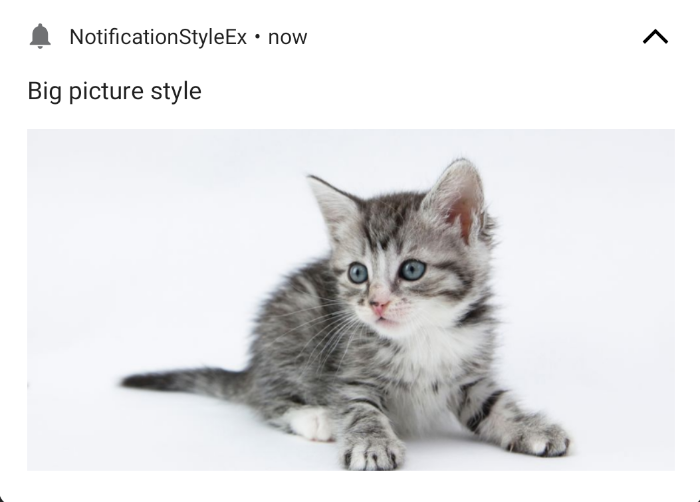
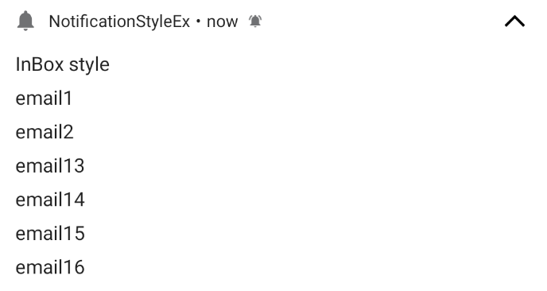
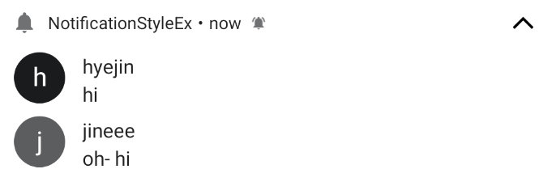
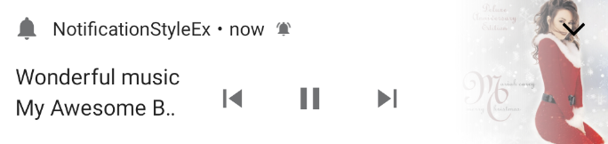
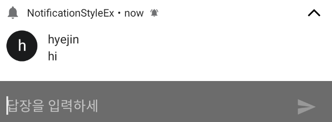
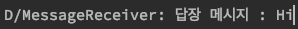
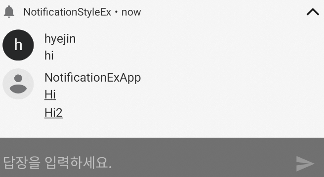

## Notification 구현

이 글에서는 다음과 같은 내용을 다루려고 합니다.

- Android 8.0과 그 아래 버전의 노티피케이션 만들기
- 다양한 모양의 노티피케이션 만들기
- 노티피케이션에서 할 수 있는 작업
  - 기본 작업
  - 답장하기

### Android 8.0과 그 아래 버전의 노티피케이션 만들기

[안드로이드 디벨로퍼 문서](https://developer.android.com/training/notify-user/channels)에 나와있듯이 android 8.0 이상에서는 노티피케이션 채널이 필수입니다. 하지만 그 아래 버전에서는 채널을 사용하지 않습니다.
때문에 버전별 분기가 필요하고 android 8.0이상에 해당하는 버전에서는 채널을 만들어줘야 합니다.

android 8.0에서 노티피케이션은

1. 노티피케이션 채널 객체 생성
2. 노티피케이션 매니저에 채널 등록
3. 노티피케이션 빌더 생성
4. 노티피케이션 매니저를 통해 빌드한 노티피케이션 notify

4단계로 생성할 수 있습니다. 그 아래 버전에서는 3,4단계만 수행합니다.

1. NotificationChannel 객체 생성

   - 생성자의 매개변수는 다음과 같습니다.
   - 채널 아이디 : 채널에서 사용하는 아이디입니다. 각 패키지마다 유일해야 하는 값입니다.
   - 채널 이름 : 채널에서 사용하는 이름입니다. 사용자의 눈에 보이는 값입니다.
   - 중요도 : 채널의 중요도를 나타냅니다. 얼마나 사용자를 방해하는 알림을 보낼 수 있는지 컨트롤합니다.

2. NotificationManager를 통해 채널 생성

   ```kotlin
       if (Build.VERSION.SDK_INT >= Build.VERSION_CODES.O) {
           val channel = NotificationChannel(
               CHANNEL_ID,
               CHANNEL_NAME,
               NotificationManager.IMPORTANCE_DEFAULT,
           )
           channel.description = CHANNEL_DESCRIPTION

           NotificationManagerCompat.from(this).createNotificationChannel(channel)
       }
   ```

3. NotificationBuilder를 사용하여 Notification 빌드
   ```kotlin
       val builder = NotificationCompat.Builder(this, CHANNEL_ID)
           .setSmallIcon(R.drawable.ic_launcher_background)
           .setContentTitle(title)
           .setContentText(msg)
           .setPriority(NotificationCompat.PRIORITY_DEFAULT) //Android8.0 아래 버전에서는 각 노티피케이션 마다 중요도를 설정해주어야 합니다.
   ```
4. NotificationManager를 통해 notify

   ```kotlin
       NotificationManagerCompat.from(this)
           .notify(NotificationId, builder.build())
   ```

### 다양한 모양의 노티피케이션 만들기

노티피케이션 빌더의 setStyle()을 통해 여러가지 모양의 노티피케이션을 만들 수 있습니다. 적용되는 스타일은 크게 확장형과 커스텀으로 나눌 수 있습니다.
setStyle()에 사용되는 값은 다음과 같습니다.

#### 확장형

- `NotificationCompat.BigPictureStyle()` : 노티피케이션에 큰 이미지를 추가합니다.

  - BigPictureStyle().bigPicture(image)를 사용하여 이미지를 확장된 영역에 추가합니다.

  ```kotlin
    fun handleBicPictureStyleButton(view: View) {

        builder
            .setContentTitle("Big picture style")
            .setStyle(
                NotificationCompat.BigPictureStyle()
                    .bigPicture(BitmapFactory.decodeResource(resources, R.drawable.cat))
            )

        NotificationManagerCompat.from(this).notify(1, builder.build())
    }
  ```

  

- `NotificationCompat.BigTextStyle()` : 노티피케이션의 확장된 영역에 텍스트를 표시합니다.

  - BigTextStyle().bigText(text)를 사용하여 확장된 영역에 텍스를 추가할 수 있습니다.

  ```kotlin
    fun handleBicTextStyleButton(v: View) {
        builder
            .setContentTitle("Big Text style")
            .setStyle(
                NotificationCompat.BigTextStyle()
                    .bigText("\uD83D\uDE00 \uD83D\uDE03 \uD83D\uDE04 \uD83D\uDE01 \uD83D\uDE06 \uD83D\uDE05 \uD83D\uDE02 \uD83E\uDD23 \uD83E\uDD72 ☺️ \uD83D\uDE0A \uD83D\uDE07 \uD83D\uDE42 \uD83D\uDE43 \uD83D\uDE09 \uD83D\uDE0C \uD83D\uDE0D \uD83E\uDD70 \uD83D\uDE18 \uD83D\uDE17 \uD83D\uDE19 \uD83D\uDE1A \uD83D\uDE0B \uD83D\uDE1B \uD83D\uDE1D \uD83D\uDE1C \uD83E\uDD2A \uD83E\uDD28 \uD83E\uDDD0 \uD83E\uDD13 \uD83D\uDE0E \uD83E\uDD78 \uD83E\uDD29 \uD83E\uDD73 \uD83D\uDE0F \uD83D\uDE12 \uD83D\uDE1E \uD83D\uDE14 \uD83D\uDE1F \uD83D\uDE15 \uD83D\uDE41 ☹️ \uD83D\uDE23 \uD83D\uDE16 \uD83D\uDE2B \uD83D\uDE29 \uD83E\uDD7A \uD83D\uDE22 \uD83D\uDE2D \uD83D\uDE24 \uD83D\uDE20 \uD83D\uDE21 \uD83E\uDD2C \uD83E\uDD2F \uD83D\uDE33 \uD83E\uDD75 \uD83E\uDD76 \uD83D\uDE31 \uD83D\uDE28 \uD83D\uDE30 \uD83D\uDE25 \uD83D\uDE13 \uD83E\uDD17 \uD83E\uDD14 \uD83E\uDD2D \uD83E\uDD2B \uD83E\uDD25 \uD83D\uDE36 \uD83D\uDE10 \uD83D\uDE11 \uD83D\uDE2C \uD83D\uDE44 \uD83D\uDE2F \uD83D\uDE26 \uD83D\uDE27 \uD83D\uDE2E \uD83D\uDE32 \uD83E\uDD71 \uD83D\uDE34 \uD83E\uDD24 \uD83D\uDE2A \uD83D\uDE35 \uD83E\uDD10 \uD83E\uDD74 \uD83E\uDD22 \uD83E\uDD2E \uD83E\uDD27 \uD83D\uDE37 \uD83E\uDD12 \uD83E\uDD15 \uD83E\uDD11 \uD83E\uDD20 \uD83D\uDE08 \uD83D\uDC7F \uD83D\uDC79 \uD83D\uDC7A \uD83E\uDD21 \uD83D\uDCA9 \uD83D\uDC7B \uD83D\uDC80 ☠️ \uD83D\uDC7D \uD83D\uDC7E \uD83E\uDD16 \uD83C\uDF83 \uD83D\uDE3A \uD83D\uDE38 \uD83D\uDE39 \uD83D\uDE3B \uD83D\uDE3C \uD83D\uDE3D \uD83D\uDE40 \uD83D\uDE3F \uD83D\uDE3E")
            )
        NotificationManagerCompat.from(this).notify(2, builder.build())
    }
  ```

  

- `NotificationCompat.InBoxStyle()` : BigTextStyle()과 다르게 짧은 텍스트 여러 줄이 확장된 영역에 표시됩니다.

  - InBoxStyle().addLine(text)를 통해 줄을 추가합니다. 확장된 영역에 최대 6개의 텍스트 줄이 보입니다.

  ```kotlin
  fun handleInBoxStyleButton(v: View) {

      builder
          .setContentTitle("InBox style")
          .setStyle(
              NotificationCompat.InboxStyle()
                  .addLine("email1")
                  .addLine("email2")
                  .addLine("email13")
                  .addLine("email14")
                  .addLine("email15")
                  .addLine("email16")
          )
      NotificationManagerCompat.from(this).notify(3, builder.build())

  }

  ```

  

- `NotificationCompat.MessagingStyle()` : 노티피케이션에 여러 사람 사이의 순차 메시지를 표시합니다.

  - MessagingStyle().addMessage(message)를 사용하여 메시지를 표시할 수 있습니다.
  - 메시지는 NotificationCompat.MessagingStyle.Message를 통해 텍스트, 시간, 보낸 사람을 표시하는 메시지 객체를 만들 수 있습니다.
  - 선택적으로 setConversationTitle()을 사용해 대화 위에 표시되는 제목을 추가할 수 있습니다.
  - 이 스타일은 Android 7.0이상을 지원하는 기기에만 적용됩니다. 그 이하 버전에서는 NotificationCompat(호환성 라이브러리)를 통해 일반 확장형 노티피케이션으로 보여집니다.

  ```kotlin
    fun handleMessagingStyleButton(v: View) {

        val person1 = androidx.core.app.Person.Builder().setName("hyejin").build()
        val person2 = androidx.core.app.Person.Builder().setName("jineee").build()

        val msg1 = NotificationCompat.MessagingStyle.Message("hi", System.currentTimeMillis(),person1)
        val msg2 = NotificationCompat.MessagingStyle.Message("oh- hi", System.currentTimeMillis(),person2)

        builder
            .setContentTitle("Message style")
            .setStyle(
                NotificationCompat.MessagingStyle("NotificationExApp")
                    .addMessage(msg1)
                    .addMessage(msg2)
            )
        NotificationManagerCompat.from(this).notify(3, builder.build())

    }
  ```

  

- `NotificationCompat.MediaStyle()` : 노티피케이션 영역에 미디어 플레이어 컨트롤을 표시할 수 있습니다.

  - 노티피케이션 빌더의 addAction(icon, text, intent)을 통해서 플레이를 컨트롤 할 수 있는 버튼을 추가할 수 있습니다.
  - 확장된 영역에서 사용되었던 버튼을 일반적인 노티피케이션 ui에서 사용하려면 MediaStyle().setShowActionInCompactView()를 사용해야 합니다.
  - 노티피케이션이 실행중인 미디어 세션을 나타내려면 MediaStyle().setMediaSession(sessionToken)을 통해 token을 전달해야 합니다.
  - media style을 사용하시 위해서 모듈 gradle에 `androidx.media:media:$version`라이브러리를 추가해야 합니다.

  ```kotlin
    fun handleMediaStyleButton(v: View) {

        val prevPendingIntent = MediaButtonReceiver.buildMediaButtonPendingIntent(this, PlaybackStateCompat.ACTION_SKIP_TO_PREVIOUS)
        val pausePendingIntent = MediaButtonReceiver.buildMediaButtonPendingIntent(this, PlaybackStateCompat.ACTION_PAUSE)
        val nextPendingIntent = MediaButtonReceiver.buildMediaButtonPendingIntent(this, PlaybackStateCompat.ACTION_SKIP_TO_NEXT)

        builder
            .setContentTitle("Wonderful music")
            .setContentText("My Awesome Band")
            .addAction(R.drawable.ic_baseline_skip_previous_24,"prev", prevPendingIntent)
            .addAction(R.drawable.ic_baseline_pause_24,"pause", pausePendingIntent)
            .addAction(R.drawable.ic_baseline_skip_next_24,"next", nextPendingIntent)
            .setStyle(androidx.media.app.NotificationCompat.MediaStyle()
                .setShowActionsInCompactView(0,1,2)
            )
            .setLargeIcon(BitmapFactory.decodeResource(resources, R.drawable.cover))
  ```


          NotificationManagerCompat.from(this).notify(3, builder.build())
      }
    ```
    

#### 커스텀 형

커스텀뷰를 갖는 노티피케이션은 setStyle()에 `NotificationCompat.DecoratedCustomViewStyle`을 설정해 사용할 수 있지만 협소한 공간에 알림을 띄우는 것이기 때문에 복잡한 레이아웃을 같은 노티피케이션은 사용할 수 없습니다.

커스텀 노티피케이션은 `RemoteViews`를 통해 커스텀 레이아웃을 활용할 수 있습니다.

RemoteViews는 다른 프로세스에 표시할 수 있는 뷰를 나타냅니다. 레이아웃 리소스 파일을 통해서 뷰의 계층 구조가 만들어집니다. 하지만 RemoteView에 사용되는 View들은 한정적입니다.

[RemoteViews가 지원하는 View목록](https://developer.android.com/reference/android/widget/RemoteViews)

커스텀 노티피케이션을 만드는 방법은 다음과 같습니다.

```kotlin
    builder
        .setStyle(NotificationCompat.DecoratedCustomViewStyle())
        .setCustomContentView(
            RemoteViews(
                packageName,
                R.layout.custom_notiview
            ).apply {
                setTextViewText(R.id.customNotiTitleTextView, title)
                setTextViewText(R.id.customNotiSubTextView, msg)
            })
```

### 노티피케이션에서 할 수 있는 작업

위의 미디어 스타일에서 보았듯이 노티피케이션에 addAction() 메서드를 통해서 노티피케이션에서 사용자가 할 수 있는 작업들을 제공할 수 있습니다.  
또 setContentIntent()를 통해서 노티피케이션 클릭 시 pendingIntent에 해당하는 특정 작업을 수행할 수도 있습니다.

#### 노티피케이션에서 바로 답장하기

Android7.0 부터는 사용자가 액티비티를 열지 않고 노티피케이션에서 바로 텍스트 입력창을 열어 답장할 수 있습니다.

1. RemoteInput.Builder를 통해 노티피케이션에 텍스트 입력창을 추가합니다.
2. 답장 작업의 PendingIntent를 만듭니다.
3. RemoteInput과 PendingIntent를 연결하는 Action을 생성합니다.
4. 만든 Action을 노티피케이션 빌더에 addAction을 통해 전달합니다.

```kotlin
    fun reply(v:View){
            val KEY_TEXT_REPLY = "key_text_reply"
            var remoteInput = RemoteInput.Builder(KEY_TEXT_REPLY)
                .setLabel("답장을 입력하세요.")
                .build()

            var replyPendingIntent: PendingIntent =
                PendingIntent.getBroadcast(applicationContext, 1000,
                    getMessageReplyIntent(1000),
                    PendingIntent.FLAG_UPDATE_CURRENT)

            val action = NotificationCompat.Action.Builder(R.drawable.ic_baseline_message_24, "REPLY", replyPendingIntent)
                .addRemoteInput(remoteInput)

            val person1 = androidx.core.app.Person.Builder().setName("hyejin").build()
            val msg1 = NotificationCompat.MessagingStyle.Message("hi", System.currentTimeMillis(),person1)

            builder
                .setContentTitle("Message style")
                .addAction(action.build())
                .setStyle(
                    NotificationCompat.MessagingStyle("NotificationExApp")
                        .addMessage(msg1)
                )
            NotificationManagerCompat.from(this).notify(5, builder.build())
        }
```



#### 리시버에서 사용자가 보낸 답장 가져오기

리시버에서 다음과 같은 코드를 사용하여 사용자가 노티피케이션 텍스트 입력창에 입력한 값을 가져올 수 있습니다. 사용자가 입력한 값을 정확하게 가져오기 위해서 위의 코드에서 `KEY_TEXT_REPLY`와 같은 값을 입력해야합니다.

```kotlin
    override fun onReceive(context: Context, intent: Intent) {
            val msg = getMessageText(intent)
            Log.d("MessageReceiver", "답장 메시지 : ${msg}")

        }

    private fun getMessageText(intent: Intent): CharSequence? {
        return RemoteInput.getResultsFromIntent(intent)?.getCharSequence(KEY_TEXT_REPLY)
    }
```



사용자가 텍스트 입력창에 값을 입력하고 보내기를 버튼을 눌러도 답장이 가능한 노티피케이션은 자동으로 사라지지 않습니다. 때문에 같은 채널로 보내기가 완료 되었음을 알리는 새로운 노티피케이션을 띄어줘야 합니다.

