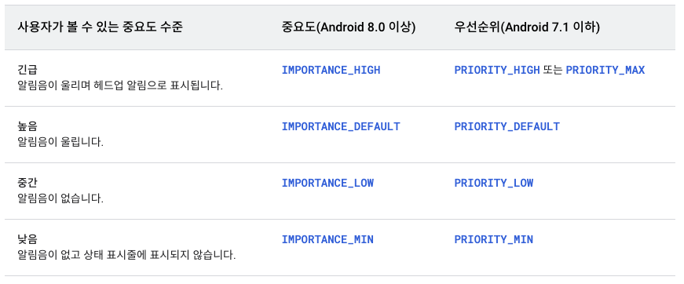

## Notification

개발한 애플리케이션의 외부에 메시지를 표시하는 방법입니다. 

### Notification 형태 

* 일반 노티피케이션 : 일반적인 형태로 상태 표시줄에 띄어지는 알림을 말합니다.
* 헤드업 노티피케이션 : 플로팅 창에 알림을 간략하게 표시할 수 있습니다. 중요한 알림에서 사용되며 기기가 잠금 해제 상태일 때만 표시됩니다.
* 잠금 화면 노티피케이션 : 잠금 화면에 알림을 표시합니다.
* 앱 아이콘 배지 : 앱 런처 아이콘 위에 표시되는 배지를 말합니다. 

### Notification 구성 
* 앱에서는 템플릿의 각 부분에 해당하는 콘텐츠만 정의합니다. 커스텀이 필요한 경우 style을 통해 커스텀 노티피케이션을 만들 수 있습니다. 
* smallIcon은 필수 구성요소입니다. 지정해 주지 않으면 에러가 발생합니다.
* 제목, 텍스 토스트, 타임스탬프, 큰 아이콘으로 구성될 수 있습니다.
* 노티피케이션의 ui 종류에는 일반 알림, 확장 가능한 알림, 커스텀뷰를 사용한 노티피케이션이 있습니다.

## 주의!!

**Android 8.0**  
* Android 8.0 부터는 반드시 채널을 만들어야 노티피케이션을 만들 수 있습니다. 
    * 덕분에 사용자는 하나의 앱에서 여러 노티피케이션 채널을 제어할 수 있습니다.
    * 채널을 통해 노티피케이션의 중요도를 지정합니다.

* Android 7.1 이하에서는 하나의 앱에 하나의 채널만 할당됩니다. 
    * 각 알림마다 노티피케이션의 중요도를 지정합니다.

* 분기를 나눠서 잘 처리해야합니다.!

```kotlin
    if(Build.VERSION.SDK_INT >= Build.VERSION_CODE.O){
        // Android 8.0 이상 -> 채널 생성
    }else{
        // 채널 생성 없이 notification 생성
    }

```

**포그라운드 서비스의 노티피케이션**
* 미디어 플레이어와 같이 백그라운드에서 오랫동안 실행되고 사용자에게 표시되는 service인 포그라운드 서비스를 실행 중인 경우는 노티피케이션이 필수입니다. 
    * 이 노티피케이션은 다른 알림처럼 닫을 수 없습니다.
    * 이 노티피케이션을 삭제하려면 서비스를 중지하거나 포그라운드 상태에서 삭제해야합니다.

### 노티피케이션의 중요도 
* 안드로이드에서는 노티피케이션의 중요도를 사용하여 노티피케이션이 사용자를 시각적 또는 청각적으로 방해하는 수준을 결정합니다. 
* 노티피케이션의 중요도가 높을수록 사용자를 방해하는 수준도 높아집니다.



