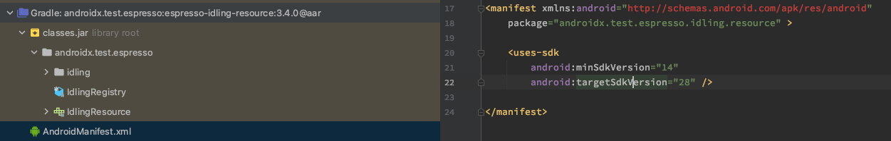
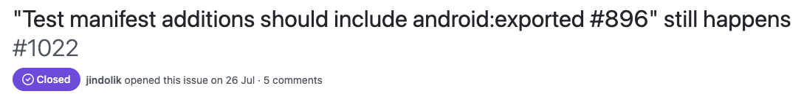
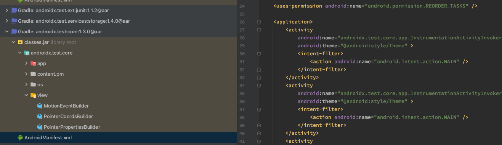
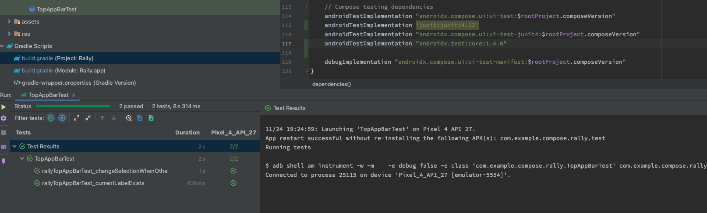
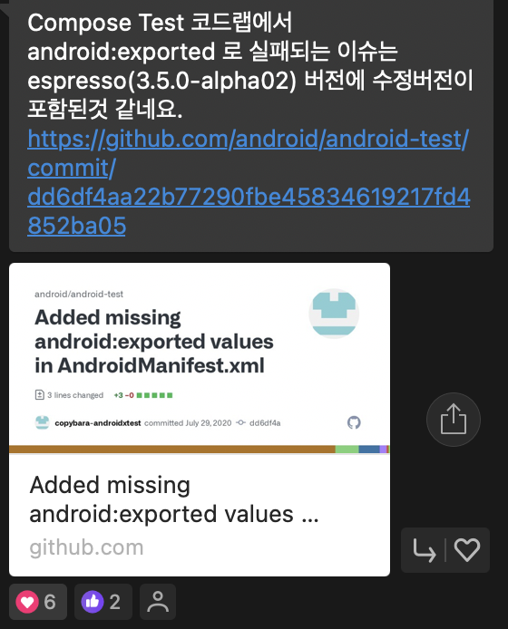
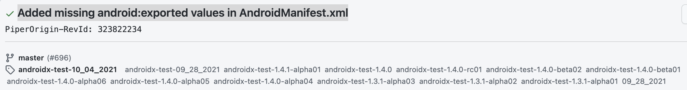

## 문제야 문제 🤷🏻‍♀️
Jetpack compose in Navigation 코드랩을 진행하던 중 마지막 테스트를 navHost 컴포저블을 테스트 하는 과정에서 다음과 같은 에러가 발생했습니다. 

```bash
android:exported needs to be explicitly specified for <activity>. Apps targeting Android 12 and higher are required to specify an explicit value for `android:exported` when the corresponding component has an intent filter defined.
```
빌드 조차 안되어 테스트가 불가능한 상황이 되었습니다. 해당 문제를 검색한 결과 tartgetSdkVersion을 31(Android12)이상으로 지정할 경우 인텐트 필터를 사용하는 컴포넌트에는 android:exported를 명시적으로 선언해야 한다는 것을 알게 되었습니다.   

하지만 프로젝트에 있는 manifest에서 액티비티와 관련된 해당 속성값은 명시가 되었는데도 불구하고 에러가 발생했습니다. MergedManifest도 확인하면서 다른 Manifest도 확인했지만 속성값이 필요없는 경우이거나, 속성값이 제대로 명시된 경우밖에 없었습니다. targetSdkVersion을 내려서 쉽게 해결할 수 있는 방법이 있었지만 이러한 에러가 왜 발생하는지 궁금하여 문제가 발생하는 곳을 자세하게 알기 위해 테스트 빌드를 --debug option과 함께 진행했습니다. 로그의 마지막 부분의 `androidx.test.espresso:espresso-idling-resource:3.4.0`를 머지하는 과정에서 에러가 발생하는 것을 알 수 있었습니다. 

```bash
2021-11-24T17:14:20.034+0900 [INFO] [org.gradle.api.Task] Merging library manifest /Users/hyunhyejin/.gradle/caches/transforms-3/72c3b97194c483ea0420e30488b8ebd0/transformed/espresso-idling-resource-3.4.0/AndroidManifest.xml
2021-11-24T17:14:20.034+0900 [INFO] [org.gradle.api.Task] Merging manifest with lower [androidx.test.espresso:espresso-idling-resource:3.4.0] AndroidManifest.xml:17:1-24:12
2021-11-24T17:14:20.034+0900 [INFO] [org.gradle.api.Task] uses-sdk defined in both files...
2021-11-24T17:14:20.034+0900 [INFO] [org.gradle.api.Task] Merging uses-sdk with lower [androidx.test.espresso:espresso-idling-resource:3.4.0] AndroidManifest.xml:20:5-22:41
2021-11-24T17:14:20.035+0900 [ERROR] [org.gradle.api.Task] /Volumes/Samsung_T5/Android/ComposeFest2021/week 4-1-Testing in Jetpack Compose/app/build/intermediates/tmp/manifest/androidTest/debug/tempFile1ProcessTestManifest14394881649179592086.xml Error:
	android:exported needs to be explicitly specified for <activity>. Apps targeting Android 12 and higher are required to specify an explicit value for `android:exported` when the corresponding component has an intent filter defined. See https://developer.android.com/guide/topics/manifest/activity-element#exported for details.
2021-11-24T17:14:20.036+0900 [ERROR] [org.gradle.api.Task] /Volumes/Samsung_T5/Android/ComposeFest2021/week 4-1-Testing in Jetpack Compose/app/build/intermediates/tmp/manifest/androidTest/debug/tempFile1ProcessTestManifest14394881649179592086.xml Error:
	android:exported needs to be explicitly specified for <activity>. Apps targeting Android 12 and higher are required to specify an explicit value for `android:exported` when the corresponding component has an intent filter defined. See https://developer.android.com/guide/topics/manifest/activity-element#exported for details.
2021-11-24T17:14:20.036+0900 [ERROR] [org.gradle.api.Task] /Volumes/Samsung_T5/Android/ComposeFest2021/week 4-1-Testing in Jetpack Compose/app/build/intermediates/tmp/manifest/androidTest/debug/tempFile1ProcessTestManifest14394881649179592086.xml Error:
	android:exported needs to be explicitly specified for <activity>. Apps targeting Android 12 and higher are required to specify an explicit value for `android:exported` when the corresponding component has an intent filter defined. See https://developer.android.com/guide/topics/manifest/activity-element#exported for details.
2021-11-24T17:14:20.036+0900 [INFO] [org.gradle.api.Task] -- Merging decision tree log ---
```

탐색 패널 부분을 project로 변경하여 error가 발생한 라이브러리의 manifest 파일을 찾아 확인한 결과 export속성이 필요한 부분은 없었습니다.   
(~~아게 뭐여~~)


해당 라이브러리가 정말 문제인지 확인하기 위해 gradle에서 espresso와 관련된 의존성을 제거한 후에 테스트를 빌드해보았지만 여전히 에러가 발생하였습니다. 다른 테스트 관련 라이브러리도 하나씩 제거 하면서 확인한 결과 `androidx.compose.ui:ui-test-junit4:$rootProject.composeVersion`가 dependency에 추가되어 있을 경우 에러가 발생한다는 것을 알았습니다. 

에러를 검색해보면서 발견한 이슈가 있었는데 현재 문제와 유사한것 같습니다. 

  
[](https://github.com/android/android-test/issues/1022) 

해당 이슈에서는 전이 종속성에 관한 문제로 어떤 라이브러리가 이전 버전인 `androidx.test:core:1.2.0`를 의존하여 문제가 발생하였고 그 라이브러리의 버전을 변경하여 높은 버전의 androidx.test.core를 의존하도록 하여 문제를 해결했습니다. androidx.test:core의 버전을 명시적으로 지정하지 않은 경우 이전 버전의 라이브러리를 전이 종속성으로 가져올 수 있다고 합니다. 

위의 내용을 참고하여 `androidx.compose.ui:ui-test-junit4`가 `androidx.test:core:1.3.0`을 의존한다는 것을 알았고 해당 버전에서는 Manifest파일에 exported속성을 명시하지 않았다는 것을 발견했습니다.   




위의 이슈에서 말한 것 처럼 `androidx.test:core`의 버전을 gradle파일에 명시적으로 선언하였더니 테스트 빌드와 실행이 정상적으로 되는 것을 확인할 수 있었습니다.
```gradle
androidTestImplementation "androidx.test:core:1.4.0"
```


그리고 GDG Compose 단톡방을 통해 해당 이슈가 해결되어 `espresso 3.5.0-alpha02`버전에 수정 사항이 포함되었다는 것을 알았습니다.  



문제를 해결하기 위해 

1. targetSdkVersion을 30으로 낮춰서 테스트를 실행 
2. targetSdkVersion은 31로 그대로 두고 `androidx.test:core`의 버전을 높은 버전(`1.3.1 이상`)으로 명시적으로 선언하여 테스트를 실행

3. targetSdkVersion은 31로 그대로 두고 espresso의 버전을 `espresso 3.5.0-alpha02`로 수정하여 테스트를 실행
   
세 가지 방법 모두 실행한 결과 모두 테스트가 정상적으로 빌드되고 진행되는 것을 확인할 수 있었습니다. 


## Ref.
[AndroidDeveloper - 동작 변경사항 : Android12를 타겟팅하는 앱](https://developer.android.com/about/versions/12/behavior-changes-12?hl=ko#exported)

[Test manifest additions should include android:exported #896" still happens](https://github.com/android/android-test/issues/1022)

[Added missing android:exported values in AndroidManifest.xml](https://github.com/android/android-test/commit/dd6df4aa22b77290fbe45834619217fd4852ba05)


