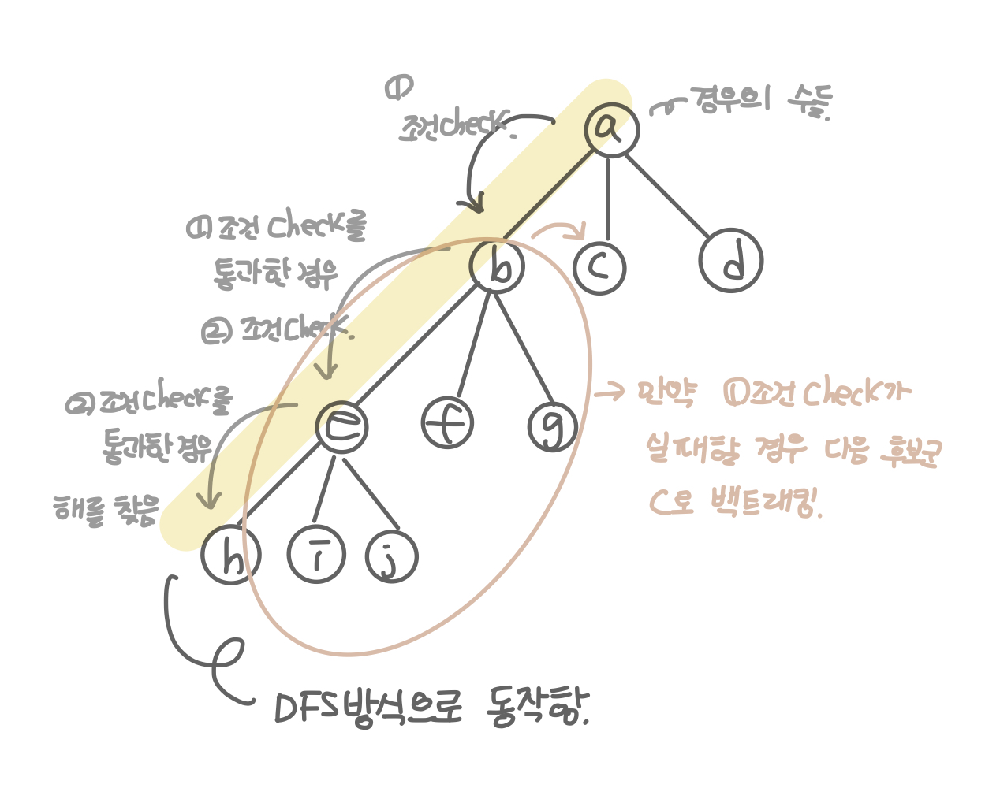
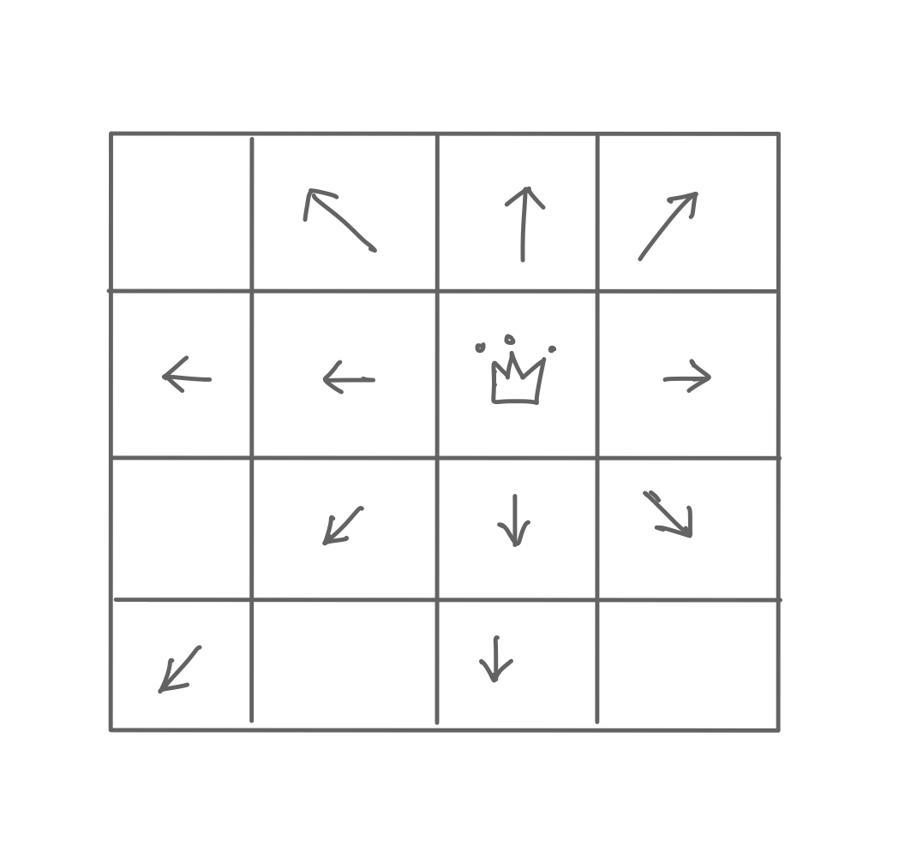

## 백트래킹 알고리즘 (or 퇴각 검색) 

 트리 구조를 기반으로 dfs로 깊이 탐색을 진행하면서 각 루트에 대해 조건에 부합하는지 체크(promising), 만약 해당 트리(나무)에서 조건에 맞지않는 노드는 더 이상 dfs로 깊이 탐색을 진행하지 않고, 가지를 쳐버림(pruning)
 
* 제약 조건 만족 문제에서 해를 찾기 위한 전략
    1. 해를 찾기 위해 후보군에 제약 조건을 점진적으로 체크하다가 
    2. 해당 후보군이 제약 조건을 만족할 수 없다고 판단되는 즉시 backTrack(다시는 이 후보군을 체크하지 않을 것을 표기)-> 계산양을 줄인다.
    3. 바로 다른 후보군으로 넘어가며, 결국 최적의 해를 찾는 방법 

* 실제 구현 시, 고려할 수 있는 모든 경우의 수(후보군)를 상태공간트리(Status Space Tree)를 통해 표현 
    - 각 후보군을 dfs방식으로 확인 
    - 상태 공간 트리를 탐색하면서, 제약이 맞지 않은 면 해의 후보가 될 만한 곳으로 바로 넘어가서 탐색
        * Promising : 해당 루트가 조건에 맞는지를 검사하는 기법 
        * Pruning(가지치기) : 조건에 맞지 않으면 포기하고 다른 루트로 바로 돌아서서, 탐색의 시간을 절약하는 기법 

* 상태공간트리(Status Space Tree)
    - 문제 해결 과전의 중간 상태를 각각의 노드로 나타낸 트리
         

### N Queen 문제 

* n * n 크기의 체스판에 n개의 퀸을 서로 공격할 수 없도록 배치하는 문제 
    * 조건 : 서로 공격할 수 없도록 
    * 퀸은 다음과 같이 이동할 수 있드므로 배치된 퀸 간에 공격할 수 없도록 배치해야한다. 
        

* 가지치기(pruning)
    * 한 행에는 하나의 퀸 밖에 위치할 수 없다.
    * 맨 위에 있는 행부터 퀸을 배치하고, 다음 행에 해당 퀸이 이동할 수 없는 위치를 찾아 퀸을 배치 
    * 만약 앞에 배치한 퀸으로 인해, 다음 행에 해당 퀸들이 이동할 수 없는 위치가 없는 경우, 더 이상 퀸을 배치하지 않고 이전 행의 퀸의 배치를 바꿈.
 
* 조건체크 (promising)
    * 해당 루트가 조건에 맞는지를 검사하는 기법을 활용하여 
    * 현재까지 앞선 행에서 배치한 퀸이 이동할 수 없는 위치가 있는지를 다음과 같은 조건으로 확인 
        - 수직 체크
        - 대각선 체크 
        - 경우의 수의 위치 좌표를 확인해서 체크 

* 각 행을 차례대로 확인하면서, 각 열에 퀸을 높는 경우를 고려한다.
    * 위쪽 행에 배치된 퀸의 위치를 확인하면서 현재 위치에 놓을 수 있는지 없는지 확인한다.

```kotlin
    fun main() {
        nQueen(4)
    }

    fun nQueen(n: Int): MutableList<Int> {

        val finalResult = mutableListOf<Int>()
        dfs(n, 0, mutableListOf<Int>(), finalResult)
        return finalResult
    }

    fun dfs(n: Int, currentRow: Int, currentCandidate: MutableList<Int>, result: MutableList<Int>) {

        if (currentRow == n) {
            result.addAll(currentCandidate.toList())
            return
        }

        for (i in 0 until n) {
            if (isAvailable(currentCandidate, i)) {
                currentCandidate.add(i)
                dfs(n, currentRow + 1, currentCandidate, result)
                currentCandidate.removeLast() //백트래킹이 이루어 지는 곳 
            }
        }
    }

    // 가지치기 하는 부분 
    fun isAvailable(currentCandidate: MutableList<Int>, currentCol: Int): Boolean {
        val currentRow = currentCandidate.size

        for (q in 0 until currentRow) {
            if (currentCandidate[q] == currentCol || abs(currentCandidate[q] - currentCol) == currentRow - q) {
                return false
            }
        }
        return true
    }
```