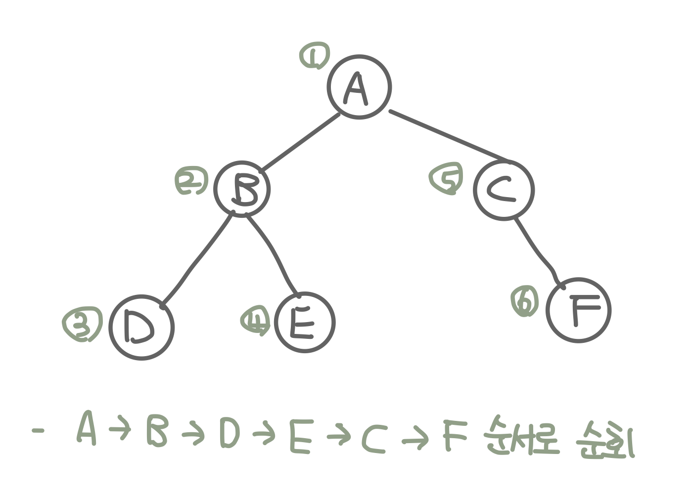
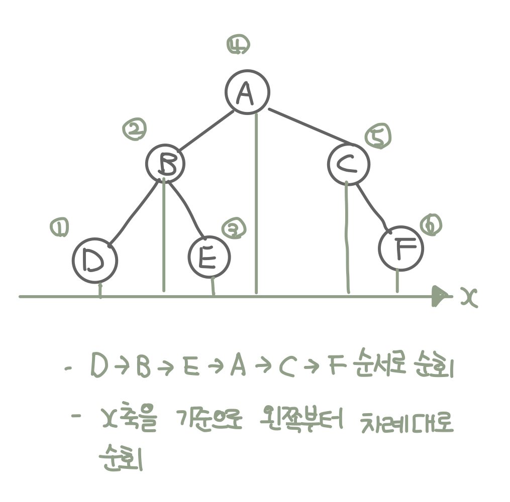
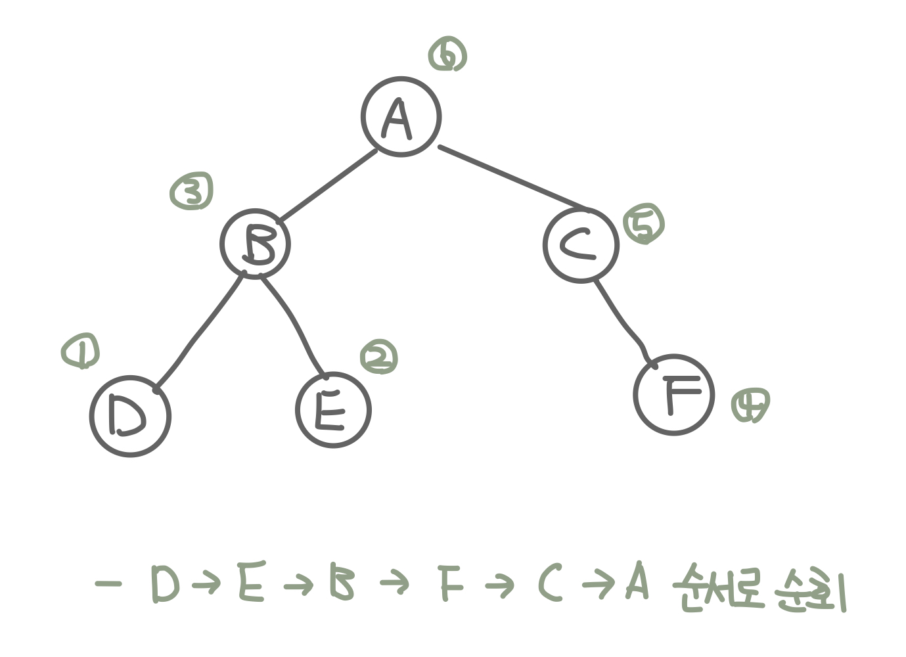

## 트리 순회

- [1991번 트리 순회](https://www.acmicpc.net/problem/1991)

### 1. 이해

- 전위 순회(pre order) : 루트-> 왼쪽 -> 오른쪽 방향으로 트리를 순회
  
- 중위 순회(in order) : 왼쪽 -> 루트 -> 오른쪽 방향으로 트리를 순회
  
- 후위 순회(post order) : 왼쪽 -> 오른쪽 -> 루트 방향으로 트리를 순회
  

### 2. 계획

- 트리를 map 형태로 구현한다.
- 구현한 트리에 맞춰서 탐색

### 3. 실행

```kotlin
    fun main() {

        preOrder('a', listOf('b', 'c'))

        println()
        inOrder('a', listOf('b', 'c'))

        println()
        postOrder('a', listOf('b', 'c'))

    }

    val tree = mapOf(
        ('a' to listOf('b', 'c')),
        ('b' to listOf('d', '.')),
        ('c' to listOf('e', 'f')),
        ('e' to listOf('.', '.')),
        ('f' to listOf('.', 'g')),
        ('d' to listOf('.', '.')),
        ('g' to listOf('.', '.')),
    )

    fun preOrder(current: Char, child: List<Char>) {

        print("$current ")

        if (child[0] != '.') {
            preOrder(child[0], tree[child[0]]!!)
        }

        if (child[1] != '.') {
            preOrder(child[1], tree[child[1]]!!)
        }
    }

    fun inOrder(current: Char, child: List<Char>) {
        if (child[0] != '.') {
            inOrder(child[0], tree[child[0]]!!)
        }

        print("$current ")

        if (child[1] != '.') {
            inOrder(child[1], tree[child[1]]!!)
        }
    }

    fun postOrder(current: Char, child: List<Char>) {
        if (child[0] != '.') {
            postOrder(child[0], tree[child[0]]!!)
        }

        if (child[1] != '.') {
            postOrder(child[1], tree[child[1]]!!)
        }

        print("$current ")
    }
```
