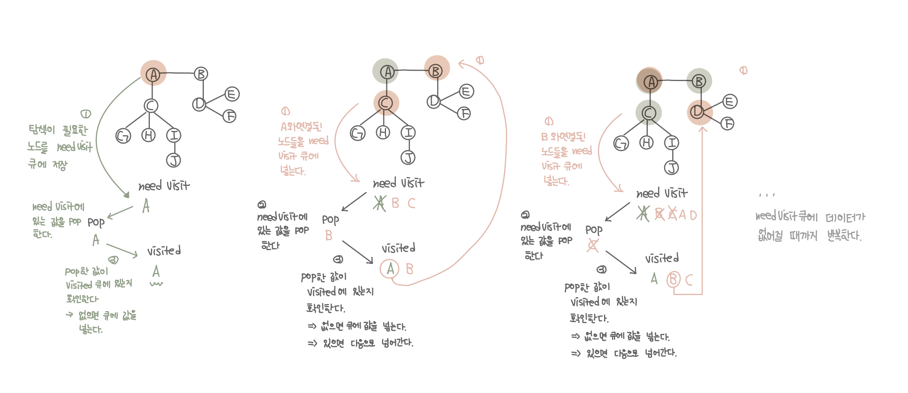
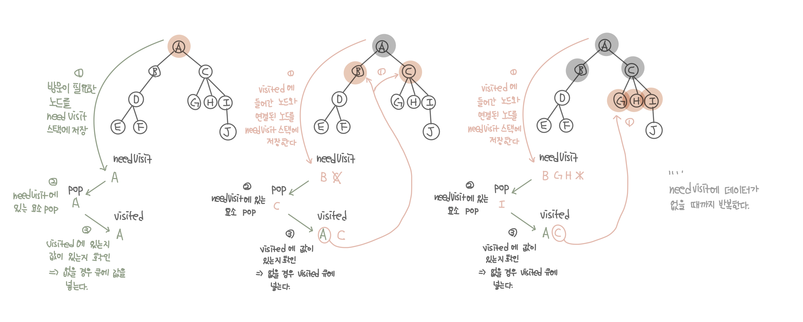

## 대표적인 그래프 탐색 알고리즘

- BFS와 DFS가 있다.
- BFS(너비 우선 탐색) : 정점과 같은 레벨에 있는 노드들(형제 노드)를 먼저 탐색하는 방식
  - 한 단계씩 내려가면서 해당 노드와 같은 레벨에 있는 노드들(형제 노드)을 먼저 순회한다.
  - A-B-C-D-G-H-I-J
- DFS(깊이 우선 탐색) : 정점의 자식들을 먼저 탐색하는 방식
  - 한 노드의 자식을 타고 끝까지 순회한 후, 다시 돌아와서 다른 형제들의 자식을 타고 내려가며 순회한다.
  - A-B-D-E-F-C-G-H-I-J


### BFS(너비 우선 탐색, Breath-First-Search)알고리즘 구현

- 자료구조 큐를 사용한다.
- needVisit : 방문이 필요한 노드를 저장해놓는 큐
- visited : 방문했던 노드를 순서대로 저장해놓는 큐
  

```kotlin
    fun main() {
        val graph = mapOf(
            'A' to charArrayOf('B', 'C'),
            'B' to charArrayOf('A', 'D'),
            'C' to charArrayOf('A', 'G', 'H', 'I'),
            'D' to charArrayOf('B', 'E', 'F'),
            'E' to charArrayOf('D'),
            'F' to charArrayOf('D'),
            'G' to charArrayOf('C'),
            'H' to charArrayOf('C'),
            'I' to charArrayOf('C', 'J'),
            'J' to charArrayOf('I'),
        )

        var needVisit = LinkedList<Char>().apply {
            add('A')
        }
        var visited = LinkedList<Char>()

        bfs(needVisit, visited, graph)

    }


    fun bfs(needVisit: LinkedList<Char>, visited: LinkedList<Char>, graph: Map<Char, CharArray>) {


        if (needVisit.isEmpty()) {
            return
        }

        val pop = needVisit.pop()

        if (pop !in visited) {
            visited.add(pop)

            println(pop)

            graph[pop]?.forEach {
                needVisit.add(it)
            }
        }

        return bfs(needVisit, visited, graph)
    }

```

### DFS(깊이 우선 탐색, Depth-First-Search)알고리즘 구현

- 오른쪽 왼쪽 방향 상관없이 Leaf노드 먼저 탐색하는 방법
- 너비 우선 탐색과 다르게 스택과 큐 자료구조를 사용한다.
- needVisit : 스택을 사용. 방문이 필요한 노드를 저장한다.
- visited : 큐를 사용. 방문했던 노드를 저장한다.
  

```kotlin
    fun main() {
        val graph = mapOf(
            'A' to charArrayOf('B', 'C'),
            'B' to charArrayOf('A', 'D'),
            'C' to charArrayOf('A', 'G', 'H', 'I'),
            'D' to charArrayOf('B', 'E', 'F'),
            'E' to charArrayOf('D'),
            'F' to charArrayOf('D'),
            'G' to charArrayOf('C'),
            'H' to charArrayOf('C'),
            'I' to charArrayOf('C', 'J'),
            'J' to charArrayOf('I'),
        )

        var needVisit = Stack<Char>().apply {
            push('A')
        }
        var visited = LinkedList<Char>()

        dfs(needVisit, visited, graph)

    }

    fun dfs(needVisit: Stack<Char>, visited: LinkedList<Char>, graph: Map<Char, CharArray>) {

        if (needVisit.isEmpty()) {
            return
        }

        val pop = needVisit.pop()

        if (pop !in visited) {
            visited.add(pop)

            println(pop)

            graph[pop]?.forEach {
                needVisit.push(it)
            }
        }

        return dfs(needVisit, visited, graph)
    }

```
