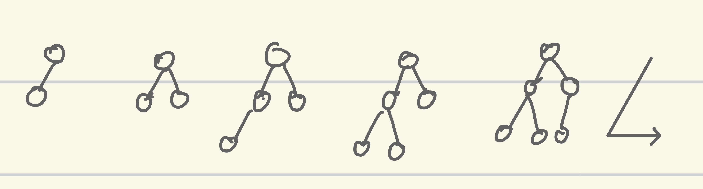
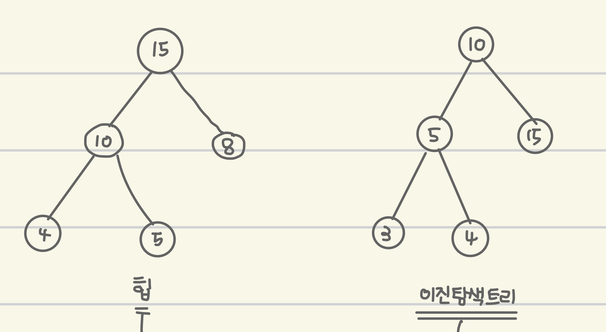
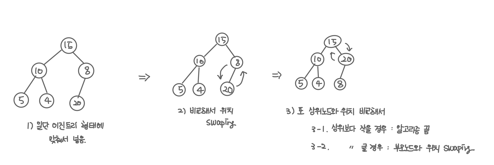
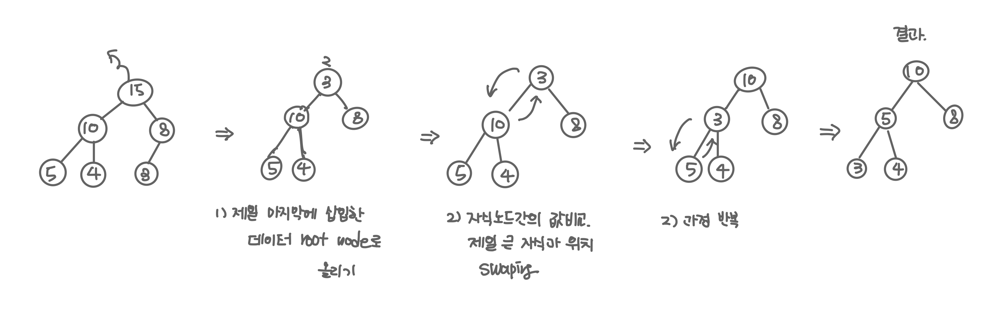

## 힙

- 데이터 구조에서 최댓값과 최솟값을 빠르게 찾긱 위해 고안된 완전 이진 트리
  - 완전 이진 트리 : 노드를 삽입할 때 왼쪽 노드부터 차례대로 삽입하는 트리
    <br><br>
    
    <br>
- 힙을 사용하는 이유
  - 힙에 데이터를 넣고 최댓값, 최솟값을 찾는면 O(logn)이 걸린다.
  - 우선 순위 큐와 같이 최댓값 또는 최솟값을 빠르게 찾아야 하는 자료구조 및 알고리즘 구현등에 활용된다.

### 힙의 종류

- 최대 힙 : 상위 노드(부모 노드)의 값이 항상 자식 노드보다 크거나 같다.-> 최댓값을 구하기 위한 구조
- 최소 힙 : 상위 노드(부모 노드)의 값이 항상 자식 노드보다 작거나 같다.-> 최솟값을 구하기 위한 구조

### 힙의 조건

1. 완전 이진 트리 형태이다.
2. 최대 힙 또는 최소 힙이다.

### 이진 탐색 트리와 heap비교

- 공통점 : 모두 이진 트리 형태이다.
- 차이점 : 각 자료구조의 목적과 조건을 생각.
  - 힙
    - 항상 부모 노드가 자식 노드 보다 크면(또는 작으면)안된다.
    - 자식 노드의 왼쪽, 오른쪽 위치 고정x
    - 목적 : 최대/ 최소 값 검색을 위한 자료구조
  - 이진 탐색 트리
    _ 부모 노드보다 크면 오른쪽, 작으면 왼쪽 자식으로 고정된다.
    _ 항상 오른쪽 자식이 크다. 왼쪽 < 부모 < 오른쪽 \* 목적 : 탐색을 위한 자료구조
    <br><br>
    

### 힙의 동작

- 힙의 구현

  - 배열을 사용해서 힙을 표현한다.
  - 힙 구현의 편의를 위해 root노드의 인덱스 번호를 1로 잡으면 편하다.
  - 부모 노드의 인덱스 번호 : 자식 노드의 인덱스 번호 / 2
  - 왼쪽 자식 노드의 인덱스 번호 : 부모 노드의 인덱스 번호 \*2
  - 오른쪽 자식 노드의 인덱스 번호 : 부모 노드의 인덱스 번호 \*2 +1

- 데이터 삽입하기

  - 기본 형태 : 완전 이진 트리이기 때문에 삽입할 노드는 기본적으로 왼쪽 최하단 노드부터 채워지는 형태로 삽입

    - 예외 상황 : (최대힙의 경우) 삽입하고자 하는 데이터의 값이 부모 노드보다 클 경우
      1. 일단 완전 이진 트리 형태에 맞춰서 데이터 삽입한다.
      2. 삽입할 데이터의 값과 부모 노드의 값을 비교해서 삽입할 데이터의 값이 크다면 부모 노드와 위치를 바꾼다.
    - 예시 : 데이터 20을 넣는 경우

    
    <br>

    ```kotlin
        fun insert(value: Int) {
            heap.add(value)

            val insertedIndex = heap.size - 1
            moveUp(insertedIndex / 2, insertedIndex)
        }

        private fun moveUp(parentIndex: Int, insertedIndex: Int) {
            if (insertedIndex <= 1) {
                return
            }

            if (heap[parentIndex]!! > heap[insertedIndex]!!) {
                return
            }

            with(heap[parentIndex]) {
                heap[parentIndex] = heap[insertedIndex]
                heap[insertedIndex] = this
            }

            return moveUp(insertedIndex / 2, parentIndex)
        }
    ```

- 데이터 삭제하기

  - 힙은 항상 맨 위의 값을 뽑아낸다. (root 삭제)
  - root를 삭제하기 때문에 새로운 root를 만들어야 한다.

    1. 제일 마지막에 삽입한 데이터를 루트 노드로 올린다.
    2. 루트 노드와 자식 노드간의 데이터 크기를 비교한다.
    3. 자식 노드가 클 경우 루트 노드와 위치를 바꾼다.

    - 2-3번의 과정을 자식 노드가 없거나 부모 노드 보다 작을 때까지 반복.
      

    ```kotlin
        fun delete() {

            val rootValue = heap[1]

            heap[1] = heap.last()
            heap.removeLast()

            moveDown(1)

        }

        private fun moveDown(targetIndex: Int) {

            val leftIndex = targetIndex * 2
            val rightIndex = targetIndex * 2 + 1

            if (leftIndex > heap.size - 1) {
                return
            }

            if (heap[leftIndex]!! < heap[targetIndex]!! && heap[rightIndex]!! < heap[targetIndex]!!) {
                return
            }

            return if (heap[leftIndex]!! > heap[rightIndex]!!) {
                with(heap[targetIndex]) {
                    heap[targetIndex] = heap[leftIndex]
                    heap[leftIndex] = this
                }
                moveDown(leftIndex)
            } else {
                with(heap[targetIndex]) {
                    heap[targetIndex] = heap[rightIndex]
                    heap[rightIndex] = this
                }
                moveDown(rightIndex)
            }
        }

    ```
