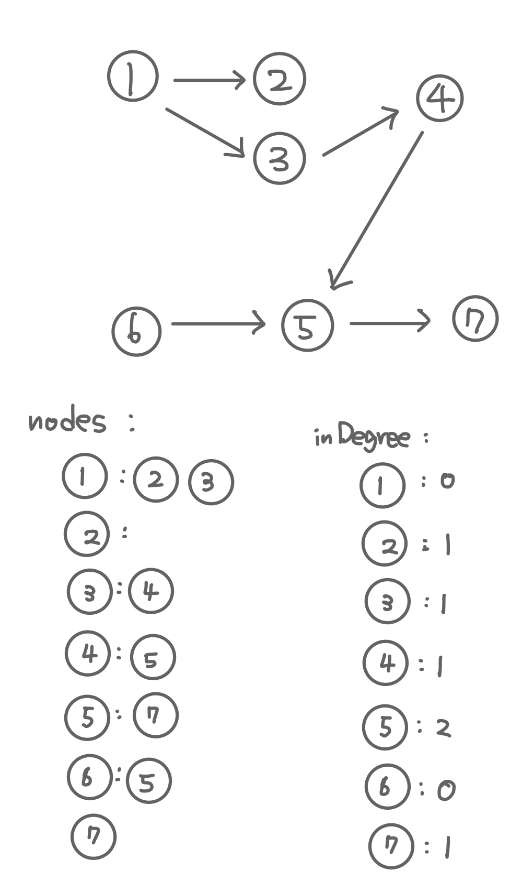
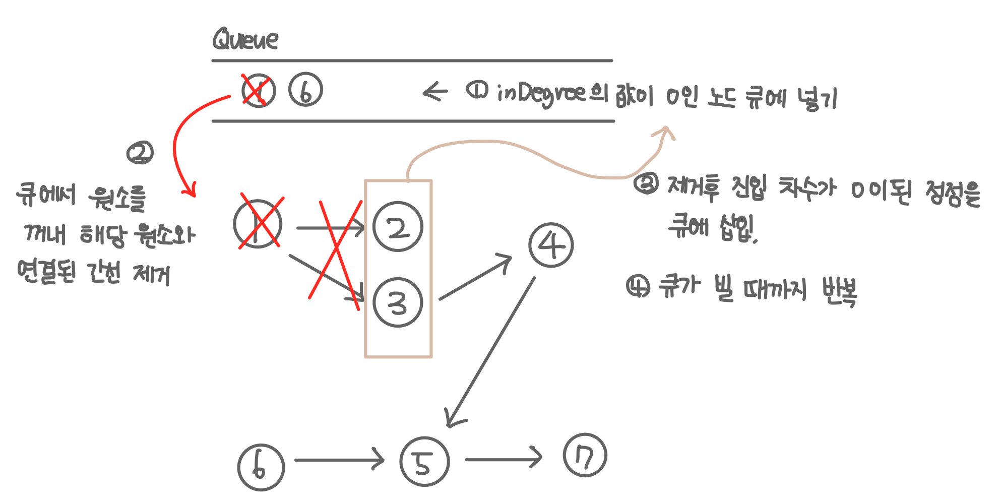

## 위상 정렬 알고리즘

순서가 정해져 있는 작업을 차례로 수행해야 할 때, 순서를 결정해주는 알고리즘

### 알고리즘 단계 

1. 진입 차수가 0인 정점을 큐에 넣는다.
2. 큐에서 원소를 꺼내 해당 원소와 연결된 간선을 제거한다.
3. 제거 후 진입 차수가 0이된 정점을 큐에 삽입한다.
4. 큐가 빌 때까지 2,3번을 반복한다.

### 특징 
- 모든 원소를 방문하기 전에 큐가 빈다면 싸이클이 존재하는 것이다.
- 모든 원소를 방문했다면 큐에서 꺼낸 순서가 위상 정렬의 결과이다.

### 동작 

1. 데이터 초기화 
    
2. 알고리즘 단계 수행 
   


```kotlin
    val nodes = mutableMapOf<Int, MutableList<Int>>()
    val inDegree = MutableList(n+1){0}
    val heap = PriorityQueue<Int>()

    (1 .. n).forEach {
        nodes[it] = mutableListOf()
    }

    (0 until m).forEach {
        val (a,b) = readLine().split(" ").map { it.toInt() }
        nodes[a]?.add(b)
        inDegree[b]+=1
    }

    for( i in 1 until inDegree.size){
        if(inDegree[i] ==0) heap.add(i)
    }

    val result = mutableListOf<Int>()

    while (heap.isNotEmpty()){

        val pop = heap.poll()
        result.add(pop)

        nodes[pop]?.forEach {
            inDegree[it] -=1
            if(inDegree[it] ==0){
                heap.add(it)
            }
        }
    }

```