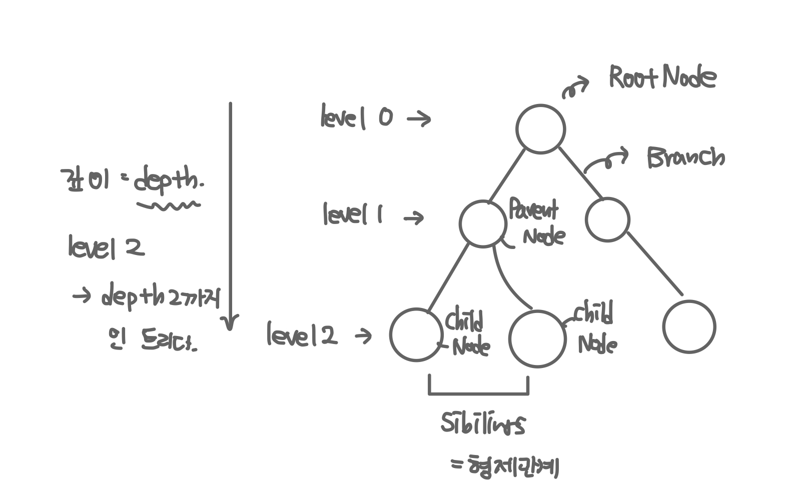
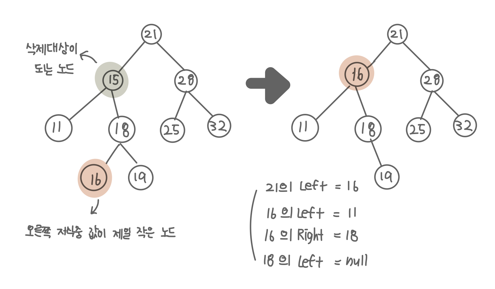
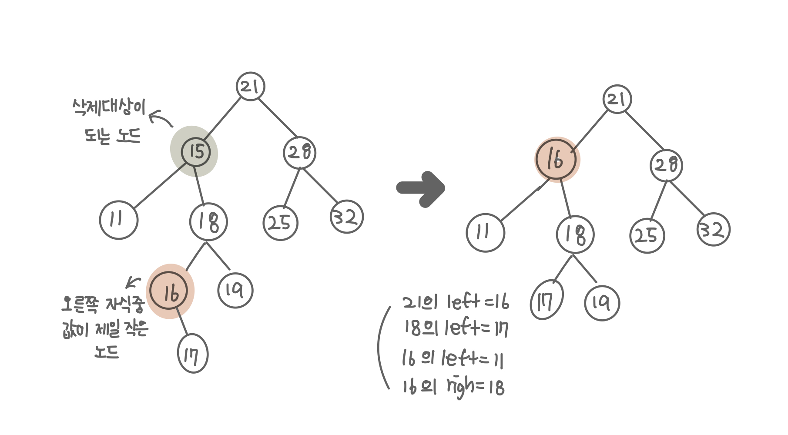

## 트리

- node와 branch를 이용해서 사이클을 이루지 않도록 구성한 데이터 구조
- 트리는 항상 위에서 아래로 연결된다.
  - 이진 트리 :
    - 하나의 노드에서 나온 브랜치가 최대 2개인 트리
    - 탐색 알고리즘 구현을 위해 많이 사용된다.

### 트리 기본 용어

- node : 트리에서 데이터를 저장하는 기본 요소. 다른 연결된 노드에 대한 브랜치 정보를 포함한다.
- root node : 트리 맨 위에 있는 노드
- level : 최상위 노드를 level0으로 하였을 때, 하위 브랜치로 연결된 노드의 깊이를 나타냄.
- depth : 트리에서 node가 가질 수 있는 최대 level



## 이진 탐색 트리 (BST, Binary Search Tree)

- 이진 트리 : 노드의 최대 브랜치가 2인 트리
- 이진 트리에 조건이 추가된 트리
  - 조건 : 기준 노드의 값보다 작으면 왼쪽, 크면 오른쪽에 노드를 위치시킨다.
- 탐색 속도를 개선하여 데이터 검색에 많이 사용된다.

### 이진 탐색 트리 구현하기

- 데이터 삽입하기
  1. 트리를 순회하면서 비교 대상이 되는 노드의 값과 삽입할 데이터의 값을 비교한다.
  2. 노드의 값보다 삽입할 데이터의 값이 크면 노드의 오른쪽 자식으로 데이터를 삽입한다.
     - 노드의 오른쪽 자식이 있을 경우 자식을 비교 대상으로 설정한다.
     - 다시 1번 부터 시작한다.
  3. 노드의 값보다 삽입할 데이터의 값이 작으면 노드의 왼쪽 자식으로 데이터를 삽입한다.
     - 노드의 왼쪽 자식이 있을 경우 왼쪽 자식을 비교 대상으로 설정한다.
     - 다시 1번 부터 시작한다.


    ```kotlin
        fun insert(node: TreeNode) {
            val current = head
            insertNode(current, node)
        }

        private fun insertNode(current: TreeNode, target: TreeNode) {
            if (current.value < target.value) {

                current.right ?: run {
                    current.right = target
                    return
                }
                insertNode(current.right!!, target)

            } else {

                current.left ?: run {
                    current.left = target
                    return
                }
                insertNode(current.left!!, target)
            }
        }


    ```

- 탐색하기 (특정 데이터가 존재하는지 확인하기)

  1. 비교 대상이 되는 노드의 값과 탐색할 데이터의 값을 비교한다.
  2. 같을 경우 true를 리턴한다.
  3. 값이 다를 경우 비교 대상을 다시 설정한다.
     - 현재 비교 대상이 되는 노드보다 탐색할 데이터의 값이 크다면 비교 대상이 될 노드를 현재 비교 대상 노드의 오른쪽 자식으로 설정한다.
     - 현재 비교 대상이 되는 노드보다 탐색할 데이터의 값이 작다면 비교 대상이 될 노드를 현재 비교 대상 노드의 왼쪽 자식으로 설정한다.
  4. 1번 부터 반복한다.
  5. 비교 대상이 없는 경우 false를 리턴한다.

  ```kotlin
      fun search(value: Int): Boolean {
          val current = head
          return searchTreeNode(current, value) != null
      }

      private fun searchTreeNode(current: TreeNode, target: Int): TreeNode? {
          if (current.value == target) {
              return current
          }

          var next: TreeNode? = null

          next = when {
              current.value < target -> current.right ?: return null
              else -> current.left ?: return null
          }

          return searchTreeNode(next, target)
      }
  ```

* 데이터 삭제하기

  - 삭제되는 경우의 수를 생각
    1. 자식이 없는 노드를 삭제하는 경우
    2. 자식이 1개 있는 노드를 삭제하는 경우
    3. 자식이 2개 있는 노드를 삭제하는 경우
  - 구현

    1. 삭제 대상이 되는 노드를 찾는다.
    2. 삭제 대상이 되는 노드가

       1. 자식이 없는 노드이고
          - 삭제 대상 노드가 부모 노드의 오른쪽 노드일 경우 부모의 오른쪽 노드의 값을 null로 설정한다.
          - 삭제 대상 노드가 부모 노드의 왼쪽 노드일 경우 부모의 왼쪽 노드의 값을 null로 설정한다.
       2. 자식이 1개 있는 노드일 경우
          - 삭제 대상 노드가 부모 노드의 오른쪽 노드일 경우 부모의 오른쪽 노드의 값을 존재하는 자식의 값으로 설정한다.
          - 삭제 대상 노드가 부모 노드의 왼쪽 노드일 경우 부모의 왼쪽 노드의 값을 존재하는 자식의 값으로 설정한다.
       3. 자식이 2개 있는 노드일 경우
          - 삭제 대상 노드가 부모 노드의 왼쪽 노드이고,
            - 삭제 대상 노드의 오른쪽 자식중 가장 작은 값을 가진 노드(selected)의 자식이 없을 경우 selected노드를 삭제 대상 노드의 위치로 옮긴다.
              
            - 삭제 대상 노드의 오른쪽 자식중 가장 작은 값을 가진 노드(selected)의 오른쪽 자식이 있을 경우 selected노드를 삭제 대상 노드의 위치로 옮기고, selected노드의 오른쪽 자식을 selected의 부모 노드의 왼쪽 자식으로 설정한다.
              
          - 오른쪽 위와 반대로.


    ```kotlin
        fun delete(value: Int): Boolean {
            val current = head
            val result = searchWithParent(current, current, TreeNode(value))

            if (result.isEmpty()) {
                return false
            }

            val (parent, deleted) = result

            // 1. 삭제할 노드가 leaf노드인 경우
            if (deleted.left == null && deleted.right == null) {
                when {
                    parent.value < deleted.value -> parent.right = null
                    else -> parent.left = null
                }
                return true
            }

            // 2. 삭제할 노드의 자식 노드가 1개인 경우
            if (deleted.left == null || deleted.right == null) {
                val node = if (deleted.right == null) deleted.left else deleted.right
                when {
                    parent.value < deleted.value -> parent.right = node
                    else -> parent.left = node
                }
                return true
            }

            // 3. 삭제할 노드의 자식노드가 2개인 경우
            val (parentOfSelected, selected) = findMin(deleted.right!!, deleted.right!!)

            if (selected.right != null) {
                parentOfSelected.left = selected.right
            } else {
                parentOfSelected.left = null
            }

            when {
                parent.value < deleted.value -> parent.right = selected
                else -> parent.left = selected
            }
            selected.left = deleted.left
            selected.right = deleted.right

            return true
        }

        private fun findMin(parent: TreeNode, current: TreeNode): List<TreeNode> {
            if (current.left == null) {
                return listOf(parent, current)
            }
            return findMin(current, current.left!!)
        }

        private fun searchWithParent(parent: TreeNode = head, current: TreeNode = head, target: TreeNode): List<TreeNode> {
            if (current.value == target.value) {
                return listOf(parent, current)
            }

            val next = when {
                current.value < target.value -> current.right ?: run {
                    return emptyList()
                }
                else -> current.left ?: run {
                    return emptyList()
                }
            }

            return searchWithParent(current, next, target)
        }

    ```

    [전체 소스 코드](https://github.com/hyejineee/FastcampusAlgorithm/blob/master/src/main/kotlin/BST.kt)
