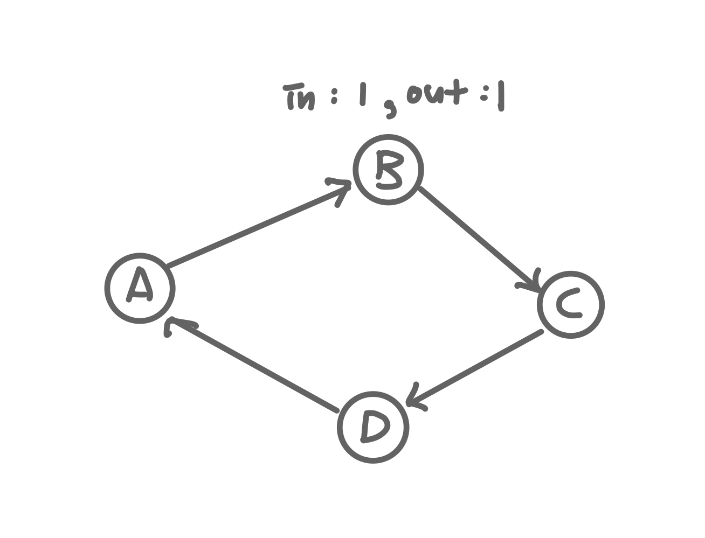

## 그래프 

* 실제 세계의 현상이나 사물을 정점(vertex) 또는 노드(node)와 간선(edge)으로 표현하기 위해 사용하는 자료구조

### 그래프의 종류 
* 무방향 그래프 : 방향이 없는 그래프, 간선을 통해 양방향으로 갈 수 있다. 
    * A,B 가 연결된 경우 (A,B) 또는 (B,A)로 표시한다.
    

* 방향 그래프 : 방향이 있는 그래프 
    * A,B 가 A->B 뱡향의 간선으로 연결된 경우 <A,B>로 표시 
    * 무방향 그래프와 다르게 <B,A>로 표시할 수 없다.
    * <A,B>와 <B,A>는 다른 것!
    

* 가중치 그래프 또는 네트워크 : 간선에 비용(가중치)가 할당된 그래프 
* 연결 그래프와 비연결 그래프 
    * 연결 그래프 : 무방향 그래프에 있는 모든 노드에 대해 항상 경로가 존재하는 경우 (알고리즘에서 많이 사용되는 그래프)
    * 비연결 그래프 : 무방향 그래프에서 특정 노드에 대해 경로가 존재하지 않는 경우 
    
* 순환 그래프와 비순환 그래프 
    * 순환 그래프 : 단순 경로의 시작 노드와 종료 노드가 동일한 경우 
    * 비순환 그래프 : 사이클이 없는 그래프 
    
* 완전 그래프 
    * 그래프의 모든 노드가 연결된 그래프
    

### 그래프와 트리 비교 

* 트리는 그래프 종류 중의 하나이다.
