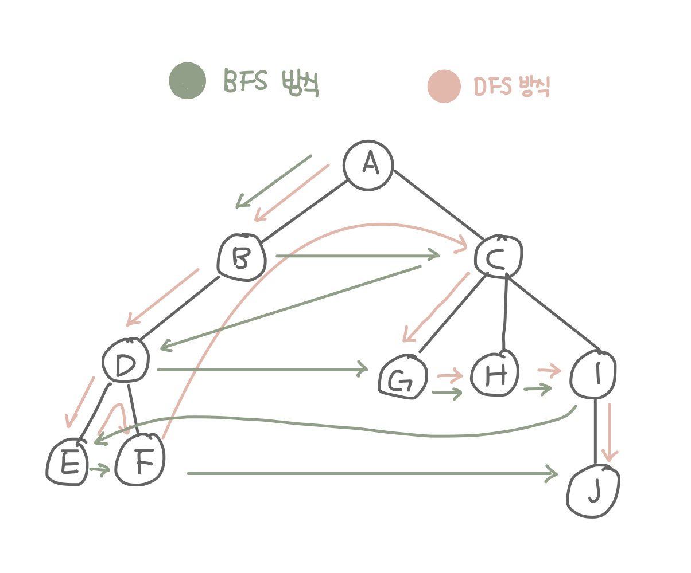

## 대표적인 그래프 탐색 알고리즘 
* BFS와 DFS가 있다. 
* BFS(너비 우선 탐색) : 정점과 같은 레벨에 있는 노드들(형제 노드)를 먼저 탐색하는 방식
    * 한 단계씩 내려가면서 해당 노드와 같은 레벨에 있는 노드들(형제 노드)을 먼저 순회한다. 
    * A-B-C-D-G-H-I-J
* DFS(깊이 우선 탐색) : 정점의 자식들을 먼저 탐색하는 방식 
    * 한 노드의 자식을 타고 끝까지 순회한 후, 다시 돌아와서 다른 형제들의 자식을 타고 내려가며 순회한다.
    * A-B-D-E-F-C-G-H-I-J

### BFS(너비 우선 탐색, Breath-First-Search)알고리즘 구현
* 자료구조 큐를 사용한다. 
* needVisit : 방문이 필요한 노드를 저장해놓는 큐 
* visited : 방문했던 노드를 순서대로 저장해놓는 큐 

### DFS(깊이 우선 탐색, Depth-First-Search)알고리즘 구현 