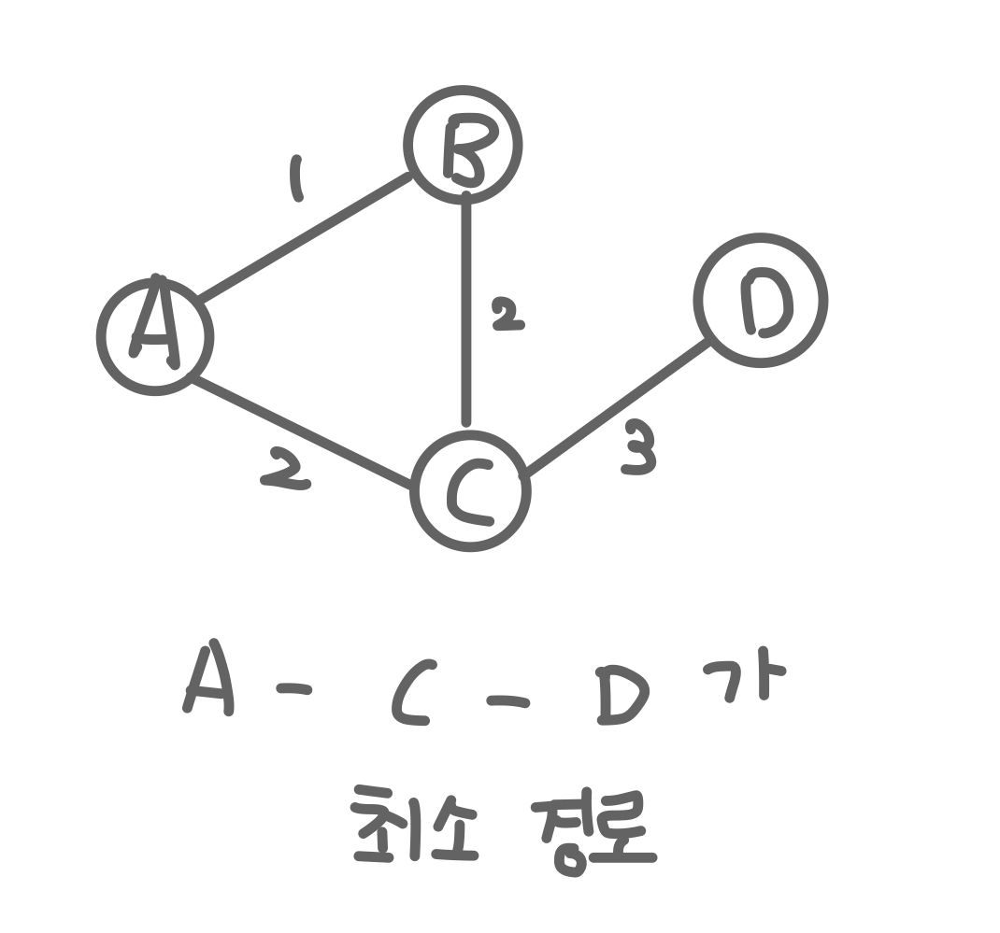
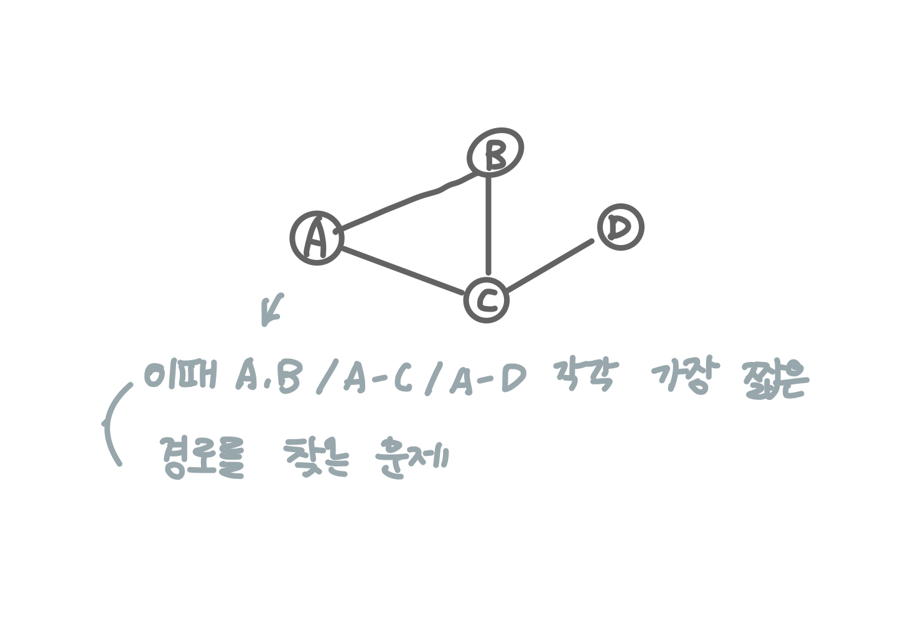
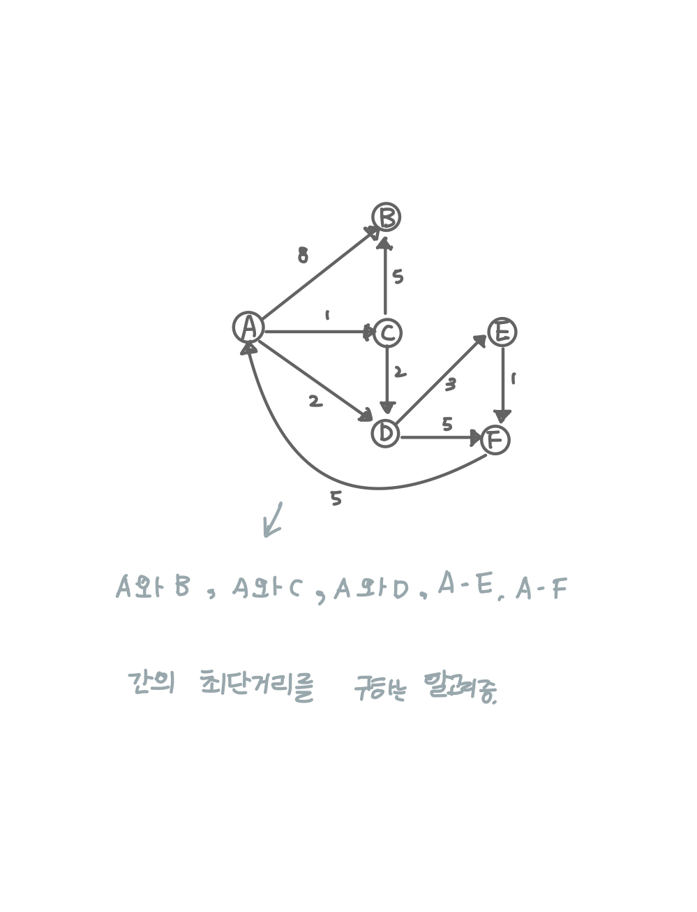
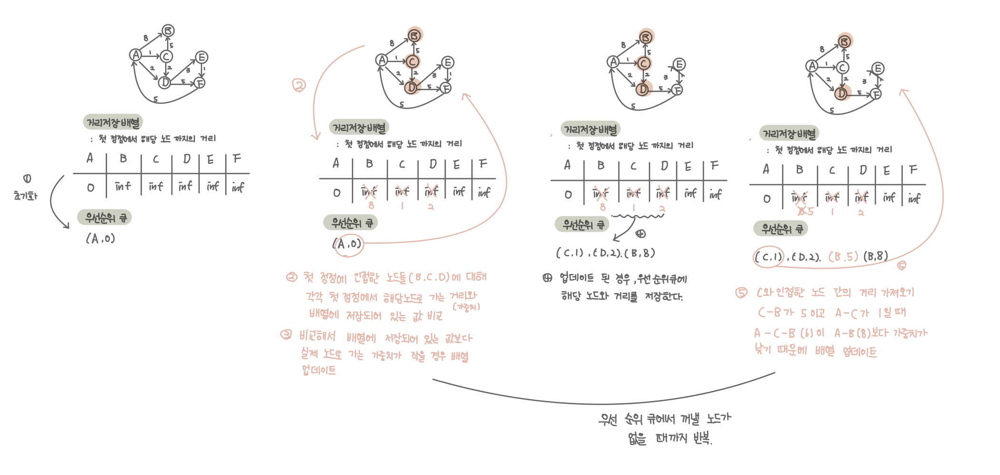

## 최단 경로 알고리즘 

### 최단 경로 문제 

* 두 노드를 잇는 가장 짧은 경로를 찾는 문제 
* 가중치 그래프에서 간선의 가중치 합이 최소가 되도록 하는 경로를 찾는 것이 목적 


* 최단 경로 문제의 종류 
    1. 단일 출발, 단일 도착 최단 경로 문제 : 특정 노드 U에서 출발, 또 다른 노드 특정 노드 V에 도착하는 가장 짧은 경로를 찾는 문제
    2. 단일 출발 최단 경로 문제 : 특정 노드 U와 그래프 내 다른 모든 노드 각각의 가장 짧은 경로를 찾는 문제 
    
    3. 전체 쌍 최단 경로 문제 : 그래프 내의 모든 노드 쌍(U,V)에 대한 최단 경로를 찾는 문제 


### 최단 경로 알고리즘 - 다익스트라 알고리즘


* 최단 경로 문제 종류 중 2번에 해당하는 문제를 해결하는 알고리즘

    

* 첫 정점을 기준으로 연결되어 있는 정점들을 추가해 가면서 최단 거리를 갱신하는 기법(bfs와 유사)
    * 첫 정점의 인접 노드 간의 거리부터 계산.
* 우선 순위 큐를 사용함
    * 현재 가장 짧은 거리를 항상 먼저 꺼내기 때문에 계산 양을 줄일 수 있다.

1. 첫 정점을 기준으로 배열을 선어하여 첫 정점에서 각 정점까지의 거리를 저장.
    * 초기에 첫 정점의 거리는 0, 나머지는 무한으로 설정
    * 우선 순위 큐에 첫 정점을 먼저 넣는다.

2. 우선순위 큐에서 노드를 꺼낸다. (처음에는 첫 정점이 꺼내짐.)
    * 첫 정점에 인접한 노드들에 대해 첫 정점에서 각 노드로 가는 거리와 현재 배열에 저장되어 있는 첫 정점에서 각 정점까지의 거리를 비교
    * 배열에 저장되어 있는 거리보다 첫 정점에서 해당 노드로 가는 거리가 더 짧을 경우 배열에 해당 노드의 거리를 업데이트한다.
    * 배열에 해당 노드의 거리가 업데이트 된 경우, 우선 순위 큐에 넣는다.
        * 결과적으로 너비 우선 탐색과 유사하게 첫 정점에 인접한 노드들을 순차적으로 방문하게 된다.
        * 거리가 먼 노드들은 우선 순위가 낮아짐.
3. 2번의 과정을 우선 순위 큐에서 꺼낼 노드가 없을 때까지 반복.



```kotlin
    fun main() {
        val graph = mapOf(
            'A' to mapOf('B' to 8, 'C' to 1, 'D' to 2),
            'B' to mapOf(),
            'C' to mapOf('B' to 5, 'D' to 2),
            'D' to mapOf('E' to 3, 'F' to 5),
            'E' to mapOf('F' to 1),
            'F' to mapOf('A' to 5),
        )

        val queue = PriorityQueue<Pair<Char, Int>>(compareBy { it.second }).apply {
            add(Pair('A', 0))
        }


        val distanceArray = mutableMapOf(
            'A' to 0,
            'B' to Int.MAX_VALUE,
            'C' to Int.MAX_VALUE,
            'D' to Int.MAX_VALUE,
            'E' to Int.MAX_VALUE,
            'F' to Int.MAX_VALUE,
        )

        println(dijkstra(distanceArray, queue, graph))


    }

    fun dijkstra(
        distanceArray: MutableMap<Char, Int>,
        priorityQueue: PriorityQueue<Pair<Char, Int>>,
        graph: Map<Char, Map<Char, Int>>
    ): MutableMap<Char, Int> {

        if (priorityQueue.isEmpty()) {
            return distanceArray
        }

        val (currentNode, currentDistance) = priorityQueue.poll()

        graph[currentNode]?.forEach {
            val distance = currentDistance + it.value

            if ((distanceArray[it.key] ?: 0) > distance) {
                distanceArray[it.key] = distance
                priorityQueue.add(Pair(it.key, distance))
            }

        }

        return dijkstra(distanceArray, priorityQueue, graph)
    }

```