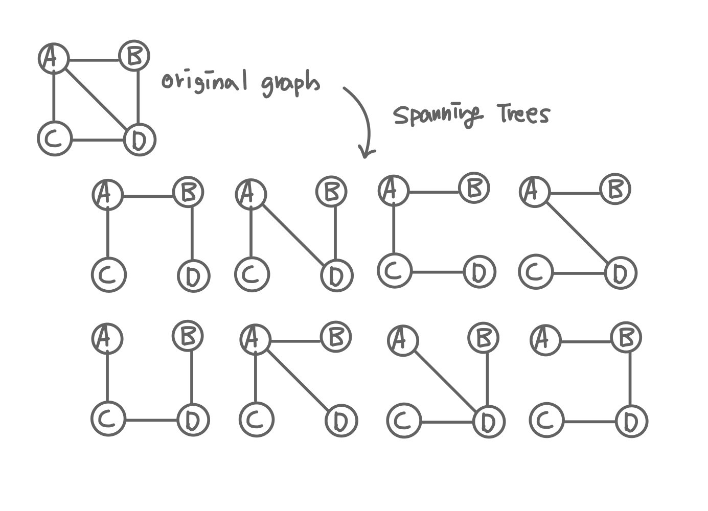
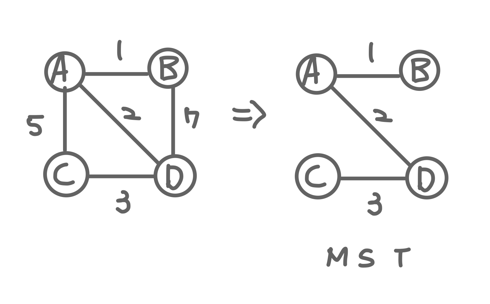

## 신장 트리 (Spanning Tree) 

* 원래의 그래프의 모든 노드가 연결되어 있으면서 트리의 속성을 만족하는 그래프
* 신장 트리의 조건 
    1. 본래 그래프의 모든 노드를 포함해야 한다.
    2. 모든 노드가 서로 연결되어 있어야 한다.
    3. 트리의 속성을 만족시켜야 한다. (사이클이 존재해서는 안 된다.)
      
    

## 최소 신장 트리 (MST, Minimum Spanning Tree)

* 가능한 spanning tree 중에서 간선의 가중치의 합이 최소인 spanning tree
      
    
