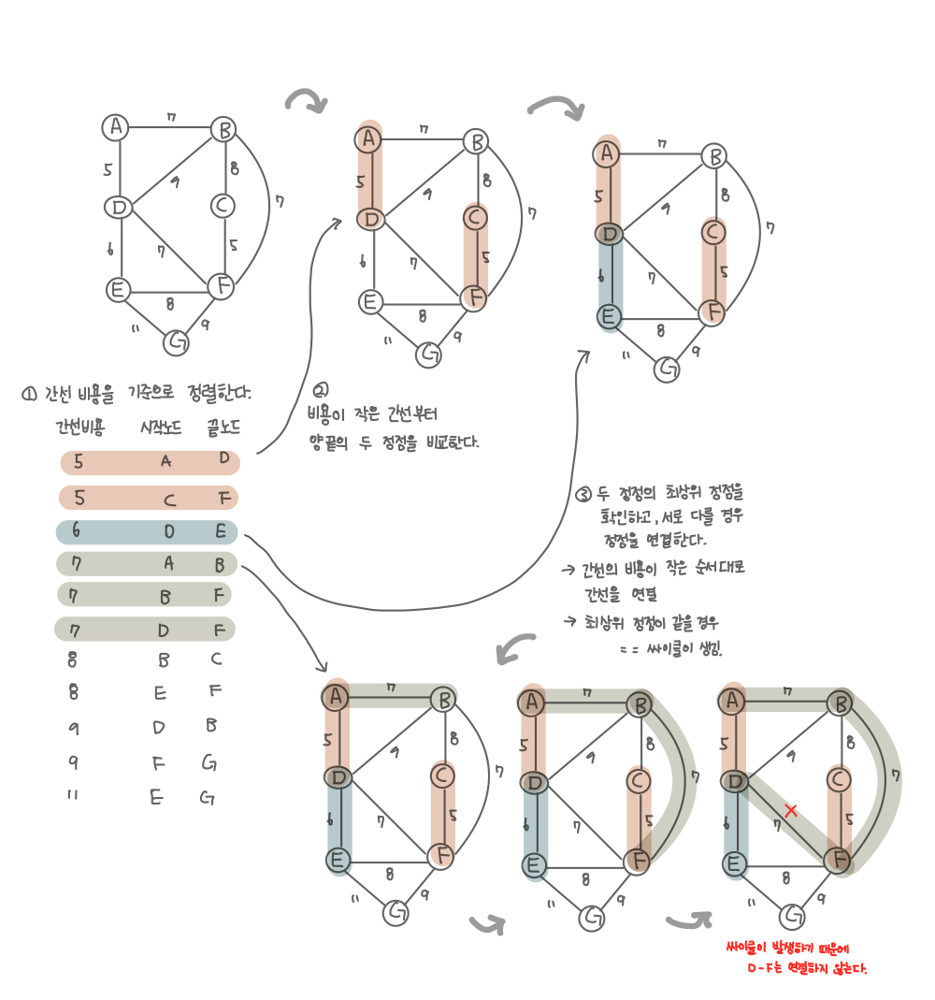
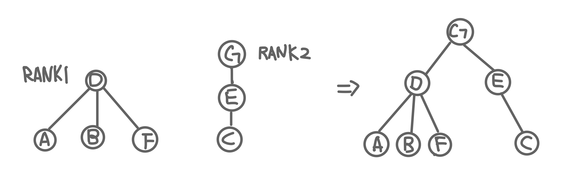
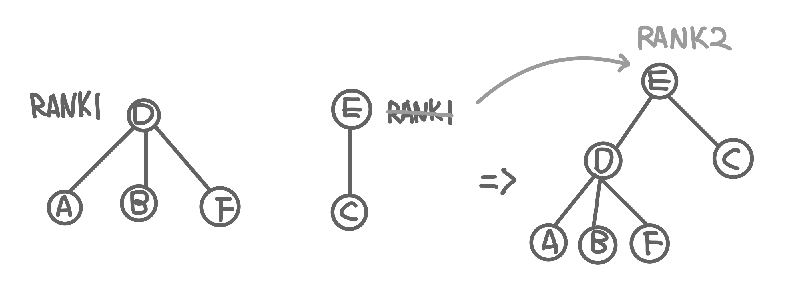
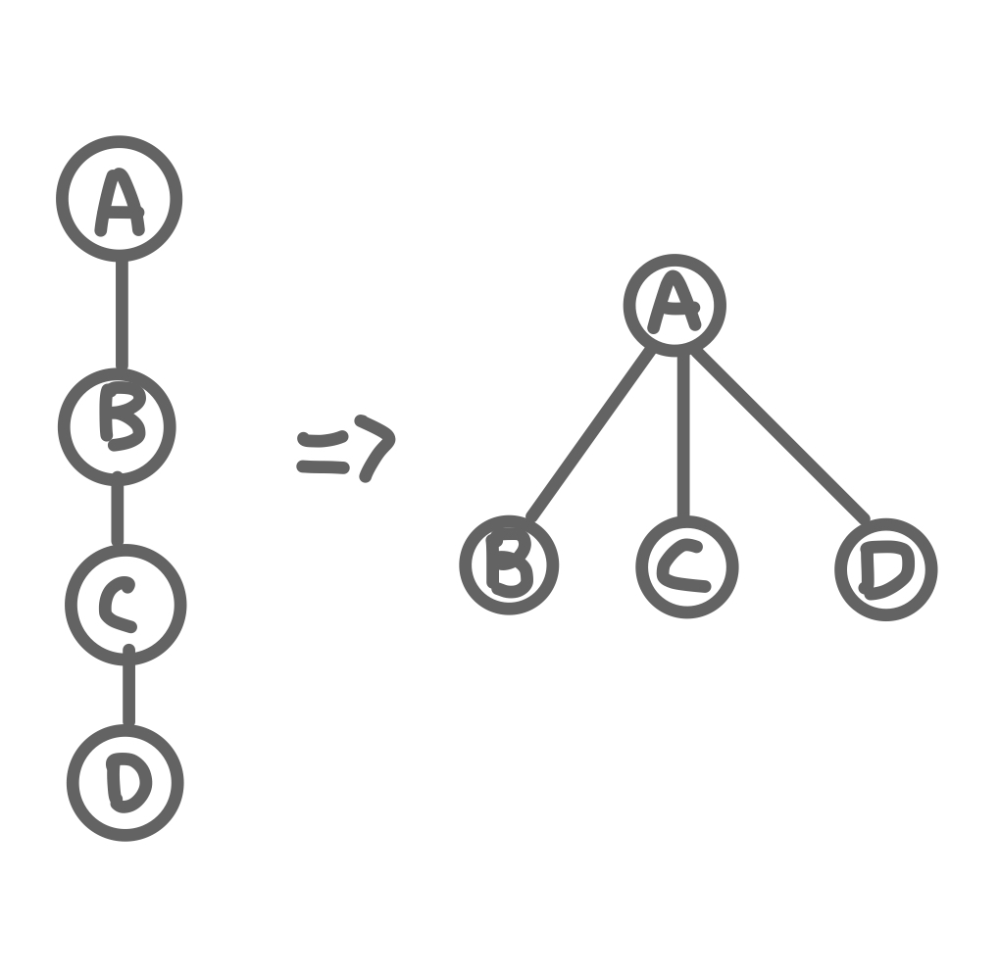

## 크루스칼 알고리즘 

1. 모든 정점을 독립적인 집합으로 만든다. (union-find 초기화 )
2. 모든 간선을 비용 기준으로 정렬하고, 비용이 작은 간선부터 양 끝의 두 정점을 비교한다. (find)
3. 두 정점의 최상위 정점을 확인하고, 서로 다를 경우 두 정점을 연결한다. (union)
    * 싸이클이 생기지 않도록 하기 위함

* 탐욕 알고리즘을 기초로 한다.



### 어떻게 싸이클이 여부를 확인할 것인가? union-find 알고리즘 

* union - find 알고리즘을 사용하여 간선 연결 시 싸이클 생성 여부를 확인한다.
    * 연결이 되어 있는 노드들을 하나의 집합으로 생각한다.
    * 연결하고자 하는 노드가 집합에 있을 경우 연결하면 사이클이 생긴다.
    * 연결하고자 하는 노드가 집합에 없을 경우 연결하면 사이클이 생기지 않는다.

* union - find 알고리즘 
    * 여러개의 부분 집합 (중복 노드가 없는)끼리 합치거나 연결 했을 때 싸이클 여부를 판단할 수 있는 알고리즘 
    * disjoint set을 표현할 때 사용하는 알고리즘으로 트리 구조를 활용하는 알고리즘 
        * disjoint set : 서로 중복되지 않는 부분 집합들로 나눠진 원소들에 대한 정보를 저장하고 조작하는 자료구조.

    * union-find 과정 
        1. union : 두 개의 부분 집합을 합치는 과정(집합은 트리 구조로 표현한다.)
        2. find : 현재 두 노드가 같은 집합에 있는지 없는지 판단하는 과정. (루트 노드를 비교해서) 
    
    * union-find 알고리즘의 고려할 점
        * 루트 노드를 어떻게 찾느냐, 트리를 어떻게 구성하느냐에 따라 알고리즘의 성능이 달라진다.
        * union 순서에 따라 최악의 경우 링크드리스트와 같은 형태가 될 수 있다.
        * 위의 두 문제를 해결하기 위해 union-by-rank, path compression 기법을 사용한다.

#### union-by-rank
* 각 트리에 대한 높이(rank)를 기억해 두고, union시 
    1. 두 집합의 rank가 다른 경우 
        * => rank가 작은 트리를 rank가 높은 트리에 붙인다.
        

    2. 두 집합의 rank가 같은 경우 
        * => 한 집합의 rank를 1 올려주고 다른 집합을 1 증가한 트리에 붙인다.
        

#### path compression
* find를 실행한 노드에서 거쳐간 노드를 루트에 디렉트로 연결하는 방법
* find를 실행한 이후부터는 루트 노드를 한 번에 알 수 있다.
<br><br>


## 코드

```kotlin 
    fun main() {
        val vertices = listOf('A', 'B', 'C', 'D', 'E', 'F', 'G')
        val edges = listOf(
            Triple(7, 'A', 'B'),
            Triple(5, 'A', 'D'),
            Triple(9, 'D', 'B'),
            Triple(8, 'B', 'C'),
            Triple(7, 'B', 'F'),
            Triple(7, 'D', 'F'),
            Triple(5, 'C', 'F'),
            Triple(6, 'D', 'E'),
            Triple(8, 'E', 'F'),
            Triple(11, 'E', 'G'),
            Triple(9, 'G', 'F')
        )

        println(kruskal(vertices, edges))

    }

    fun kruskal(vertices: List<Char>, edges: List<Triple<Int, Char, Char>>): MutableList<Triple<Int, Char, Char>> {
        val parent = mutableMapOf<Char, Char>()
        val rank = mutableMapOf<Char, Int>()

        val mst = mutableListOf<Triple<Int, Char, Char>>()

        vertices.forEach {
            parent[it] = it
            rank[it] = 0
        }

        val sorted = edges.sortedBy { it.first }

        sorted.forEach {
            val (_, node1, node2) = it

            if (find(node1, parent) != find(node2, parent)) {
                union(node1, node2, parent, rank)
                mst.add(it)
            }

        }
        return mst
    }

    fun find(node: Char, parent: MutableMap<Char, Char>): Char {

        if (parent[node] != node) {
            parent[node] = find(
                parent[node] ?: node,
                parent
            )
        }
        return parent[node] ?: node
    }

    fun union(node1: Char, node2: Char, parent: MutableMap<Char, Char>, rank: MutableMap<Char, Int>) {
        val root1 = find(node1, parent)
        val root2 = find(node2, parent)

        if (rank[root1]!! > rank[root2]!!) {
            parent[root2] = root1
        } else {
            parent[root1] = root2
        }

        if (rank[root1]!! == rank[root2]!!) {
            rank[root2]?.plus(1)
            parent[root1] = root2
        }
    }
```

  


