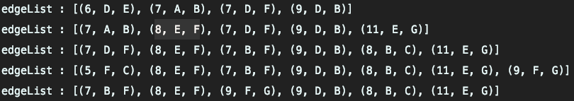

## 프림 알고리즘 

* 시작 정점을 선택한 후, 정점에 인접한 간선 중 최소 간선으로 연결된 정점을 선택하고, 해당 정점에서 다시 최소 간선으로 연결된 정점을 선택하는 방식으로 최소 신장 트리를 확장해 가는 방식 

1. 임의의 정점을 선택, `연결된 노드 집합`에 삽입
2. 선택된 정점에 연결된 간선들을 `간선 리스트`에 삽입
3. `간선 리스트`에서 최소 가중치를 가지는 간선부터 추출
    - 최소 가중치를 가지는 간선을 찾아야 하기 때문에 `우선 순위 큐`를 사용한다.
    - 해당 간선에 연결된 인접 정점이 `연결된 노드 집합`에 이미 들어 있으면 skip => 싸이클 발생을 막기 위해서 
    - 해당 간선에 연결된 인접 정점이 `연결된 노드 집합`에 들어있지 않은 경우 
        - 해당 간선을 선택, `최소 신장 트리`에 삽입.
4. 추출한 간선은 `간선 리스트`에서 제거
5. `간선 리스트`에 더 이상 간선이 없을 때까지 3~4번 반복.

### 크루스칼 알고리즘과 프림 알고리즘 비교 
* 둘 다 탐욕 알고리즘을 기초로 한다.
* 크루스칼은 가중치가 작은 간선부터 선택하면서 MST를 구한다. -> 간선 리스트를 정렬하면서 진행
* 프림은 특정 정점에서 시작. 해당 정점에 연결된 가장 가중치가 작은 간선을 선택
    * 연결된 정점들의 연결된 간선들 중에서 가장 가중치가 작은 간선을 선택하는 방식으로 MST를 구함.

### 구현 
```kotlin 
    fun main() {
        val edges = listOf(
            Triple(7, 'A', 'B'),
            Triple(5, 'A', 'D'),
            Triple(9, 'D', 'B'),
            Triple(8, 'B', 'C'),
            Triple(7, 'B', 'F'),
            Triple(7, 'D', 'F'),
            Triple(5, 'C', 'F'),
            Triple(6, 'D', 'E'),
            Triple(8, 'E', 'F'),
            Triple(11, 'E', 'G'),
            Triple(9, 'G', 'F')
        )
        prim('A', edges)
    }

    fun prim(startNode: Char, edges: List<Triple<Int, Char, Char>>): MutableList<Triple<Int, Char, Char>> {
        // 노드에 인접한 간선 정보를 저장
        val adjacentEdges = mutableMapOf<Char, MutableList<Triple<Int, Char, Char>>>()

        for ((w, n1, n2) in edges) {
            adjacentEdges[n1]?.add(Triple(w, n1, n2)) ?: run { adjacentEdges[n1] = mutableListOf(Triple(w, n1, n2)) }
            adjacentEdges[n2]?.add(Triple(w, n2, n1)) ?: run { adjacentEdges[n2] = mutableListOf(Triple(w, n2, n1)) }
        }

        val connectedNode = mutableListOf(startNode) //연결된 노드 정보를 저장.

        val edgeList = TreeSet<Triple<Int, Char, Char>>(kotlin.Comparator { o1, o2 ->       //간선 리스트를 저장.
            when {
                o1.first < o2.first -> -1
                o1.first < o2.first -> 1
                else -> 0
            }
        })

        adjacentEdges[startNode]?.forEach {
            edgeList.add(it)
        }

        val mst = mutableListOf<Triple<Int, Char, Char>>()

        while (edgeList.isNotEmpty()) {
            val (w, n1, n2) = edgeList.pollFirst()

            if (n2 !in connectedNode) {
                connectedNode.add(n2)
                mst.add(Triple(w, n1, n2))

                // 선택된 간선과 연결된 간선 정보를 간선 리스트에 저장.
                for (edge in adjacentEdges[n2]!!) {
                    if (edge.third !in connectedNode) {
                        edgeList.add(edge)
                    }
                }
            }

        }
        return mst
    }

```

* kotlin에서 PriorityQueue를 사용할 경우 정렬이 제대로 되지 않는 문제가 있었다. 

    * 다음 내용을 참고하여 TreeSet이라는 자료구조를 사용했다.
    * Ref : https://stackoverflow.com/questions/5695017/priorityqueue-not-sorting-on-add

