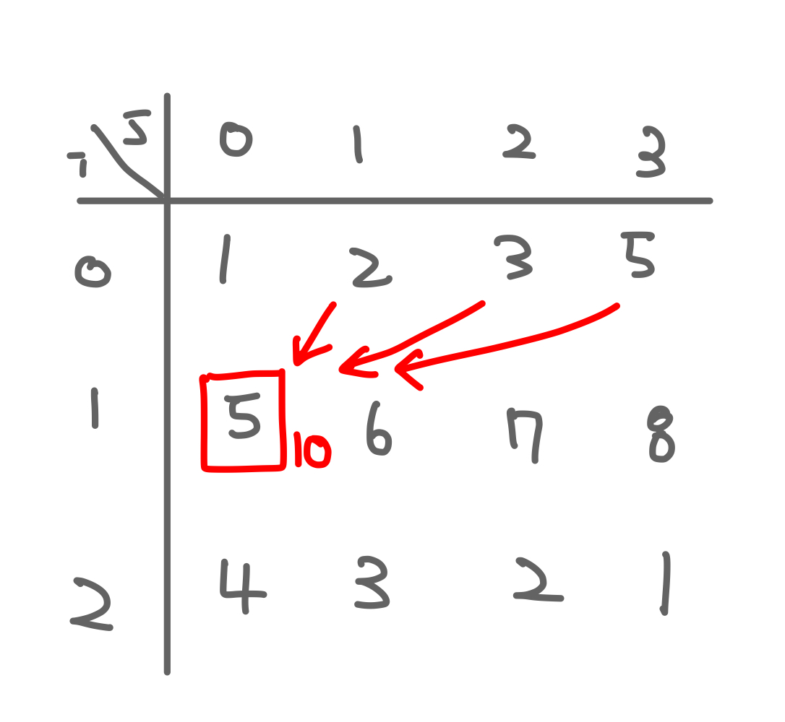
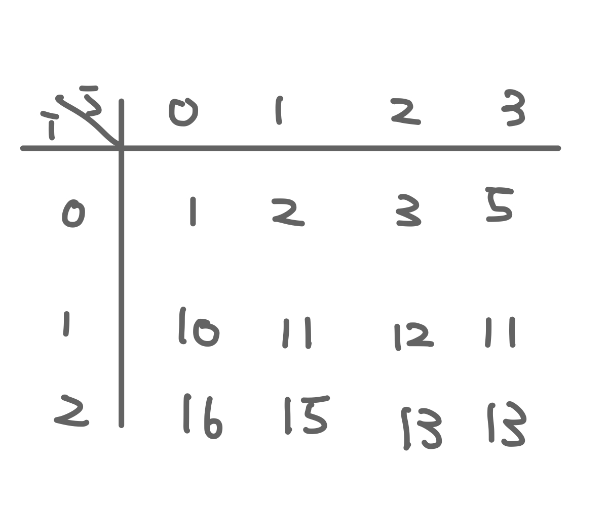

[프로그래머스 - 땅따먹기](https://school.programmers.co.kr/learn/courses/30/lessons/12913)

### 구하고자 하는 것은 무엇인가?

- 마지막 행까지 모두 내려왔을 때 얻을 수 있는 점수의 최대 값

### 1. 이해

- 땅은 n행 4열의 2차원 배열로 주어집니다.
- 각 칸에는 점수가 쓰여 있습니다.
- 각 행의 한 칸만 밟으면서 내려와야 합니다.
- 한 행씩 내려올 때 같은 열을 연속해서 밟을 수 없습니다.

### 2.계획

- 동적 프로그래밍을 사용합니다.
- [i][j]칸을 밟고 있을 때 이전에 밟을 수 있는 칸과 현재 칸의 합이 가장 큰 값을 구합니다.
    
    
    
    - 예를 들어 현재 위치가 (1,0)은 이전의 밟을 수 있는 칸 중에서 가장 큰 수가 5이기 때문에 현재 밟고 있는 칸의 점수와 이전에 밟을 수 있는 칸의 점수를 합친 10으로 갱신합니다.
    - 위 과정을 모든 원소에 적용하면 다음과 같이 값이 업데이트 됩니다.
        
        
        
- 마지막 행에서 가장 큰 값을 리턴합니다.

### 3. 실행

```jsx
const solution = (land) => {
  const dp = Array(land.length)
    .fill(0)
    .map((_, i) => Array.from({ length: 4 }, (_, j) => land[i][j]));

  for (let i = 1; i < land.length; i++) {
    for (let j = 0; j < 4; j++) {
      for (let k = 0; k < 4; k++) {
        if (j === k) continue;
        dp[i][j] = Math.max(dp[i][j], land[i][j] + dp[i - 1][k]);
      }
    }
  }

  return Math.max(...dp[dp.length - 1]);
};
```

### 4. 회고

- 첨에 감 못잡다가 dp사용하라는 힌트를 얻고 바로 해결ㅎ
- 아직 문제에 어떻게 접근해야 하는지에 대한 감이 부족한 것 같습니다.