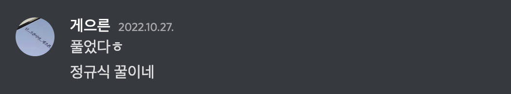
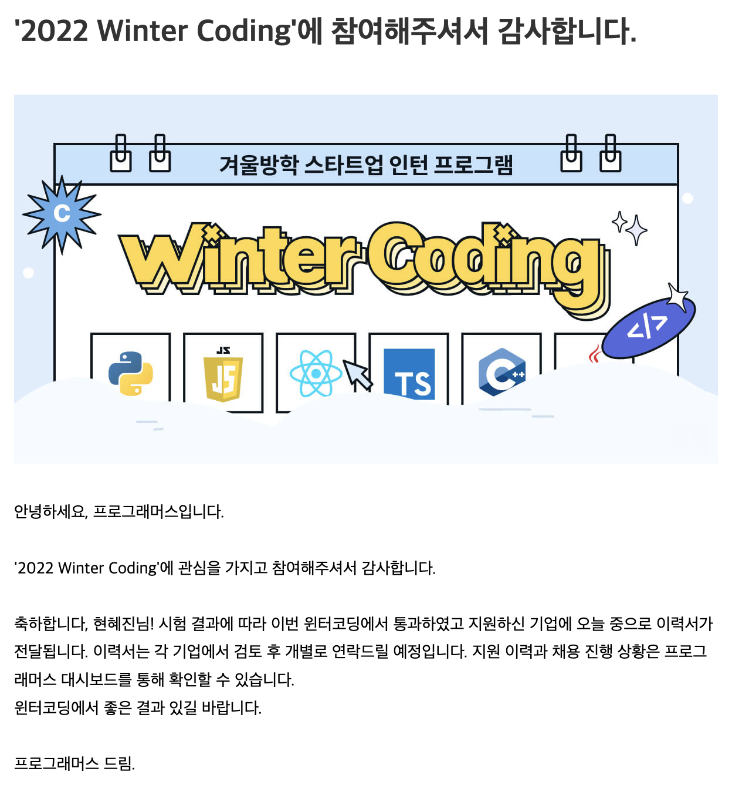

프로그래머스에서 진행하는 \***\*2022 Winter Coding - 겨울방학 스타트업 인턴 프로그램\*\*** 에 지원하며 11월 5일에 코딩테스트를 봤습니다.

알고리즘 문제들은 무난한 난이도였던 것 같습니다. 1,2번은 쉽게 풀고 100점으로 모두 통과했으나 3번에서 40점으로 밖에 통과하지 못했는데 나중에 보니 m과 n의 위치가 바뀌어 있는 것을 발견했습니다. (~~쥬륵~~ ) m과 n의 위치를 바꿨으면 100점은 아니지만 그래도 점수를 더 받을 수 있지 않았을까 조금 아쉽습니다. sql은 평소에 연습하지 않았기 때문에 쿨하게 포기했습니다.

1번 문제는 문자열을 처리하는 문제였습니다. 저는 다음과 같이 풀었습니다.

```kotlin
// expect(solution1("aabbbc")).toEqual("a*b*c");

const solution1 = (str) => {
  for (let i = 97; i < 123; i++) {
    const a = String.fromCharCode(i);
    const reg = new RegExp(`${a}{2,}`, "g");
    str = str.replace(reg, `${a}*`);
  }
  return str;
};
```

이전에 동기 분과 알고리즘 문제를 풀 때 정규식 사용에 대한 얘기를 나누고 몇 문제를 정규식을 사용해서 풀어봤었는데 그 경험이 꽤 많이 도움이 된 것 같습니다.



2번 문제는 구현 문제였던 것 같습니다.

```kotlin
// expect(
//    solution2(
//      6,
//      [6, 1, 4, 2, 5, 1, 3, 3, 1, 6, 5],
//      [3, 2, 5, 3, 4, 2, 4, 2, 3, 2, 2]
//    )
//  ).toEqual(7);

const solution2 = (n, student, point) => {
  const half = parseInt(n / 2);
  let dominant = Array.from({ length: half }, (_, i) => i + 1);

  const record = {};
  for (let i = 1; i <= n; i++) {
    record[i] = 0;
  }

  let count = 0;
  student.forEach((s, i) => {
    record[s] += point[i];

    const arr = Object.entries(record).sort((a, b) => b[1] - a[1]);
    const d = arr.slice(0, half).map((e) => Number(e[0]));

    if (!d.every((e) => dominant.includes(e))) {
      dominant = d;
      count++;
    }
  });

  return count;
};
```

3번 문제는 bfs를 사용하여 문제를 풀었습니다.

```kotlin
// expect(solution3(["..XXX", "..XXX", "...XX", "X....", "XXX.."])).toEqual(5);

const solution3 = (worldmap) => {
  const dx = [-1, 1, 0, 0, -1, -1, 1, 1];
  const dy = [0, 0, -1, 1, -1, 1, -1, 1];
  const m = worldmap.length;
  const n = worldmap[0].length;

  const record = Array(m)
    .fill(0)
    .map((_) => Array(n).fill(0));

  const needVisit = [[0, 0, "r", 90]];
  record[0][0] = 1;

  while (needVisit.length > 0) {
    const [x, y, dir, deg] = needVisit.shift();

    for (let i = 0; i < dx.length; i++) {
      const nx = x + dx[i];
      const ny = y + dy[i];

      // 맵을 벗어나는 경우
      if (nx < 0 || nx > m - 1 || ny < 0 || ny > n - 1) continue;

      // 가려는 곳이 위험 지역인 경우
      if (worldmap[nx][ny] === "X") continue;
      if (isDanger(dir, deg, worldmap, [x, y])) continue;

      const nDir = [5, 3, 7].includes(i)
        ? "r"
        : [4, 2, 6].includes(i)
        ? "l"
        : i === 0
        ? "u"
        : "d";

      const nDeg = [6, 7].includes(i) ? 135 : [4, 5].includes(i) ? 45 : 90;

      if (record[nx][ny] === 0) {
        needVisit.push([nx, ny, nDir, nDeg]);
        record[nx][ny] = record[x][y] + 1;
      }
    }
  }

  return record[m - 1][n - 1] - 1; // 여기서 m과 n의 위치를 바꿔썼습니다;;
};

const isDanger = (dir, deg, map, current) => {
  if (deg === 90) return false;

  const m = map.length;
  const n = map[0].length;

  const dx = deg === 45 ? [-1, 0] : [1, 0];
  const dy = dir === "r" ? [0, 1] : [0, -1];

  for (let i = 0; i < 2; i++) {
    const nx = current[0] + dx[i];
    const ny = current[1] + dy[i];

    if (nx < 0 || nx > m - 1 || ny < 0 || ny > n - 1) continue;

    if (map[nx][ny] === "X") return true;
  }

  return false;
};
```

월요일에 칼같이 코딩 테스트 결과 메일이 날라왔습니다.



사실 문제 난이도도 무난하고, 나는 다 풀지 못하고,,, 그래서 기대하지 않았는데 (~~사실 접수할 때부터 코테 통과할 거란 기대가 없었음… )~~

운좋게 코테에 합격하게 되었습니다. 그러나 나의 이력서는 그러지 못하지… 이번주 부터 간간히 이력서 정리를 해야겠습니다. 개발하는 것보다 이력서 쓰는게 더 어려운 것 같습니다. 그리고 재미도 없습니다. 흐에에ㅔㅔㅔ

현재까지 2개의 기업에서 이력서를 확인했는데 연락은 아직 없습니다. (바로 나락 갈 줄 알았는데….) 한 기업은 13일까지 일반 신입 지원 서류를 받는데 거기에 다시 내볼까 생각중입니다. 현재 웹으로 진행했던 프로젝트를 다시 안드로이드로 만들면서 이력서를 보충하려고 했는데 이 내용을 제출하는 이력서에 어떻게 녹일까 고민입니다.
