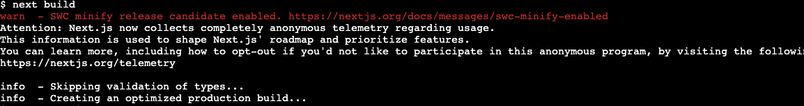

어제 드디어 팀 프로젝트 마지막 기능(?)을 받아냈습니다.

해당 코드를 develop 브랜치에 머지하고 ec2에서 docker를 사용해 배포하려고 하는데 문제가 발생했습니다. 
이전에 배포할 때도 불안 불안하게 한 번씩 ec2를 재부팅하고 배포했어야 했는데 오늘은 ec2를 몇 번이나 재부팅하고 docker를 정리해도 빌드가 다음 단계에서 더 이상 진행이 되지 않았습니다.

관련된 내용을 찾아보니 ec2 프리 티어는 사양이 많이 낮아서 메모리가 부족해 빌드 시에 멈추는 현상이 흔하게 발생하는 것 같았습니다. 팀원들의 주머니로 운영되는 서버라 인스턴스 유형을 당장 업그레이드할 수도 없고, 해결할 수 있는 방법을 찾던 중에 다음과 같은 방법을 발견할 수 있었습니다.

[스왑 파일을 사용하여 Amazon EC2 인스턴스에서 스왑 공간으로 사용할 메모리를 할당하는 방법](https://aws.amazon.com/ko/premiumsupport/knowledge-center/ec2-memory-swap-file/)

다행히도 위의 방법으로 스왑 메모리를 만든 후에 빌드를 하니 멈추는 현상 없이 빌드가 진행되었습니다. 하지만 스왑 메모리를 사용해서 인지 배포 후에 각 페이지 맨 처음 접근할 때 이전보다 굉장히 늦게 페이지가 불러오지는 것을 발견할 수 있었습니다. 

프로젝트가 최적화가 안된 문제도 있지만 로딩이 너무 느려서 앞으로 프로젝트 최적화에 집중할 것 같습니다. (할 거 많지만,,,, 일단 할 일에 추가,,,)

