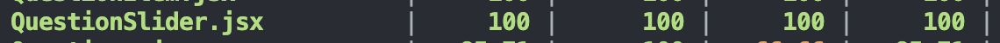
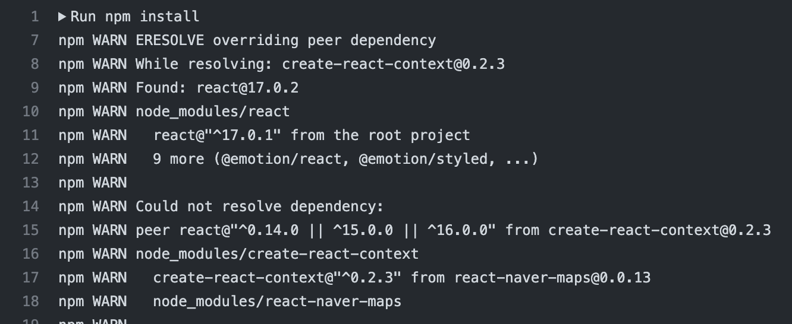
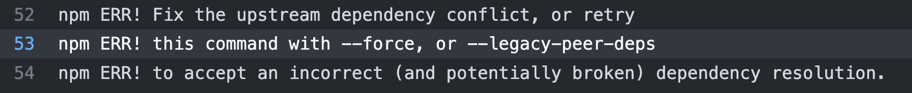
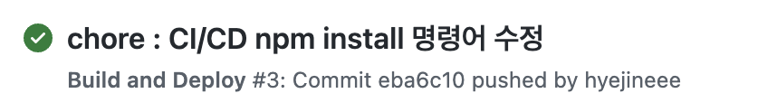
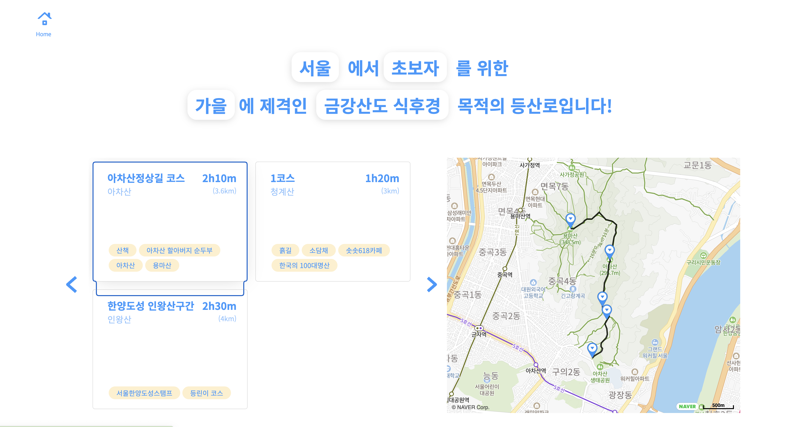
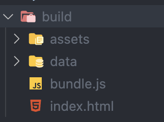

이전에 리액트, 프론트엔드 개발을 처음 배울 때 했던 프로젝트를 정리했습니다. 이력서에 첨부할 프로젝트가 없어서 대강 정리하고, 이력서에 첨부했는데 다음과 같은 피드백을 받았습니다. 


ㅇㅈ 합니다...

먼저, 깨지는 테스트들을 수정하고 aws s3에 새롭게 배포하는 것으로 계획을 잡고 프로젝트를 수정했습니다. 깨지는 테스트는 하단에 QuestionSlider 컴포넌트 관한 테스트였는데 쿼리 시 getByAltText를 사용해야 하는데 getByLabelText를 사용해서 컴포넌트를 못 찾아서 발생하는 문제였습니다. 간단한 문제라 금방 해결할 수 있었습니다. 또 마지막 질문이 나오는 화면에서는 버튼이 등산 코스 보러 가기! 버튼으로 변경되는데 이 부분에 대한 테스트 코드가 없어서 추가하고, QuestionSlider의 테스트 커버리지가 100%를 채울 수 있도록 했습니다.



다음으로 aws에 배포하기 위해 aws s3 버킷 설정과 github actions의 워크 플로우에서 해당 버킷에 접근할 수 있도록 iam에서 access key를 받아 github actions 환경 변수로 설정을 해주었습니다. 이전에 현재 진행하고 있는 프로젝트에서 동적 배포 자동화를 위해 한 번 경험했던 과정이라 워크 플로우를 생성하고, 버킷에 업로드하는 과정은 쉽게 할 수 있을 거라 생각했습니다.

그러나....


<p align="center">

</p>

롸? npm install 부터 에러가 났습니다. 하핳

npm7부터 [peer dependencies 자동 설치 기능](https://github.blog/2021-02-02-npm-7-is-now-generally-available/#peer-dependencies)이 등장했는데 이전에 프로젝트를 진행할 때 없었던 기능이 현재(npm8 버전대 사용 중) 사용되면서 문제가 발생하게 되었습니다.

react-naver-map@"0.0.13"을 사용했었는데 해당 패키지가 의존하는 create-react-context@"^0.2.3" 패키지가  react@"^0.14.0 || ^15.0.0 || ^16.0.0 버전을 참조하고 현재 프로젝트에는 리액트 17버전을 사용하고 있어서 peer dependencies 충돌이 발생했고 npm에서 설치를 중단했기 때문에 에러가 발생한 것입니다. 그동안 npm4~6 버전에서는 peer dependencies가 있으면 경고만 뜨고 설치가 진행되기 때문에 프로젝트를 만들 당시에는 에러 없이 잘 돌아갔었던 것 같습니다.

일단은 npm이 친절하게 문제를 해결할 방법을 알려주기 때문에 아래 두 가지 방법중에 하나를 선택해서 워크 플로우에 넣어 줬습니다. 



첫 번째 `--force`는 다른 의존 패키지들을 설치해서 충돌을 우회하는 옵션이고, 두 번째 `--legacy-peer-deps` 의존 관계를 완전히 무시해서 충돌을 무시하는 옵션이라고 합니다. 

저는 이전에도 현재 버전들로 이상 없이 잘 돌아갔기 때문에 두 번째 옵션을 택했습니다. 



이후에는 저번에 했던 것처럼 build하고 빌드 결과물을 s3에 업로드 step을 무난하게 진행할 수 있었습니다.

하지만...! 

빌드된 결과물을 s3 정적 사이트로 배포했는데 네이버 지도가 안나오는 문제가 발생했습니다. 생각해보니 git 레포에는 .env 파일이 없기 때문에 지도 API 키를 사용할 수 없었습니다. 쓰읍 - 

다시 CD 워크 플로우를 뜯어고칩니다. 워크 플로우가 실행되는 중간에 지도 API 키를 build 명령어에 전달하기 위해서 먼저 github actions에 API 키를 환경 변수로 등록해 주었습니다. 그 후에 build 명령어를 다음과 같이 변경해 주었습니다.  
```
run : MAP_CLIENT_ID=${{secrets.MAP_KEY}} npx webpack --config webpack.config.js
```

이렇게 변경한 후에 지도가 잘 나오긴 했으나, 다른 문제가 발행했습니다.  


이거 정말 산 넘어 산...

등산 코스를 보여주는 용도로 gpx 파일을 사용하는데 업로드한 파일을 못 찾는 문제가 발생했습니다. 개발자 도구의 네트워크 탭에서 요청하는 주소를 복사해서 url decode를 사용해서 파일명을 봤는데 s3에 업로드된 파일의 주소와 약간 다른 것을 발견하게 되었습니다. 아차산-아차산-정상길.gpx 라는 파일을 요청하는데 

요청시 사용하는 주소는 
```
/data/gpx/%EC%95%84%EC%B0%A8%EC%82%B0-%EC%95%84%EC%B0%A8%EC%82%B0-%EC%A0%95%EC%83%81%EA%B8%B8-%EC%BD%94%EC%8A%A4.gpx
```

버킷에 있는 주소는 
```
/data/gpx/%E1%84%8B%E1%85%A1%E1%84%8E%E1%85%A1%E1%84%89%E1%85%A1%E1%86%AB-%E1%84%8B%E1%85%A1%E1%84%8E%E1%85%A1%E1%84%89%E1%85%A1%E1%86%AB-%E1%84%8C%E1%85%A5%E1%86%BC%E1%84%89%E1%85%A1%E1%86%BC%E1%84%80%E1%85%B5%E1%86%AF-%E1%84%8F%E1%85%A9%E1%84%89%E1%85%B3.gpx
```

로 약간의 차이가 있었습니다. 등산 코스를 일일이 마커를 찍고 뽑은 gpx 파일을 사용하기 때문에 구분이 쉽게 파일 이름으로 한글을 사용했는데 s3에 업로드되는 파일명은 조합형으로 인코딩 되고 요청시 사용되는 파일명은 완성형으로 인코딩 되기 때문에 발생하는 문제였습니다.

아으 어쩔 수 없이 gpx 파일 이름을 영어로 다 변경해줍니다...



넘고 넘어서 드디어 배포 성공...!

하지만 몇 가지 거슬리는 부분이 있어서 다시 작업합니다... 웹팩을 사용해서 빌드 시 output 폴더에는 index.html 파일과 reset.css 파일이 포함되지 않는데 이 부분을 자동으로 포함할 수 있도록 웹팩 설정을 해줄 겁니다.

먼저, 웹팩이 html 파일을 알아 먹을 수 있도록 html 로더를 설치하고 webpack.config.js 에 설정해 줍니다.

```
npm install --save-dev html-loader
```
```javascript
      {
        test: /\.html$/,
        use: [
          {
            loader: 'html-loader',
            options: { minimize: true },
          },
        ],
      },
```

그 후에 html을 output 폴더에 추가하기 위해서 HTMLWebpackPlugin을 설치하고 설정해 줍니다. 설정 후에 다시 빌드 명령어를 수행하여 output으로 생성된 build 폴더에 index.html이 정상적으로 들어가 있는 것을 확인할 수 있었습니다. (~~사실 버전 때문에 한 번에 성공 못 함. 휴~~)
```
npm install --save-dev html-webpack-plugin
```
```javascript
    const HtmlWebPackPlugin = require('html-webpack-plugin');

    // ...이전 설정들...

    new HtmlWebPackPlugin({
      template: './index.html', // 현재 경로에 있는 index.html 파일을 읽어서 
      filename: 'index.html', // output으로 index.html 이란 이름으로 내보낸다.
    }),
```

<p align="center">

</p>

다음은 css 파일 차례입니다. css도 마찬가지로 웹팩이 알아먹을 수 있도록 로더를 설치하고, 웹팩 설정 파일에 설정해 줍니다. 추가로 css 파일은 웹팩에서 사용할 수 있는 모듈로 변경한 후에 모듈에서 읽은 CSS를 DOM에 주입해 주기 위해 style-loader도 같이 설정해 주어야 합니다.
```
npm install --save-dev css-loader style-loader
```
```javascript
      {
        test: /\.css$/,
        use: ['style-loader', 'css-loader'],
      },
```
웹팩은 왼쪽에서 오른쪽 순서로 로더를 적용하기 때문에 css-loader로 먼저 모듈 변환을 해주고 style-loader를 사용해서 DOM 주입을 할 수 있도록 설정해 주었습니다.


기본 css가 잘 먹혔습니다.

마지막으로... 후하-후하- 웹팩으로 빌드 시 이전 빌드 결과물이 output 폴더에 그대로 있게 됩니다. 빌드 할 때마다 이전에 빌드된 결과물을 수동으로 지워 주어야 했는데 이 작업을 자동으로 할 수 있도록 웹팩 플러그인을 설정해 줍니다.

```
npm install --save-dev clean-webpack-plugin
```
```javascript
 // ... 기존 플러그인
 new CleanWebpackPlugin({}),
```

이 플러그인을 추가하고 새롭게 빌드를 하면 이전에 output 폴더에 있던 빌드 결과물들이 자동으로 제거됩니다.

이렇게 넘고, 넘어서 프로젝트가 정상적으로 돌아갈 수 있도록 뜯어고쳤습니다. 예전에 처음 프론트를 배울 때 작성했던 코드들이라 왜 이렇게 짰지 싶은 코드들이 많이 있었습니다. 또 이전에 지도 API를 사용하는 부분들 테스트하지 못하고 그냥 넘겼었는데 이 부분에 대한 테스트도 추가하면서 기능적으로 추가할 부분까지 정리해서 다시 차근차근 리팩터링을 진행하려고 합니다.

이번 정리를 통해서 웹팩을 다시 공부하게 되었습니다. 예전에 사용할 때 제대로 공부하면서 사용했어야 했는데 당시 알바와 같이 정신없이 프로젝트를 진행하면서 잘 모르고 썼던 내용이 많았던 것 같습니다. 잘 모르고 썼던 설정들을 무엇에 쓰고 왜 쓰는지 다시 정리해서 포스팅하려고 합니다. 

### Ref.
- https://naveen.tistory.com/22
- https://trend21c.tistory.com/2180


