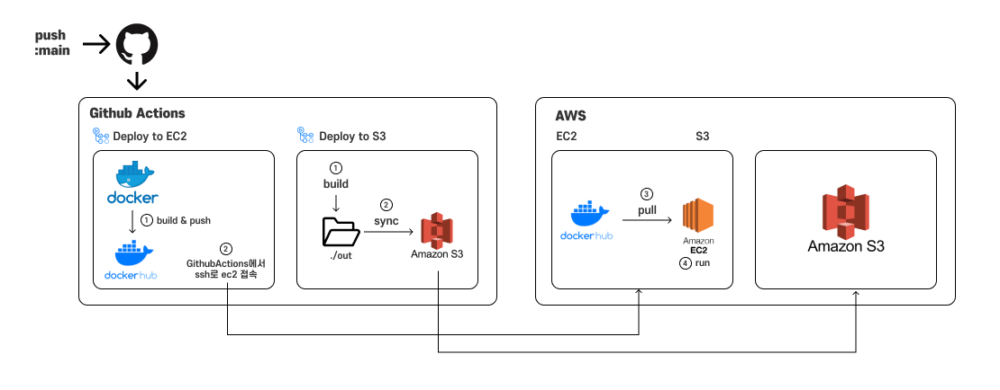

프론트엔드 프로젝트를 위해서 github actions를 사용해서 배포 CI/CD를 구축하고 있었는데 마침 원티드의 프리온보딩 세션에서 배포에 관한 내용을 배웠습니다. 배운 것을 정리하는 겸 제가 정적 배포, 동적 배포 자동화를 만들면서 고민했던 내용들을 기록하려고 합니다.

## CI /CD 란 무엇인가요?

CI(Continuous Integration)는 지속적 통합, CD(Continuous Delivery/Deployment)는 지속적 배포를 의미합니다. 통합은 단순히 물리적인 코드의 통합뿐만 아니라 통합 이후에 코드가 정상적으로 동작하는가에 기준을 두어 코드를 통합합니다. 때문에 물리적인 코드 통합 이후에 코드를 테스트하여 배포 이전에 문제를 발견하게 합니다. CI는 이러한 과정을 자동화한 것을 의미합니다.

CI를 통해서 정상적으로 통합된 코드는 사용자가 사용할 수 있는 형태로 배포됩니다. CD는 실제 product가 사용자에게 전달되는 과정을 자동화합니다.

## 내가 CI/CD 파이프라인을 만들려는 이유

CI/CD를 사용하는 일반적인 이유는 효율이 좋기 때문입니다. 코드의 통합과 배포 하는 과정을 자동화함으로써 통합 및 배포에 들어가는 비용을 다른 코어 개발에 투자할 수 있습니다. 저 역시 배포에 들어가는 시간을 줄이고자 CI/CD 도입하고자 합니다. 

이전에 프로젝트를 진행할 때는 ec2 콘솔로 들어가 git에서 코드를 pull 하고 docker-compose로 빌드하고 실행하는 과정을 직접 해줬습니다. 프로젝트 코드의 양이 많아질수록 빌드 시간도 늘어나고... 도커가 실행되기를 마냥 기다리다가 멈춘 걸 발견하고... 등등 기능 개발에도 모자란 시간을 배포하는데 쪼개서 투자해야 했습니다. 이번 프로젝트에서는 프론트 개발이 저 혼자이고, 최대한 많은 시간을 기능 개발에 투자해야 하기 때문에 CI/CD 도입을 결정하게 되었습니다.

또 이전 프로젝트에서 급하게 머지, 배포하는 과정에서 e2e테스트와 단위 테스트의 필요성을 느꼈습니다. 추후에 nextjs 프로젝트에 테스트 환경까지 세팅하고 나서 CI를 수행하는 workflow를 만들 계획입니다.

CI/CD 파이프라인을 구축하는 플랫폼으로는 Github Actions를 사용하기로 했습니다. 그 이유는
1. 무료 
2. 익숙함  

두 가지 이유가 있습니다. 익숙하기 때문에 따로 배포 자동화를 위해서 학습하는 시간을 줄일 수 있습니다. 때문에 고민없이 github actions를 사용하기로 했습니다. 위에서 말했듯이 기능 개발에 시간을 쏟아야 하기 때문에...

## CD 파이프라인

github actions를 사용해 자동으로 배포하는 과정은 다음과 같습니다.

먼저 main 브랜치에 push가 되면 각각 Deploy to EC2, Deploy to S3 workflow가 실행됩니다.  
* Deploy to EC2 : EC2에 동적 배포를 하기 위해 만든 워크 플로우
* Deploy to S3 : S3에 정적 배포를 하기 위해 만든 워크 플로우  

동적 배포와 정적 배포를 나눈 가장 큰 이유는 이전 프로젝트에서는 나누지 않고 모두 ec2에 올려서 동작하도록 배포했었는데 ec2 인스턴스의 사양이 낮다 보니 힘겨워 하는 게 느껴졌습니다. 그래서 정적 페이지는 빠르게 접근이 가능할 수 있도록 나누었습니다. 동적 배포된 자원과 정적 배포된 자원에 각각 접근할 수 있도록 하려면 cloudFront와 로드밸런서 등등을 설정 하지만 일단은 코드를 배포하는 과정만 기록하려고 합니다.

다시 돌아와서 각각의 워크 플로우는 다음 순서로 동작합니다.

* Deploy to EC2  
    1. 도커 메타 데이터 설정 
    2. 도커 허브 로그인 
    3. 도커 파일 빌드 및 생성된 이미지를 도커 허브에 푸시 
    4. EC2에 SSH 접속
    5. 현재 돌아가고 있는 컨테이너 삭제
    6. 도커 허브에서 다시 이미지 pull 
    7. 새로운 이미지로 컨테이너 실행

S3에 정적 파일들을 배포하는 워크 플로우는 이보다 훨씬 더 간단합니다.

* Deploy to S3  
    1. 정적 빌드 실행 
    2. AWS에서 사용하는 환경 변수 설정 
    3. aws cli를 사용하여 S3에 이전 파일들을 지우고 out 폴더에 있는 내용을 복사

이렇게 동작하는 워크플로우를 생성함으로써 main 브랜치에 푸시하는 것만으로도 배포할 수 있도록 환경을 구성했습니다. 다음 글에서는 aws에서 s3먼저 설정하고 워크 플로우를 작성하는 내용을 다루겠습니다.