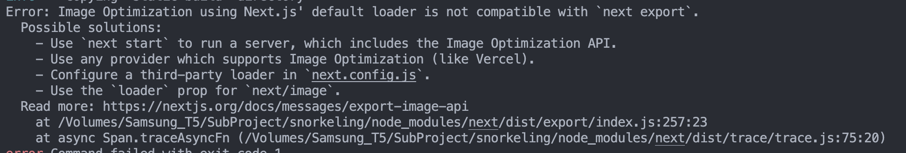
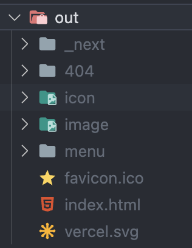
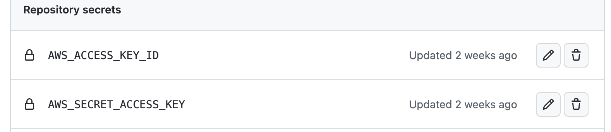

이번 글에서는 정적 배포 파이프라인 구축 과정을 기록하려고 합니다. 이전 글에서도 언급했듯이 정적 배포는 동적 배포에 비해 간단합니다. 빌드 명령어를 수행하고, 빌드 된 결과물을 s3 버킷에 복사해주면 됩니다.

먼저, 정적으로 파일을 생성하기 위해 build 스크립트에 다음 명령어를 추가해줍니다.
```
// package.json

"scripts" :{
    ...,
    "build:ssg" : next build && next export
}
``` 
build 명령어를 통해서 정적 페이지를 생성하고, export 명령어를 통해서 생성된 정적 페이지를 내보냅니다.

기본적으로 next.js에서는 모든 페이지를 pre-rendering 합니다. pre-rendering은 순수 리액트 앱처럼 모든 html 태그 요소를 js에서 생성하는 것이 아니라 사전에 각 페이지에 대해서 정적 html 파일을 생성해 주는 과정을 말합니다.

 pre-rendering을 통해서 생성된 html은 해당 페이지에 필요한 최소한의 js코드와 연결되어 있고, 페이지가 브라우저에서 로드될 때, js 코드가 실행되어 사용자와 상호작용할 수 있는 완전한 페이지를 만듭니다. 이렇게 브라우저에서 html과 작은 js로 완전한 페이지를 만드는 과정을 하이드레이션(hydration)이라고 합니다. 

 next.js에서는 pre-rendering 하는 방법을 다음 두 가지 형태로 제공하고 있습니다.

 1. static generate (SSG, Static Site Generate)
 2. server side rendering (SSR)

 두 방법의 차이점은 정적 파일이 생성되는 시점에 있습니다. 

 SSG를 사용해 pre-rendering 시 빌드 타입에 정적 파일이 생성되고, SSR을 사용해 pre-rendering 할 경우 매 요청마다 정적 파일을 생성합니다. 

 이번에는 두 방법 모두 사용해서 프로젝트를 진행하려고 합니다. 정적 배포에서는 SSG를 사용하고 동적 배포 시에는 SSR을 사용해 하이브리드 형태로 배포합니다. 아직 세부 내용을 정하진 않았지만 스노클링 포인트 상세 페이지 같은 부분에 SSR을 적용할 것 같습니다. 이번 프로젝트는 스노클링 포인트를 큐레이션을 해주는 웹 사이트이기 때문에 사용자 유입이 중요하다고 생각되어 SEO에 신경을 쓸 계획입니다.

 각 방식을 어떻게 사용할지 자세한 내용은 다른 글에서 다루도록 하겠습니다. 

 다시 배포 프로세스로 돌아와서 위의 명령어 실행하고 나면...!

 

 에- 한번에 되는 건 없습니다.
 
 이미지 최적화를 위해 next에서 제공하는 Image 컴포넌트를 사용했는데 이 컴포넌트의 default loader를 next export에서 사용할 수 없기 때문에 에러가 발생하게 되었습니다. 

 친절하게 에러와 함께 출력되어 있는 해결 방법을 통해 문제를 해결해 줍니다. 4가지 문제 해결방법을 제공해 주는데 이 중에서 저희 프로젝트 상황과 맞는 방법을 찾아 프로젝트에 적용합니다.

 1. ~~next start를 사용해서 서버로 돌리기~~ -> 정적 배포를 사용하기 때문에 패스 
 2. ~~vercel 같은 image optimization을 지원하는 프로 바이더 사용하기~~ -> aws s3를 사용하기 때문에 패스 
 3. third-party 로더를 설정하기 
 4. Image 컴포넌트를 위한 loader props 사용하기 

선택지로 3번과 4번이 있지만 남이 잘 만들어 놓은거 쓰기로 했습니다. 3번 당첨.

next.config.js 파일에 다음 설정을 추가해 줍니다. 

```javascript
{
    ...,
    images: {
        loader: 'akamai',
        path: '',
    },
}
```
빌드가 정상적으로 진행되고 이미지 또한 제대로 나오는 것을 확인했습니다. 또한 export 명령어를 통해 output 폴더도 제대로 나온 것을 확인했습니다.

<p align="center">
    
</p>

이제 aws로 가서 [s3 버킷을 설정](https://longtermsad.tistory.com/44)해 줍니다. 먼저 사용할 도메인으로 버킷을 생성해 주고 export로 뽑아낸 결과물들을 업로드해줍니다. 속성 탭에 들어가서 정적 웹 사이트 호스팅 설정을 해줍니다. 버킷 웹 사이트 엔드포인트를 통해 들어가면 우리가 만든 프로젝트 첫 화면에 제대로 나오는 것을 확인할 수 있습니다. 

이제 이 과정을 github actions의 워크 플로우를 통해 자동화해줍니다. 워크 플로우에서 aws cli를 사용하기 위해서는 access key가 필요합니다. aws에 로그인한 김에 IAM에서 access key를 발급 받습니다. 발급받는 방법은 [참고 포스팅](https://lannstark.tistory.com/66)에 나와 있는대로 진행하면 됩니다. 다만 저희는 s3를 사용하기 때문에 기존 정책 직접 연결 부분에서 S3FullAccess 정책을 선택했습니다.

발급받은 access key를 고이 모셔놓고 깃헙 레포의 settings로 가서 action에 사용할 환경 변수로 모셔 놓은 access key와 secret access key를 등록해줍니다.



이제 마지막으로 워크 플로우를 작성해 줍니다. main 브랜치에 푸시 될 때마다 배포가 될 수 있도록 설정해 주었습니다.

```yml

name: Deploy to S3

on:
  workflow_dispatch:
  push:
    branches:
      - main    

jobs:
  build:
    runs-on: ubuntu-18.04
    steps:
      - name: Checkout source code
        uses: actions/checkout@master

      - name: Cache node modules  
        uses: actions/cache@v1
        with:
          path: node_modules
          key: ${{ runner.OS }}-master-build-${{ hashFiles('**/yarn.lock') }}
          restore-keys: |
            ${{ runner.OS }}-build-
            ${{ runner.OS }}-

      - name: Install Dependencies
        run: yarn

      - name: Build
        run: yarn build:ssg

      - name: Deploy to S3
        env:
          AWS_ACCESS_KEY_ID: ${{ secrets.AWS_ACCESS_KEY_ID }}
          AWS_SECRET_ACCESS_KEY: ${{ secrets.AWS_SECRET_ACCESS_KEY }}
          AWS_EC2_METADATA_DISABLED: true

        run: |
          aws s3 sync ./out s3://jeju-diving.site --acl public-read --delete
```
맨 아래에 있는 aws cli 명령어만 살펴보자면 sync는 디렉터리에 있는 파일 전부를 s3에 옮길 때 사용합니다. export로 나온 out 폴더의 내용물을 s3 버킷에 모두 옮깁니다. --acl 옵션을 사용해서 옮긴 객체에 대해서 public-read로 권한을 주고, --delete 옵션을 사용해서 업로드하기 전에 존재하는 모든 객체를 삭제해 줍니다.


이렇게 정적 배포가 자동화 파이프라인 구축이 끝났습니다. 다음 글에선 동적 배포 자동화 파이프라인을 구축하는 과정을 기록하도록 하겠습니다.


 ## Ref.
 - https://nextjs.org/docs/basic-features/pages
 - https://nextjs.org/docs/advanced-features/static-html-export
 - https://nextjs.org/docs/api-reference/next/image#loader
 - https://github.com/vercel/next.js/issues/36431
 - https://stackoverflow.com/questions/65487914/error-image-optimization-using-next-js-default-loader-is-not-compatible-with-n
 https://programming119.tistory.com/235#dcb78305-aa90-441f-8dc1-c9f46c538316
 - https://inpa.tistory.com/entry/AWS-CLI-%F0%9F%93%9A-S3-CLI-%EB%AA%85%EB%A0%B9%EC%96%B4-%EC%A2%85%EB%A5%98-%F0%9F%92%AF-%EC%B4%9D%EC%A0%95%EB%A6%AC