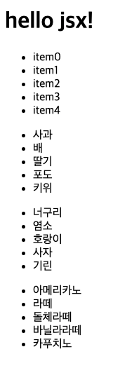

## JSX란 무엇인가요?

jsx는 리액트에서 컴포넌트의 생김새 정의를 위해 사용되는 문법입니다. 하지만 반드시 리액트를 위해서만 사용되는 것은 아닙니다. ([참고](https://www.typescriptlang.org/ko/docs/handbook/jsx.html))

처음 그 형태를 보면 html과 비슷한 생김새를 볼 수 있습니다. 그러나 사실 그 내부는 javascript를 확장해서 만든 것입니다. [babel.io의 try it out](https://babeljs.io/repl#?browsers=defaults%2C%20not%20ie%2011%2C%20not%20ie_mob%2011&build=&builtIns=false&corejs=3.21&spec=false&loose=false&code_lz=DwEwlgbgfAUABHUkp3gx5pwBYFMA2-A9nAFYDOAHogPSawLB3IxP1A&debug=false&forceAllTransforms=false&shippedProposals=false&circleciRepo=&evaluate=false&fileSize=false&timeTravel=false&sourceType=module&lineWrap=true&presets=env%2Creact%2Cstage-2&prettier=false&targets=&version=7.18.7&externalPlugins=&assumptions=%7B%7D)을 통해 jsx를 자바스크립트로 변환 해보면 그 사실을 알 수 있습니다.

```jsx
//jsx
;<div>
  <div>
    <div> hello jsx </div>
  </div>
</div>

// javascript
/*#__PURE__*/
React.createElement(
  "div",
  null,
  /*#__PURE__*/
  React.createElement(
    "div",
    null,
    /*#__PURE__*/
    React.createElement("div", null, " hello jsx ")
  )
)
```

### 바닐라 자바스크립트로 jsx 흉내내기

바닐라 자바스크립트로도 리액트의 createElement와 비슷한 동작을 하는 메서드를 만들 수 있습니다. DOM api를 사용하여 필요한 태그를 만들어 DOM 트리에 추가하는 과정부터 시작합니다.

```jsx
function createElement(tag, props, ...children) {
  // 1. element 생성
  const element = document.createElement(tag)

  // 2. element에 속성 지정
  Object.entries(props || {}).forEach(([key, value]) => {
    element[key.toLowerCase()] = value
  })

  // 3. 자식 element 추가
  children.forEach(child => {
    if (child instanceof Node) {
      element.appendChild(child)
      return
    }

    // 자식이 일반 텍스트일 경우 텍스트 노드로 만들어서 추가
    element.appendChild(document.createTextNode(child))
  })

  return element
}
```

위의 코드를 사용하면 리액트의 컴포넌트와 같이 의미를 갖는 무언가를 만들 수 있습니다.

```jsx
// 제목
const title = () => createElement("h1", null, "hello jsx!")

// 리스트의 아이템
const item = data => createElement("li", null, data)

// 여러 아이템을 갖는 리스트
const countList = () => {
  const items = [...Array(5).keys()].map(v => item(`item${v}`))
  console.log(items)
  return createElement("ul", null, ...items)
}

const root = createElement(
  "div",
  null,
  title(),
  countList() // 의미를 담아서 만든 내용 추가
)

document.getElementById("app").appendChild(root)
```

## JSX는 왜 필요한가요?

리액트 공식 문서에 따르면 jsx를 사용하여 마크업과 로직을 포함하여 관심사를 분리한다고 합니다. 위에서 createElement를 사용하면서 길게 늘어져 있는 html 대신 각각의 의미를 같은 작은 html 조각으로 분리했습니다. 일반 html을 사용했을 경우와 위의 코드를 비교하면 다음과 같습니다.

```jsx
// 일반 html
;<body>
  <div id="app">
    <h1>hello jsx!!</h1>
    <ul>
      <li>item0</li>
      <li>item1</li>
      <li>item2</li>
      <li>item3</li>
      <li>item4</li>
    </ul>
  </div>
</body>

// craateElement 사용
// 제목
const title = () => createElement("h1", null, "hello jsx!")

// 리스트의 아이템
const item = data => createElement("li", null, data)

// 여러 아이템을 갖는 리스트
const countList = () => {
  const items = [...Array(5).keys()].map(v => item(`item${v}`))
  return createElement("ul", null, ...items)
}

const root = createElement(
  "div",
  null,
  title(),
  countList() // 의미를 담아서 만든 내용 추가
)

document.getElementById("app").appendChild(root)
```

겉으로 보기에 createElement를 사용한 코드가 복잡해보이고 길어 보일 수 있지만 여러개의 리스트가 생기는 경우 아래의 코드를 사용하여 html 조각을 만드는 것이 더 편리하다고 느껴질 겁니다. 예를 들어 과일 리스트, 동물 리스트, 커피 리스트를 추가해보도록 하겠습니다. 먼저 평범한 html은 다음과 같이 아래 ul로 감싼 li들을 15개 추가해야 합니다.

```jsx
<body>
  <div id="app">
    <h1>hello jsx!!</h1>
    <ul>
      <li>item0</li>
      <li>item1</li>
      <li>item2</li>
      <li>item3</li>
      <li>item4</li>
    </ul>
    // 과일 리스트
    <ul>
      <li>사과</li>
      <li>배</li>
      <li>딸기</li>
      <li>포도</li>
      <li>키위</li>
    </ul>
    //동물 리스트
    <ul>
      <li>너구리</li>
      <li>염소</li>
      <li>호랑이</li>
      <li>사자</li>
      <li>기린</li>
    </ul>
    //커피리스트
    <ul>
      <li>아메리카노</li>
      <li>라떼</li>
      <li>돌체라떼</li>
      <li>바닐라라떼</li>
      <li>카푸치노</li>
    </ul>
  </div>
</body>
```

매우 귀찮은 작업이 아닐 수 없습니다. 또한 각각의 리스트는 주석으로 통해서 아래 리스트가 어떤 리스트인지 알려주고 있습니다. 이번엔 createElement를 사용하여 똑같이 과일, 동물, 커피 리스트를 추가해 보도록 하겠습니다. 그 전에 listBox() 부분을 인자를 받을 수 있는 함수로 변경하겠습니다.

```jsx
const listBox = datas => {
  const items = [...datas].map(v => item(v))
  return createElement("ul", null, ...items)
}
```

```jsx
const title = () => createElement("h1", null, "hello jsx!")
const item = data => createElement("li", null, data)

const listBox = datas => {
  const items = [...datas].map(v => item(v))
  return createElement("ul", null, ...items)
}

const fruitList = () => {
  const fruits = ["사과", "배", "딸기", "포도", "키위"]
  return listBox(fruits)
}

const animalList = () => {
  const animal = ["너구리", "염소", "호랑이", "사자", "기린"]
  return listBox(animal)
}

const coffeeList = () => {
  const coffee = ["아메리카노", "라떼", "돌체라떼", "바닐라라떼", "카푸치노"]
  return listBox(coffee)
}

const root = createElement(
  "div",
  null,
  title(),
  listBox(["item0", "item1", "item2", "item3", "item4"]),
  fruitsList(),
  animalList(),
  coffeeList()
)

document.getElementById("app").appendChild(root)
```



createElement를 사용한 코드에서는 필요한 데이터외에 추가한 내용이 없습니다. 각 xxxList함수도 listBox에 그냥 인자를 넘겨주어 사용해도 되지만 해당 요소가 어떤 것을 표현하는지 의미를 부여하기 위해 xxxList 함수를 만들었습니다.

이렇게 jsx를 사용하면 길게 늘어져 있는 html 파일로부터 각가의 의미있는 ui요소를 컴포넌트로 분리할 수 있게 함으로써 관심사의 분리를 실천합니다. 또한 의미를 갖는 조각으로 분리함으로써 자바스크립트 코드 안에서 UI과련 작업을 할 때 시각적으로 도움을 줍니다. 그리고 마지막으로 코드의 재사용성으로 높여 유지보수가 쉬운 UI를 만들 수 있습니다.

## JSX는 어떻게 사용하나요?

jsx를 사용하는 방법은 html과 매우 비슷합니다. html과 다른 점은 다음과 같습니다.

- 사용자가 정의한 태그를 사용할 수 있습니다.
  ```jsx
  return <MyComponent>hello</MyComponent>
  ```
- 반드시 하나의 태그로 감싸야 합니다.

  ```jsx
  return (
  	<>
  		<div></div>
  		<div></div>
  	</>
  );

  // 아래의 경우 에러가 발생합니다.
  // Adjacent JSX elements must be wrapped in an enclosing tag
  return (
  		<div></div>
  		<div></div>
  );

  ```

- jsx에서 속성의 이름은 camelCase 표기법으로 따라야 합니다.
  ```jsx
  return (
    <>
      <div className="my"></div>
    </>
  )
  ```

또한 jsx안에서 자바스크립트를 사용할 수 있습니다. 자바스크립트를 사용하기 위해서는 중괄호를 사용해야 합니다.

```jsx
const title = "title"
return (
  <>
    <div> {title} </div>
  </>
)
```

## Ref.

- [https://ko.reactjs.org/docs/introducing-jsx.html](https://ko.reactjs.org/docs/introducing-jsx.html)
- [https://react.vlpt.us/basic/04-jsx.html](https://react.vlpt.us/basic/04-jsx.html)
- [코드숨 - 소프트웨어의 지혜:리액트편](https://www.codesoom.com/)
