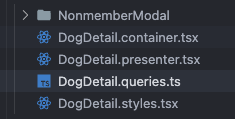
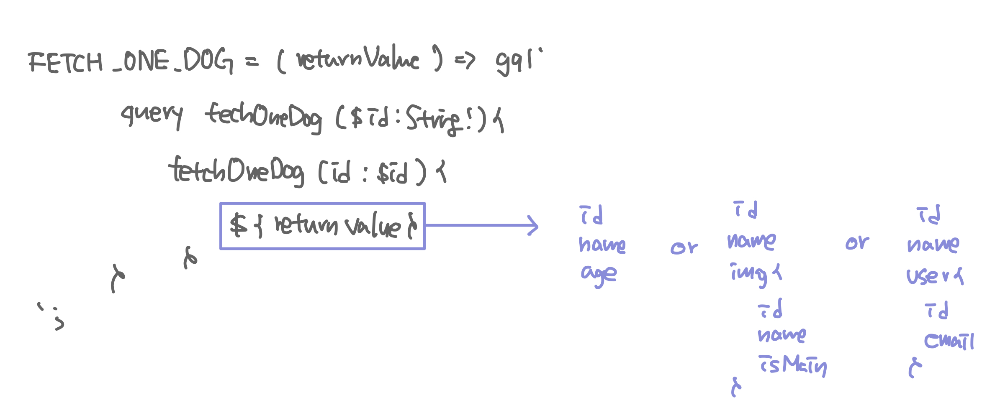
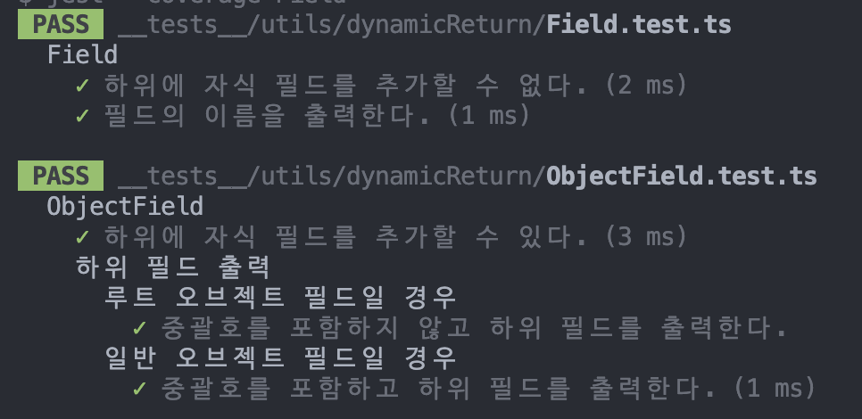

프로젝트에 repository 패턴을 도입하면서 이전 프로젝트에서 graphql을 사용하는 방식도 고칠 필요가 있어 해당 문제를 해결하는 과정을 기록하려고 합니다.

## 이전 방식의 문제점
먼저 저희 프로젝트에서는 graphql을 사용하고 있기 때문에 서버와 요청하기 위해서는 graphql 쿼리문을 선언하고 apollo client를 사용해서 통신해야 했습니다. 이전 프로젝트에서 graphql 쿼리문을 사용했던 방식은 다음과 같습니다. 

<br/>



<br/>

```ts
export const CREATE_LIKE = gql`
  mutation createLike($createLikeInput: createLikeInput!) {
    createLike(createLikeInput: $createLikeInput) {
      isMatch
      sendId
      receiveId
    }
  }
`;
```

먼저 하나의 페이지와 관련된 컴포넌트를 모아놓은 폴더에 queries.ts 폴더를 추가하고 해당 페이지에서 사용할 쿼리를 위의 코드처럼 상수로 선언에서 사용하는 방식이었습니다. 같은 요청이지만 받을 데이터와 사용하고자 하는 위치가 n개일 경우 n번 선언해서 사용하는 방식이었습니다. 이러한 방식은 여러 문제점이 있었습니다. 예를 들면 아래와 같은 상수가 각각 다른 파일에 선언된 경우 문제가 발생했습니다.

```ts
// 1 : 강아지 상세 페이지에서 사용되는 쿼리
export const FETCH_ONE_DOG = gql`
  query fetchOneDog($id: String!) {
    fetchOneDog(id: $id) {
      id
      name
      age
      gender
      isNeut
      description
      interests {
        id
        interest
      }
      characters {
        id
        character
      }
      img {
        id
        img
        isMain
      }
      user {
        id
      }
    }
  }
`;

// 2 : 채팅에서 사용되는 쿼리
export const FETCH_ONE_DOG = gql`
  query fetchOneDog($id: String!) {
    fetchOneDog(id: $id) {
      id
      name
      age
      img {
        id
        img
        isMain
      }
      user {
        id
      }
    }
  }
`;
```

같은 이름을 사용해서 잘못 import 하는 경우가 빈번했고 이름을 다르게 선언한다고 해도 이름은 생각하는 데도 한계가 있을 것으로 판단되었습니다. 위의 코드는 중복 사용, 가독성, 유지 보수 측면에서 더 나은 구조를 찾아야 할 필요가 있다고 생각했습니다. 따라서 코드에서 공통인 부분은 놔두고 변하는 부분만 사용자로부터 받아서 최종적으로 쿼리문을 만들 수 있도록 하는 방식으로 개선하기로 했습니다.

<br/>

## 문제 해결 과정
제가 원하는 방식의 최종 형태는 다음과 같습니다. 리턴으로 받을 수 있는 객체의 필드중에서 원하는 필드만 기록한 returnValue를 넘겨 받으면 그 부분을 쿼리와 결합하고 쿼리문을 리턴해 주는 메서드를 하나 만드는 것입니다. 

<br/>



<br/>

이를 위해서 먼저 테스트 한 것은 gql 안에 string 변수를 사용할 수 있는가? 였습니다. 간단하게 stirng 변수를 선언하고 gql 안에 넣었을 때 정상적으로 동작하는지 확인했습니다. 확인결과 정상적으로 동작!

<br/>

string 값을 그냥 사용할 수 있기 때문에 returnValue의 타입을 string으로 잡고 아래와 같은 방법으로 사용할까 싶었지만 제가 원하는 것은 returnValue에 포함되는 값이 반드시 받을 수 있는 필드 중에 있는 값이어야 한다는 것이었습니다. 이전 프로젝트에서 gql에서 return으로 받는 필드의 이름에 오타가 있어서 문제를 일으킨 적이 있었습니다. 또한 서버에서 스키마의 필드명을 변경한 경우 사용한 부분을 모두 찾아 일일이 고쳐줘야 했습니다. 이러한 문제를 방지하기 위해 returnValue에 포함되는 값에 제약을 걸어 구현하고자 했습니다. 또한 받을 수 있는 값의 형태는 일반 필드 값도 있지만 위의 그림에서 img 같이 객체인 형태의 필드 값도 있기 때문에 이러한 형태를 표현할 수 있도록 구현하고자 했습니다. 요구사항을 정리하면 다음과 같습니다.

<br/>

1. 받을 수 있는 값의 형태는 객체 형태도 가능해야 한다. 
2. returnValue에 포함되는 값이 받드시 받을 수 있는 필드 중에 있는 값이어야 한다. 

<br/>

먼저 어떻게 하면 객체 형태도 받아서 string으로 변환할 수 있을까를 고민했습니다. 어떻게 구현할까 굉장히 많이 고민한 것 같습니다. 처음에는 자바스크립트 객체로 어떻게 해볼까 하다가.... 배열을 사용해서 어떻게 해볼까... 등등 많이 생각하다가 이전에 디자인 패턴 책에서 봤던 composite 패턴으로 디렉터리-파일 구조를 표현했던 것이 생각났습니다.

<br/>

composite 패턴은 단일 객체와 복합 객체를 구분하지 않고 모두 동일한 인터페이스로 다룰 수 있기 때문에 일반 문자열 형태의 필드와 객체 형태의 필드를 동일하게 사용해야 하는 현재 요구사항에 적합하다고 생각했습니다. 이렇게 해서 1번 요구사항에 대한 해결책을 찾았고 2번 요구사항에 대한 해결책으로는 이전에 타입스크립트를 공부하면서 배웠던 `keyOf`를 사용해서 해결하는 방향으로  생각하고 구현했습니다.

<br/>

## 구현 
먼저 composite 패턴을 적용하여 구조가 되는 클래스들을 만들어 줬습니다. composite 패턴의 구성요소를 프로젝트에서는 각각 다음과 같이 정의했습니다. 

* Component -> Entry
* Leaf -> Field 
* Composite -> ObjectField

```ts
export default abstract class Entry<T> {
  abstract readonly name: keyof T | string;

  add(entry: Entry<T>) {
    throw new Error('필드에 하위요소를 추가할 수 없습니다.');
  }

  abstract toQuery(): string;
}
```
 
디자인 패턴에 있는 대로 먼저 필드와 객체 피드를 동일시할 수 있도록 하는 Entry 추상 클래스를 생성했습니다. name은 스키마의 필드 값만 사용할 수 있도록 keyof를 사용해서 제약을 걸었습니다. 또 맨 처음에 루트 객체를 만들 때는 중괄호가 필요 없기 때문에 이를 구분해 주기 위해서 string 값을 받을 수 있도록 했는데 이제 보니까 string 보다는 '' 리터럴 타입을 사용해야 할 것 같습니다.

다음으로는 Field 클래스를 구현합니다. Field 클래스는 단순히 스키마의 필드 값만 받을 수 있기 때문에 생성자로 제네릭 타입의 key만 받을 수 있도록 구현했습니다.

```ts
import Entry from './Entry';

export default class Field<T> extends Entry<T> {
  name: keyof T;

  constructor(name: keyof T) {
    super();
    this.name = name;
  }

  toQuery() {
    return String(this.name);
  }
}
```

마지막으로 그릇 역할을 하는 ObjectField 클래스를 구현합니다. ObjectField 클래스는 일반 필드 값도 담을 수 있어야 하고 전체 형태를 grapql 쿼리에 맞는 형태의 문자열로 변환하는 작업도 해야 하기 때문에 구현할 내용이 앞선 클래스보다 많습니다. 

```ts
import Entry from './Entry';

export default class ObjectField<T> extends Entry<T> {
  private childFields: Entry<T>[] = [];

  name: keyof T | string;

  constructor(name: keyof T | string = '') {
    super();
    this.name = name;
  }

  add(field: Entry<T>) {
    this.childFields.push(field);
    return this;
  }

  toQuery(): string {
    if (this.name === '') {
      return `${this.childFields.map(field => field.toQuery()).join('\n')}`;
    }

    return `${String(this.name)} {
            ${this.childFields.map(type => type.toQuery()).join('\n')}
        }`;
  }
}
```

먼저 객체 형태의 필드이기 때문에 하위에 자식 필드를 담아서 저장할 수 있도록 childFields 배열을 선언해 줍니다. 생성자로는 필드 값에 해당하는 key와 빈 문자열을 받을 수 있는데 이는 루트 객체와 객체 형태인 필드를 구분하기 위해서 이렇게 구현했습니다. 그리고 add 메서드를 오버라이딩 하여 하위 필드를 childFields 배열에 추가할 수 있도록 구현합니다. 마지막으로 gql 내부에서 사용할 수 있는 문자열로 변환할 수 있도록 하기 위해 toQuery 메서드를 구현합니다. 이때 생성자로 받은 값을 사용해서 분기 처리를 하는데 빈 문자열을 받은 경우 루트 객체이기 때문에 중괄호를 포함하지 않고 자식 필드들의 값을 가져와 문자열을 만듭니다. 빈 문자열이 아닌 경우에는 위 그림에서 img와 같이 이름이 있는 객체 형태 필드이기 때문에 이름을 출력하고 중괄호를 감싼 다음 자식 필드들의 값을 가져와 문자열을 만듭니다. 

## 적용
실제 코드에 적용하기 앞서 제가 원하는 대로 동작하는 지 테스트 코드를 작성해 확인했습니다. 굿👍🏻



실제 코드에선 다음과 같이 적용하여 사용했습니다. 

```ts
 async createUser(createUserInput: ICreateUserInput): Promise<string> {
    const result = await this.httpClient.mutation<
      Pick<IMutation, 'createUser'>
    >(
      MUTATION.createUserMutation(
        new ObjectField<IUser>()
			.add(new Field('id'))
			.toQuery(),
      ),
      { createUserInput },
    );

    if (!result?.createUser.id)
      throw Error(ERROR_MESSAGE.AUTH.FAIL_REGISTER_USER);

    return result.createUser.id;
  }

// network/query/auth.ts

import { gql } from 'graphql-request';

export const MUTATION = {
  createUserMutation: (returnValue: string) =>
    gql`
    mutation createUser($createUserInput : CreateUserInput!){
        createUser(createUserInput : $createUserInput){
            ${returnValue}
        }
    }
  `,

  verifyMailToken: gql`
    mutation verifyMailToken($email: String!, $code: String!) {
      verifyMailToken(email: $email, code: $code)
    }
  `,

  createMailToken: gql`
    mutation createMailToken($email: String!, $type: String!) {
      createMailToken(email: $email, type: $type)
    }
  `,
};
```

이렇게 하여 graphql 쿼리를 한 곳에서만 관리할 수 있도록 하는 기능을 구현하였습니다. 이전보다 관리해야 하는 포인트가 줄어들었고 코드의 재사용성이 증가했습니다.

일반 Field에 자식을 추가하려고 하면 런타임에 에러가 발생한다는 점, 그리고 재귀적으로 수행되기 때문에 성능상의 고민이 필요하다. 이렇게까지 해야하나 등등 아쉬운 점이 있습니다. 그러나 주어진 문제를 해결하고 배운 것을 실제 프로젝트에 적용해보았다는 점에서 큰 성취감을 느낄 수 있었습니다.


