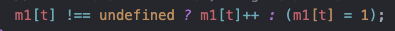
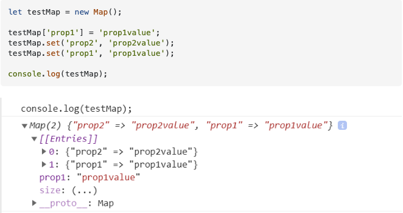

알고리즘 문제를 풀다 map에 대해서 이상한 동작을 발견했습니다. 분명 map 안에는 해당 키값이 있는데 map.delete(key)는 false 값을 리턴하는 것이었습니다.

항상 map 을 사용할 때 (~~사실 주로 그냥 object 사용함.~~) bracket notation을 사용했는데 다음과 같이 사용할 경우 map의 자료구조를 사용하는 것이 아니라 객체의 값으로서 사용하는 것이기 때문에 발생하는 문제였습니다.

위와 같이 bracket notation을 사용하게 되면 map 객체는 다음과 같은 형태가 됩니다. bracket을 사용한 prop1은 map 객체의 프로퍼티로서 들어가게 되고, map의 set 메서드를 사용한 prop1과 prop2는 map 자료구조의 데이터로 들어가게 됩니다.

코틀린에서는 map에 데이터를 넣을 때 put(), bracket 모두 같은 동작을 하기 때문에 자바스크립트에서도 bracket을 사용하더라도 자바스크립트에서 map의 데이터로 알아서 변환해서 넣어주는 줄 알았는데 아니었습니다. 두 개의 언어를 사용해서 문제를 풀다 보니 이런 문제가 발생한 것 같습니다.

### Ref.

- https://stackoverflow.com/questions/66663133/why-does-map-has-return-false-for-an-integer-key-that-does-exist
