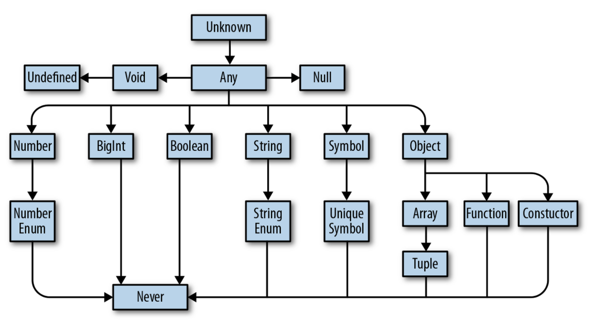

 * Top 타입 Bottom  타입 
	* top 타입 : 시스템에서 가능한 모든 값을 나타내는 타입 -> any, unknown
		* any : 모든 타입의 위치에 제공될 수 있음. top 타입 처럼 작동 
			* 타입스크립트가 해당 값에 대한 할당 가능성 또는 멤버에 대해 타입 검사를 수행하지 않도록 명시적으로 지시한다는 문제점이 있음. -> 안정성 부족
		* unknown : any보다 안전 -> any 대신 unknown을 사용할 것.
			* 어떤 값이든 될 수 있음을 나타냄.
			* 타입스크립트에서 진정한 top type 
			* unknown 타입의 값이 훨씬 더 제한적으로 취급한다는 점에서 any와 차이가 있음.
				* 타입스크립트는 unknown 타입 값의 속성에 직접 접근할 수 없음. -> instance of 난 typeof 또는 타입 어서션을 사용하는 것처럼 타입이 narrow를 한 경우 속성에 접근할 수 있음
				* unknown 타입은 top 타입이 아닌 타입에는 할당할 수 없음. -> ??
	* bottom 타입 : 값을 가질 수 없고 참조할 수 없는 타입 -> never




* 타입 서술어 : type predicate (= 사용자 정의 타입 가드)
	* typescript-exercises 4번 문제
	* 인수가 특정 타입인지 여부를 나타내기 위해 boolean 값을 반환하는 함수를 위한 구문
	* 타입 서술어는 단순히 boolean 값을 반환하는 것이 아니라 인수가 더 구체적인 타입임을 나타내는 것
	* 더 구체적인 인터페이스의 인스턴스인지 여부를 검사하는 데 자주 사용됨.
	* false 조건에서 의도치 않게 동작할 수 있기 때문에 간단하게 사용하는 것이 좋다.
		* 타입 서술어는 속성이나 값의 타입을 확인하는 것  이상을 수행해 잘 못 사용하기 쉬우므로 가능하면 피하는 것이 좋다.

		```ts
		// 매개변수의 이름 is 키워드, 특정 타입
		function typePredicate(input : WideType) : input is NarrowType
		```

* 타입 연산자 : keyof, typeof
	* keyof : 기존에 존재하는 타입을 사용하고, 해당 타입에 허용되는 모든 키의 조합을 반환하는 연산자. 
		* 인터페이스, 타입과 같이 구체적인 값을 갖지 않는 요소가 옴

		```ts
		interface Ratings{
			audience : number;
			critics : number;
		}

		function getRating(ratings : Ratings , key : keyof Ratings) : number {...}
		== 
		function getRating(ratings : Ratings , key : audience | critics) : number {...}	
		```

	* typeof : 제공되는 ⭐️값⭐️의 타입을 반환하는 연산자
		* 뒤에 구체적인 값이 오는 요소가 옴.
		* 자바스크립트의 typeof 연산자 : 타입에 대한 문자열 이름을 반환하는 런타임 연산자.
		* 타입스크립트의 typeof 연산자 : 타입스크립트에서만 사용할 수 있음. 컴파일된 자바스크립트 코드에서는 나타나지 않음
				
		```ts
		interface Ratings{
			audience : number;
			critics : number;
		}

		const test = {
			hello : 'hello',
			rating : 0
		}

		// keyof test (x)
		type TestKey = keyof typeof test

		// typeof Ratings (x)
		type keys = keyof Ratings
		```

* Type assertion (타입 어서션 = 타입 캐스트)
	* 값의 타입에 대한 타입 시스템의 이해를 재정의 하기 위한 구문
	* 타입 어서션은 타입스크립트 타입 시스템에마 존재하며 자바스크립트로 컴파일될 때 다른 타입 시스템 구문과 함께 제거된다.
	* 타입 스크립트 모범 사례는 가능한 한 타입 어서션을 사용하지 않는 것.
	* as 를 사용해서 강제로 형 변환을 하는 것 보다 instanceof 검사와 같은 type narrowing을 사용하는 것이 안전하다.
	* non-null 어서션 (!)
		* 코틀린의 !!와 비슷한 기능
		* 타입이 null 또는 undefined가 아니라고 간주함.
	* 변수의 타입 애너테이션과 초깃값이 모두 있을 때, 타입스크립트의 타입 검사기는 변수의 타입 애너테이션에 대한 변수의 초깃값에 대해 할당 가능성 검사를 수행함. 그러나 타입 어서션은 타입스크립트에 타입 검사 중 일부를 건너뛰도록 명시적으로 지시한다.

* const 어서션
	* as const 
	* 배열, 원시 타입, 값, 별칭 등 모든 값을 상수로 취급해야 함을 나타내는 데 사용함.
	* as const는 수신하는 모든 타입에 다음 규칙을 적용함.
		* 배열은 가변 배열이 아니라 읽기 전용 튜플로 취급된다.
		* 리터럴은 일반적인 원시 타입과 동등하지 않고 리터럴로 취급된다.
		* 객체의 속성은 읽기 전용으로 간주된다.
	* as const를 사용해 값 리터럴을 어서션하면 유추된 타입이 가능한 한 구체적으로 전환된다. 
		* 모든 멤버 속성은 readonly가 됨.
		* 리터럴은 일반적인 원시 타입 대신 고유한 리터럴 타입으로 간주됨.
		* 배열은 읽기 전용 튜플이 됨.