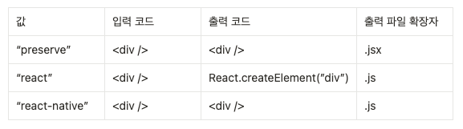

 * tscofig 파일 
	* 대부분의 구성 옵션을 디렉터리의 tsconfig.json 파일에 구체적으로 명시할 수 있다.
	* tsconfig.json의 존재는 해당 디렉터리가 타입 스크립트 프로젝트의 루트임을 나타낸다.
	* tsc --init 명령어로 해당 프로젝트에 tsconfig.json 생성
	* cli와 tsconfig 파일에서 사용 가능한 대부분의 옵션은 다음 두 가지 범주중 하나로 분류된다
		* 컴파일러 : 포함된 각 파일이 타입스크립트에 따라 컴파일되거나 타입을 확인하는 방법
		* 파일 : 타입스크립트가 실행될 파일과 실행되지 않을 파일

* 파일 관련 
	* include 
		* 타입 스크립트 컴파일에 포함할 디렉터리와 파일을 설명하는 문자열 배열 명시 
	* exclude
		* include에 포함된 요소 중 타입 스크립트 컴파일에서 제외할 디렉터리와 파일을 설명하는 문자열 배열 명시
		* 비록 컴파일 하려는 파일이 exclude 목록에 명시적으로 나열되어 있더라도 파일에 따라 ts가 컴파일 할 수도 있음.
		* 코드 베이스에서 제외하는 것이 아니라 include 설정에서 제외하는 것일 뿐...

* 컴파일 관련 옵션
	* jsx 
		* 타입 스크립트는 기본적으로 확장자가 .ts.인 모든 파일을 읽을 수 있음.
		* jsx 처럼 확장자가 다른 파일도 읽을 수 있어야 함.
		* 타입 스크립트에서 jsx 사용하기 위해서 
			1. tsconfig에서 `jsx` 컴파일 옵션을 활성화 해야함.
			2. .tsx 활장자로 파일의 이름을 지정
		* jsx 컴파일 옵션 : .tsx 파일에 대한 자바스크립트 코드를 내보내는 방법

		

		* .tsx 파일의 제네릭 화살표 함수 
			* 제네릭 화살표 함수 구문이 jsx 구문과 충돌함.
			* 구문 모호성을 해결하기 위해 타임 인수에 =unknown 제약 조건을 추가

			```ts
			const identity = <T = unknown>(input : T) => input
			```

	* resolveJsonModule 
		* 이 옵션을 true로 설정하면 .json 파일을 읽을 수 있음.
		* .json 파일을 마치 객체를 내보내는 .ts 파일인 것처럼 가져올 수 있음.
	* target 
		* 타입스크립트는 es3(1999)와 같은 오래된 환경에서 실행할 수 있는 자바스크립트 출력 파일을 생성할 수 있음.
		* 타입스크립트는 자바스크립트 코드 구문을 지원하기 위해 어느 버전까지 변환해야 하는지를 지정하는 target 옵션을 제공함.
	* declaration  : 소스 파일에서 .d.ts 출력 파일을 내보내는 옵션 
	* emitDeclarationOnly : 타입스크립트가 .js .jsx 파일 없이 선언 파일만 내보내도록 지시하는 옵션
	* noEmit : 타입스크립트가 타입 검사기로만 작동하도록 하는 옵션

* 타입 검사기 제어 옵션
	* lib 
		* 브라우저 타입 포함을 나타내는 dom과 target 컴파일러 옵션을 기본값으로 하는 문자열 배열을 사용
		* lib 설정을 변경하는 유일한 이유는 브라우저에서 실행되지 않는 프로젝트에서 기본으로 포함되는 dom을 제거하기 위함.
	* 엄격 모드 
		* 기본적으로 false 값을 가짐. true로 변경할 경우 타입 검사기에 일부 추가적인 검사를 켜도록 지시
		* noImplictAny : 암시적으로 any로 대체될 때 타입스크립트에 타입 검사 오류가 발생하도록 지시
		* strictBindCallApply : apply, bind, call 함수 유틸리티를 나타내는 타입을 사용하도록 함. (이전에는 함수의 매개변수 및 반환 타입이 모두 any로 표현됨.)
		* strictFunctionType : 
			* 함수 매개변수 타입을 엄격하게 검사함. 하위 타입 허용하지 않음. 
			* 매개변수의 타입이 string | undefined 일때 string 타입의 인자를 허용하지 않음. 반드시 string | undefined 여야 함.
		* strictNullChecks 
			* 이 옵션을 비활성화할 경우 코드의 모든 타입에 null | undefined가 추가됨. -> 모든 변수가 null 또는 undefined를 받을 수 있도록 허용함.
			* 타입스크립트 모범 사례는 이 옵션을 활성화 하는 것
		* strictPropertyInitialization : 이 옵션을 활성화 하면 초기화가 없고, 생성자에 확실하게 할당되지 않은 클래스 속성에서 타입 오류를 발생시킴
		* useUnknownInCatchVariables : 기본 catch 절의 error 타입을 unknown으로 변경함.

* 모듈 관련 옵션
	* module : 어떤 모듈 시스템으로 변환된 코드를 사용할지 결정하는 옵션
	* moduleResolution 
		* moduleResolution  = import에서 가져온 경로가 module에 매핑되는 과정
		* 타입스크립트는 해당 과정에 로직을 지정하는 데 사용할 수 있는 moduleResolution 옵션을 제공함 
			* node : 기존 nodejs와 같은 CommonJS 리졸버에서 사용하는 동작
			* nodenext : ECMA 스크립트 모듈에 대해 지정된 동작에 맞게 조정
	* CommonJS와 상호 운용성
		* 모듈 형식 간의 상호 운용성을 개선하기 위해 몇가지 컴파일러 옵션 제공
		* esModuleInterop 
			* module이 ECMA 스크립트 모듈 형식이 아닌 경우 타입스크립트에서 내보낸 자바스크립트 코드에 소량의 로직을 추가
			* 추가되는 로직 = ECMA 스크립트 모듈이 기본 또는 네임스페이스 가져오기에 대한 ECMA 스크립트 모둘의 규칙을 준수하지 않는 경우에도 모듈에서 가져올 수 있도록 함

* 다른 트랜스파일러와 같이 사용할 때 필요한 옵션 
	* isolatedModules 
		* 타입 정보에 의존하며 자바스크립트를 내보내는 타입스크립트 구문 기능은 바벨 같은 트랜스파일러에서는 지원되지 않음.
		* 프로젝트에서 타입스크립트가 아닌 다른 도구를 사용해 자바스크립트로 변환하는 경우에 이 옵션을 활성화 하는 것이 좋음

* 자바스크립트 관련 옵션 
	* allowJs : 자바스크립트 파일에 선언된 구문을 타입스크립트 파일에서 타입 검사 하도록 허용하는 옵션
	* checkJs 
		* 타입스크립트가 자바스크립트 파일을 타입스크립트 관련 구문이 없는 타입스크립트 파일인 것처럼 처리 -> .js, .jsx 에서 타입 검사기 활성화
		* @ts-check 주석으로 파일별로 checkJs 옵션을 활성화할 수 있음.                     

* 확장 
	* extends 
		* 이 옵션을 사용해서 다른 tsconfig 파일을 확장할 수 있음
		* 파생된 tscofig에서 특정 옵션을 재정의하지 않는 한 기본 tsconfig의 옵션이 그대로 복사됨.
		* @tsconfig/recommended와 같이 미리 만들어진 베이스 tsconfig 파일을 extends 할 수 있음.