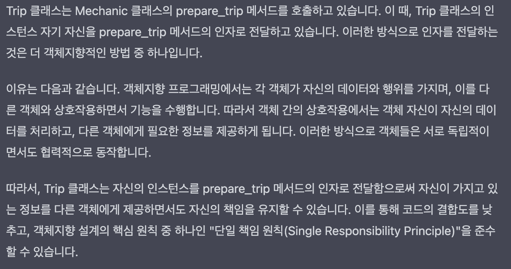

* 애플리케이션은 클래스로 구성되어 있지만 메시지를 통해 정의된다.
* 애플리케이션의 움직임을 반영하는 것은 메시지이며 이 메시지가 애플리케이션을 살아 움직이게 한다. 
* 그렇기 때문에 디자인은 객체 사이를 가로지르는 메시지에 관심을 두어야 한다.
	* 객체가 무엇을 아는지(객체의 책임)와 누구를 알고 있는지(객체의 의존성)뿐만 아니라 어떻게 소통하는지 알아야 한다. 
* 객체 사이의 소통은 인터페이스로 이루어진다. 

## 인터페이스 이해 
* 인터페이스 = 객체들 사이의 소통 수단
* 밖으로 노출하는 인터페이스가 많을 수록(주변 객체에 드러내는 것이 많을 수록)재사용하기 어려운 클래스가 만들어진다. 
* 인터페이스의 종류
	* 클래스 내부에 있는 인터페이스 - 퍼블릭 인터페이스 (클래스 밖으로 노출된 메서드)
	* 메시지의 묶음. 메시지 자체가 인터페이스를 정의한다.

## 인터페이스 정의
* 퍼블릭 메서드와 프라이빗
	* 퍼블릭과 프라이빗의 구분은 일을 가장 효율적으로 처리하기 위해 존재한다. 
	* 퍼블릭 : 식당에서 메뉴판과 같은 역할을 함
		* 클래스의 핵심 책임을 드러낸다.
			* 클래스의 퍼블릭 인터페이스를 클래스의 책임에 대한 설명처럼 읽을 수 있다. 
		* 다른 객체에 의해 호출될 수 있다.
		* 쉽게 변경되지 않는다.
		* 다른 객체가 안정적으로 의존할 수 있다.
		* 테스트를 통해 꼼꼼하게 문서화 되어 있다.
	* 프라이빗 : 자잘한 내부 구현에 관여
		* 세부적인 구현을 담당한다.
		* 다른 객체에 의해 호출되지 않는다.
		* 필요에 따라 언제든 변경할 수 있다. 
		* 다른 객체가 의존하기에는 위험이 있다.
		* 테스트에서 다루지 않을 수도 있다. 
* 클래스를 퍼블릭한 부분과 프라이빗한 부분으로 구분하면 자신보다 덜 변화하는 것에 의존해야 한다는 생각은 클래스 내부에도 적용된다.

## 퍼블릭 인터페이스 찾기
* 좋은 퍼블릭 인터페이스는 예상치 못했던 변화에 따라오는 비용을 줄여주는 반면 안 좋은 퍼블릭 인터페이스는 그 비용을 증대시킨다.
* 퍼블릭 인터페이스를 찾는 단계 
	* 유스케이스에서 도메인 객체 추출
		* 도메인 객체를 찾아내기에는 매우 쉽지만 이들이 애플리케이션의 핵심을 차지하지 않는다. 
		* 도메인 객체가 아니라 도메인 객체들이 주고 받는 메시지에 주목한다.
	* 시퀀스 다이어그램을 활용하여 의도 구상하기
		* 유스케이스를 만족시켜 줄 수 있는 객체들 그리고 메시지들의 의도를 구상할 필요가 있다.
		* 시퀀스 다이어그램
			* 객체들의 배치와 메시지 전송 전략에 대해 검토해볼 수 있는 간단한 방법 제공
			* 객체들이 주고 받는 메시지를 명시적으로 들어낸다. 
			* 다이어그램을 보고 '이 수신자가 이 메시지에 반응할 책임을 가지고 있는 것이 맞을까?'라는 질문을 던져봐야 함.
			* 
	* 어떻게(HOW) 해야 하는지 말해주지 말고, 어떤 것(WHAT)을 달라고 요구하기
		* 송신자가 원하는 것을 요구하는 메시지 (what)
		* 수신자가 어떻게 행동해야 하는지 알려주는 메시지 (how)
		* 이 두 종류의 메시지 사이의 차이를 이해하는 것 -> 잘 정의된 퍼블릭 인터페이스를 가진, 재사용이 가능한 클래스를 만들기 위한 핵심 포인트
	* 주어진 맥락에서 독립적일 수 있게 하기 

		

		* 복잡한 맥락 속에 위치한 객체는 사용하기도 어렵고, 테스트 하기도 어렵다.
		* 의존성 주입 : 누구인지 모르는 객체와 협업하는 방법
		* 83p 그림 4.7
			* 클래스 A의 내부에서 클래스 B의 메서드를 호출하는데 인자로 자기 자신을 넘김
				* 클래스 A에 내부에 프로퍼티로 갖고 있는 데이터만 넘겨줄 수 있지만 그럴 경우 객체의 캡슐화를 위반할 가능성이 있음.

				
				
* 메시지 기반의 디자인 관점은 클래스 기반의 관점보다 훨씬 유연한 애플리케이션을 만들 수 있게 해준다. 
	* **메시지를 전송해야 하는데 누구에게 전송해야 하지?**
	* 어떤 메시지를 어떤 객체에게 전송하느냐 고민하면서 애플리케이션에 필요한 클래스를 찾는다. 

## 명시적인 인터페이스 만들기
* 일반적인 의미, 엄밀하고 명시적으로 규정되어 있어야 한다.
* 어떻게보다는 어떤 것에 대해 말해야 한다.
* 예측할 수 있는 한도에서나마 바뀌지 않을 이름을 지어야 한다.
* 추가적인 인자는 해시로 받아라.

## 데메테르의 원칙
* 객체들의 결합도를 낮추면서 코딩할 수 있도록 해주는 규칙
* 메시지를 전달받은 객체가 바로 이어 **다른 타입의 객체**애개 메시지를 전달하는 것을 금지한다.
* 고장난 기차 모양
	* 메시지 연쇄의 한 부분이 변경하면 나머지 부분도 변경해야 하는 위험성이 높아짐.
	* 어딘가에 퍼블릭 인터페이스가 없는 객체가 있다고 말해준다. -> 우리의 관점을 다시 검토하게 함.
	* 메시지 기반의 관점을 취하면 새로운 메시지를 발견할 수 있고 이 메시지가 곧 퍼블릭 인터페이스가 된다.  