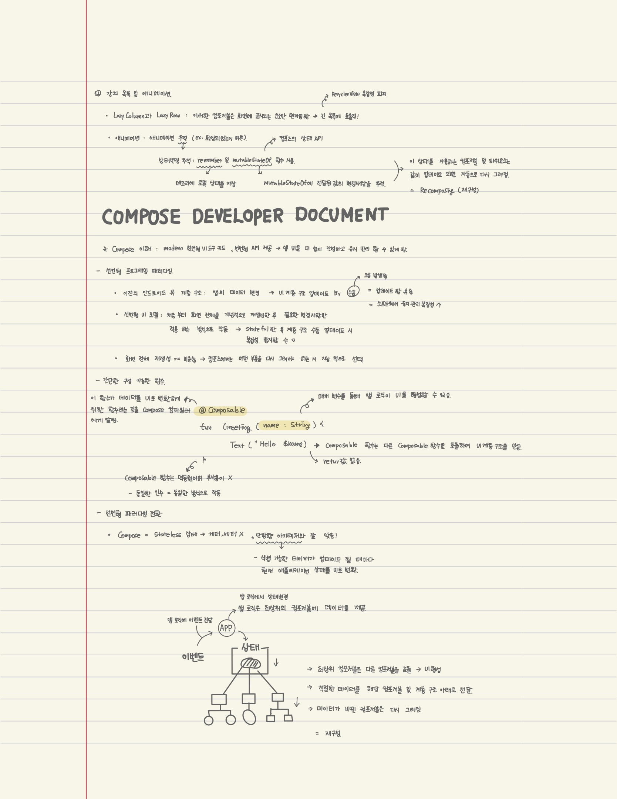
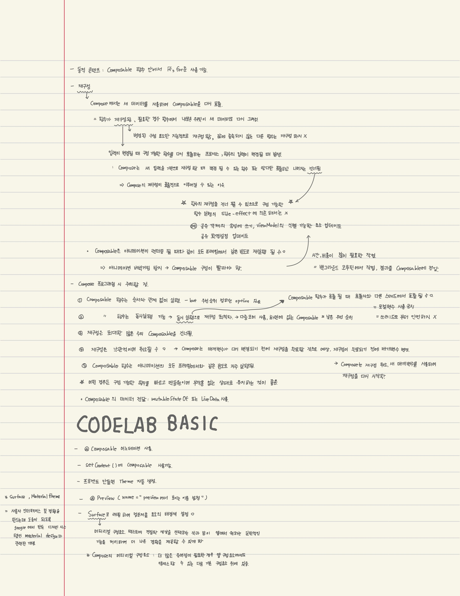

## Facts

* 백트래킹 알고리즘 문제를 풀었습니다.
  * 백준 - nQueen, 알파벳, 암호 만들기 문제 풀이를 포스팅 했습니다.

* 안드로이드 jetpack compose 스터디를 시작했습니다. 
  * 관련 아티클과 영상을 보고 코드랩을 진행했습니다.
  * step7까지 진행했습니다.

* 도서 리뷰앱 구현을 마쳤습니다. 

## Feelings

* 요즘 밤에 너무 피곤한 관계로 전날 TIL을 다음날 아침에 쓰고 있습니다. 다음날에 적으려고 하니 공부한 것 공부하면서 느낀 것이 잘 생각나지 않습니다. 그래서 TIL을 대충 작성하게 되는 것 같습니다. 좀 늦게 자더라도 그날 TIL은 그날 작성하도록 해야겠습니다.

* 안드로이드 jetpack 컴포즈 스터디를 진행했습니다. 안드로이드에서 제공하는 튜토리얼을 따라 스터디를 진행합니다. 끝까지 공부해서 이쁜 맨투맨 받고 싶습니다.ㅋㅋㅋㅋㅋ 컵 포즈에 대해 학습하면서 리액트가 계속 생각났습니다. 상태를 따라 변경되는 패러다임을 보니 리액트와 비슷한 것 같습니다. ui 적으로 구조화하는 부분은 아직 감이 덜 잡혀서 헤매지만 상태 변경이나 어떻게 사용해야 하는지에 대해서는 감이 오는 것 같습니다. 리액트와 아주 비슷합니다. 컴포즈 스터디를 진행하면서 리액트에서 어떻게 프로그래밍 했는지 생각하고 비교해야겠습니다. 내일은 컴포즈 베이직 코드랩 남은 부분을 진행하고 리액트 프로젝트 했던 것을 복습해 봐야겠습니다.

* 도서 리뷰앱 구현을 끝냈습니다. 허접하지만 생각했던 기능들을 구현했고 test감도 익혀서 좋았습니다. 빨리 다음 앱들을 구현해야겠습니다. 다음 구현부터는 확실하게 플로우를 잡고 시작해서 빨리 끝내야겠습니다.

## Findings

## Future Action Plans

* 나는 기록을 잘 하는 사람입니다.

