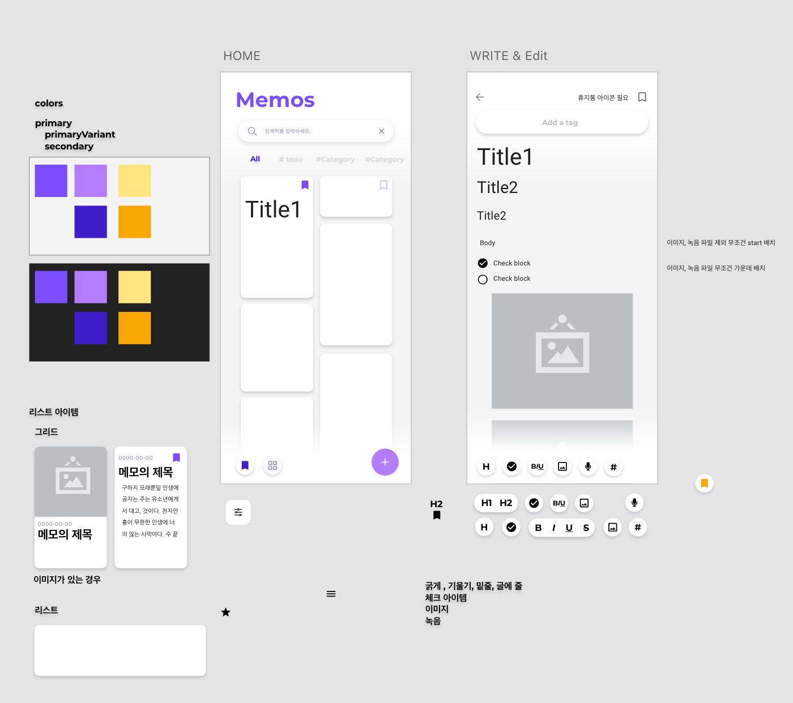

## Facts

* 클린 아키텍처로 쇼핑앱 만들기 강의를 수강했습니다.
* compose 메모 앱 화면을 기획했습니다. 
* compose 메모 앱 구현을 시작했습니다.
* 안드로이드 CI/CD 구축에 대한 글을 작성했습니다.

## Feelings

* 어제 발생한 kapt에러를 다시 확인하려고 kotlin-version을 1.5.31로 맞추고 다시 빌드했더니 빌드가 정상적으로 됩니다.!!!왓더,,,, 어제 화면을 캡처해놨어여 했는데... 트러블 슈팅으로 글을 작성하려고 했는데 문제가 사라져 글을 작성하지 못하게 되었습니다. 좀 아쉽습니다. 흠... 어제 잠깐만 그런건가... 누가 코드 잘 못 올렸나...??

* compose 메모 앱 화면 기획을 했습니다. 테마 색상을 선택하고 레이아웃을 어떻게 잡을지 대략적으로 정했습니다. 빨리 하나 하나씩 만들어 보고 싶습니다.

* github action을 사용하여 안드로이드 CI/CD를 구축하는 과정을 글로 작성하고 있습니다. 요즘 글 쓰는 데에 재미 들인 것 같습니다. 그래서인지 kapt 에러를 글로 쓰지 못한 게 많이 아쉽습니다.

* 오랜만에 디자인 작업도 하니 재미 있는 것 같습니다. 못 하지만 재미있습니다. 리스트 아이템 같은 건 귀찮아서 대충 만들었는데 이렇게 보니 못 생겼습니다. 다시 만들어야겠습니다. 색은 디자인과 시절이나 지금이나 여전히 어렵습니다.

  
## Findings

* CI/CD에 대해서 확실하게 정리했습니다. 
* Github action의 몇가지 기능에 대해 알게 되었습니다. 
  * workflow를 재사용 하는 방법에 대해서 알게 되었습니다. 
  * 선행 job을 지정하는 needs에 대해서 알게 되었습니다.

## Future Action Plans
* compose 메모 앱 기능1,2 구현하기 
* 코딩 테스트 1문제 풀기 
* 패스트 캠퍼스 안드로이드 강의 수강

