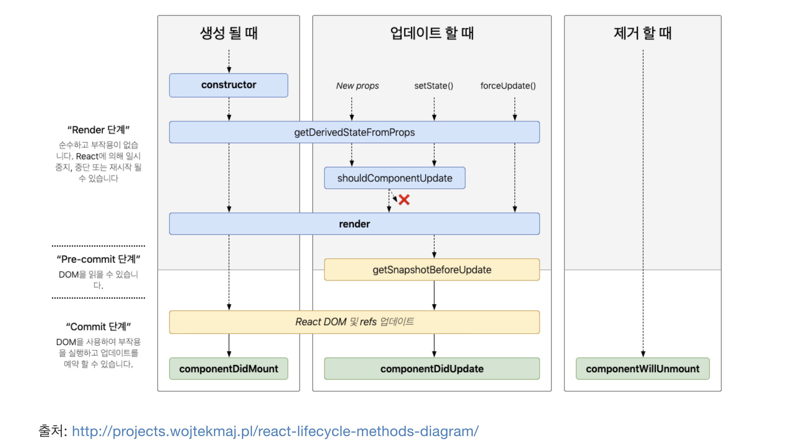

## Facts.

- 프로그래머스 거리두기 확인하기 문제를 풀고있습니다.
- 리액트에서 클래스 컴포넌트와 함수형 컴포넌트가 어떻게 다른지 알게 되었습니다.
- useEffect에 대해서 알게 되었습니다.
- 밀린 포트폴리오 기능들을 구현했습니다.
- 오늘의 과제 완료!

## Feelings.

- 주말 쉬지를 못했더니 입병이 났습니다.ㅠ 졸려서 기절할 것 같습니다.
- 프로그래머스 문제를 풀고 있는데 포폴 밀린 기능 구현하느라고 거의 풀지 못했습니다. bfs로 풀어 보려는데 생각보다 잘 안됩니다.
- 일요일에 몰아서 포폴 구현하려고 했었는데 못했습니다. 덕분에 진도 체크 시간에 혼났습니다. ㅜ 그래서 대충 메인 기능들은 학원에서 구현하고 왔습니다.ㅜ 다음주엔 밀리지 말고… 디자인 슬슬 입혀서 구현해야겠습니다.

## Findings.

- 리액트 컴포넌트 생명주기 메서드
  - [https://react.vlpt.us/basic/25-lifecycle.html](https://react.vlpt.us/basic/25-lifecycle.html)
  - 생명주기 메서드는 컴포넌트가 브라우저상에 나타나고, 업데이트되고, 사라지게 될 때 호출되는 메서드입니다.
  - 오늘 배운 componentDidMount, componentDidUpdate, componentWillUnmount이외에 다른 생명주기 메소드들이 존재합니다.
  - 생명주기 메서드는 크게 마운트, 업데이트, 언마운트 세개의 카테고리로 나눌 수 있습니다.
    
    - 마운트
      - 컴포넌트가 DOM에 붙게 될 때 호출되는 메서드입니다.
      - constructor, getDerivedStateFromProps, render, componentDidMount 메소드가 있습니다.
      - componentDidMount는 첫번째 렌더링이 마치고 나면 호출되는 메서드입니다. 이 메서드에서 외부 라이브러리 연결 및 데이터 요청, DOM 조작등의 작업을 합니다.
    - 업데이트
      - 컴포넌트가 업데이트 되는 시점에 호출되는 메서드입니다.
      - getDerivedStateFromProps, shouldComponentUpdate, render, getSnapshotBeforeUpdate, componentDidUpdate 메서드가 있습니다.
      - componentDidUpdate는 리렌더링이 마치고, 화면에 모든 변화가 반영되고 난 뒤 호출되는 메서드입니다.
    - 언마운트
      - 컴포넌트가 DOM에서 떨어질 때 호출되는 메서드입니다. 언마운트와 관련된 메서드는 componentWillUnmount 밖에 없습니다.
      - componentWillUnmount는 컴포넌트가 화면에 사라지기 직전에 호출됩니다.
      - 컴포넌트가 사라질 때 자원들을 정리하는 작업을 합니다.
- useEffect
  - [https://ko.reactjs.org/docs/hooks-effect.html](https://ko.reactjs.org/docs/hooks-effect.html)
  - [https://blog.appleseed.dev/post/react-design-principle-and-hooks/](https://blog.appleseed.dev/post/react-design-principle-and-hooks/)
  - [https://points.tistory.com/86](https://points.tistory.com/86)
  - 함수형 컴포넌트 내에서 sideEffect를 수행할 수 있게 해주는 훅입니다.
  - useEffect를 사용하여 React에게 컴포넌트가 렌더링된 이후에 어떤 작업을 수행하게 할지 정할 수 있습니다.
  - 다른 컴포넌트에 영향을 줄 수 있고, 렌더링 과정에서 직접 제어할 수 없는 일을 말합니다.
    - 함수 외에 있는 변수를 변경하거나, DOM을 조작하는 일, 데이터를 가져오거나 구독하는 일이 있습니다.
    - 함수형 컴포넌트에서 발생하는 부수효과를 최대한 제어하기 위해 만들어진 훅인가?? 싶습니다.
  - 클래스 컴포넌트의 생명주기 메소드인 componentDidMount, componentDidUpdate, componentWillUnmount와 같은 목적으로 제공됩니다.
  - 기본적으로 useEffect는 첫번째 렌더링과 그 이후의 모든 업데이트 대해서 수행됩니다. 렌더링 이후에 발생하기 때문에 effect가 수행되는 시점에 DOM이 업데이트 되었음을 보장합니다.
  - 두 번째 인자로 의존성 배열을 전달하여 어떤 변경에 대해서 effect를 수행할지 결정할 수 있습니다.
  - 기본적인 사용방법
    ```jsx
    useEffect(() => {
      // 그려지고 나서 실행 - componentDidMount
      return () => {
        // 컴포넌트가 사라질 때 실행 - componentWillUnmount
      }
    }, [])

    // 의존성 배열이 아예 없기 때문에 컴포넌트가 관여하는 모든 데이터에 대해서 변경이 일어나면 콜백함수 실행.
    useEffect(() => {
      // 변경되고 나서 실행 + 그려질 때 실행 - componentDidUpdate
    })
    ```
- 클래스 컴포넌트와 함수형 컴포넌트
  - [https://ui.toast.com/weekly-pick/ko_20171117](https://ui.toast.com/weekly-pick/ko_20171117)
  - 클래스 컴포넌트
    - 컴포넌트를 리액트의 Component 클래스를 상속하여 클래스 형태로 만듭니다.
    - 내부에 render(), 생명주기 함수 등이 있습니다.
    - render는 컴포넌트를 렌더링하는 함수로 반드시 구현해야 합니다.
    - 클래스 내부에 정의된 state, 메소드에 접근하기 위해서 this를 사용합니다.
      - 하지만 this가 런타임시 동적으로 달라지는 자바스크립트의 문제 때문에 오류가 발생할 가능성이 많습니다.
      - 때문에 명시적으로 this를 바인딩하여 사용해야 합니다. 또는 화살표 함수를 사용합니다.
  - 함수형 컴포넌트
    - 리액트는 함수형 프로그래밍을 지향합니다.
      > 리액트는 조단 워크(Jordan Walke)가 개발했는데, 처음 만들 때 [함수형 언어인 ML기반 언어들에서 많은 영향을 받았다](https://www.reactiflux.com/transcripts/jordan-walke/)고 한다.
    - 함수 선언 방식을 사용하여 컴포넌트를 만듭니다.
    - hook을 사용하여 클래스 컴포넌트에서 처럼 상태 관리, 생명 주기 관리를 할 수 있습니다.
    - 함수형 컴포넌트는 클래스 컴포넌트의 단점인 this를 보완하면서 hook을 사용하여 컴포넌트 클래스의 장점을 취할 수 있습니다.
    - 함수형 컴포넌트는 복잡한 ReactElement 트리를 구성하기 위해 컴포넌트 내부에 다른 컴포넌트를 함수처럼 호출해서 결과값을 받은 후 조합해서 반환합니다.
    - 뭔가 함수형 프로그래밍을 좀 더 공부하고 이해해야 할 것 같습니다. 느낌만 오네

## Future Action Plans.

- 부지런히
