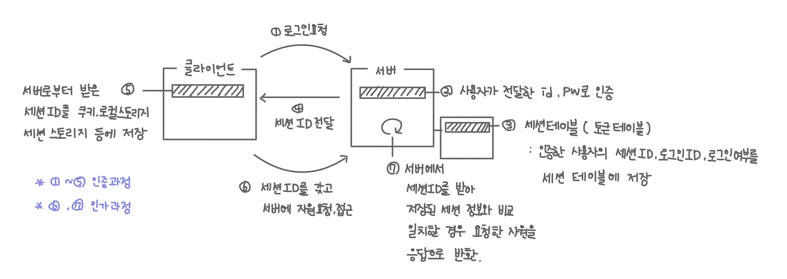

## Facts.

- 정규표현식에 대해서 배웠습니다.
- 서버에서 로그인을 처리하는 과정을 배웠습니다.
- 목이 아프고 미열이 나서 코로나 검사를 했습니다.

## Feelings.

- 미열이 나고 어지럽고 목이 칼칼해서 코로나 검사 했는데 음성이 나왔습니다. 그냥 감기인가 봅니다. 그래도 마스크 열심히 써야겠습니다. 근데 이번년도 손에 꼽히게 아픈 듯.. ㅠ
- 코로나 검사 하느라 로그인 실습 수업을 못 들었습니다. 그래도 학습자료로 올라온 내용을 보니 실습은 어렵지 않은 내용이여서 다행이였습니다.
- 정규 표현식에 대해서 배웠습니다. 맨날 대충 인터넷에 있는거 하나하나씩 찾아서 썼었는데 확실하게 알게 되어서 좋습니다. 굿. 맨날 정규 표현식만 쓰면 내가 원하는 패턴이 아닌데도 true가 나와서 알고리즘 문제를 풀 때 애먹었는데 ^$ 사용 용도를 알게 되어 앞으로 잘 써먹을 것 같습니다.

## Findings.

- 로그인 프로세스
    - 인증, 인가 프로세스
        
        
        
    - 부하 분산을 위한 노오오력
        - 스케일업, 스케일아웃
            - 서버 컴퓨터의 성능을 업그레이드(스케일업)하거나 서버를 증설(스케일아웃)하여 부하를 분산하고자 함.
            - 스케일아웃 시 여러 서버에서 세션 정보를 공유하지 못하는 문제 발생
                
                → 문제를 해결하기 위해 세션 테이블에 있는 내용을 다른 데이터베이스에 저장 
                
                → 백엔드의 부하가 데이터베이스로 옮겨감 → 수직 파티셔닝 또는 샤딩으로 문제 해결 
                
        - JWT(Json Wen Token)
            - 로그인 정보를 데이터베이스에 저장하지 않고 로그인 정보를 담은 객체를 암호화하여 사용.
            - 클라이언트에는 암호화된 token을 전달하고 필요시 서버에서 복호화하여 사용합니다.
            - 단순한 알고리즘으로 암호화시 악성 사용자가 복호화하여 사용자 정보를 탈취할 수 있기 때문에 주의해야 합니다.

## Future Action Plans.

- 포트폴리오 파이어베이스 사용 부분 기획
- 포트폴리오 UI기획
- Recoil문서 읽기
- 블로깅
- 코드캠프 노션 정리(TIL연결, 키워드 정리)