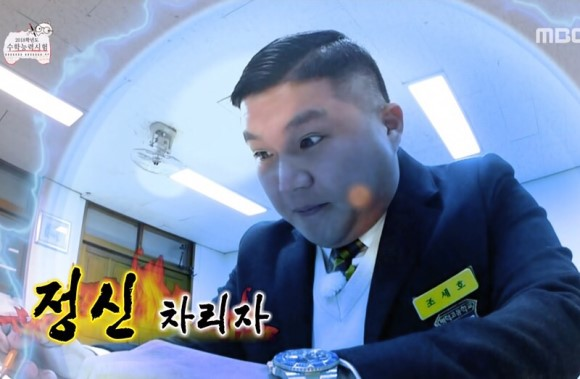

## Facts.

* 포트폴리오 작업에 들어갔습니다. 자기소개서 부분을 새롭게 작성했습니다.
* 러닝 타입스크립트 13장을 읽고 정리했습니다.
* 리얼월드 프로젝트에 필요한 기능을 정리하고 프로젝트 구조를 어떻게 가져갈지 결정했습니다.
* 면접 스터디를 진행했습니다.

## Feelings.

* 오늘은 전체적으로 집중을 잘 못한 것 같습니다. 왤까여... 오전에 알고리즘 안 풀어서 그런가...오전 내내 인터넷이 안돼서 씨름하기는 했습니다.
* 지금 til 쓰는데도 집중 안 되는 중... 
* 타입스크립트 13장을 읽고 정리하는데도 평소보다 많은 시간이 걸렸습니다.  
* 평소 그냥 쓰고 있었던 타입 스크립트 config 옵션에 대해서 많은 것을 알게 되었습니다. 엄격 모드에 대해서 자세히 알게 되었습니다. 앞으로 프로젝트할 때 유용하게 써먹을 것 같습니다.
* 오늘은 포폴 틀만 잡아놓고 리얼월드 프로젝트가 끝나면 내용을 채워 넣으려고 하는데 리얼월드 부분은 제외하고 다른 프로젝트들을 채워 넣으려고 합니다. 오늘 낮에 집중 못하고 놀았기 때문에.. 3시까지 포폴 채워넣고 자기....
* 리얼월드 데모 사이트를 보면서 개발해야 할 기능들을 정리했습니다. 페이지 라우트를 정하고, 디렉터리를 어떤 기준으로 분리할지 결정했습니다. compound component에 관한 내용은 내일 하려고 합니다. 
* 프로젝트 구조를 고민하면서 클린 아키텍처를 다시 읽어야겠다는 생각이 들었습니다. 
* 면접 스터디를 통해서 좋은 정보들을 공유 받았습니다. 굿- 다 같이 다음 면접 스터디까지 뭐를 해올지도 정했습니다. 함께 공부하고 으쌰 으쌰 하니 동기 부여가 더 잘 되는 것 같습니다.

## Future Action Plans.

* 프로젝트를 셋팅하고 린트, 테스트, 프리티어 등등을 설정합니다. 
* 토요일 면접 스터디 시간까지 포트폴리오 정리를 완성하기로 했습니다. 새벽에 열심히 달리기!
* 내일은 빠릿하게 움직여서 러닝 타입스크립트 끝내고 새벽에 다 읽은 언리시를 정리하려고 합니다. 

