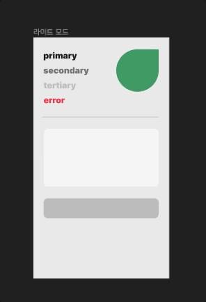

## Facts.

* 러닝 타입스크립트를 모두 읽었습니다!
* 리얼월드
	* 프로젝트를 생성하고 필요한 설정들을 해주었습니다.
	* 간단하게 와이어프레임 스케치를 진행했습니다. 
	* 다크모드 지원을 위해서 시맨틱 컬러 시스템을 만들고 피그마 작업을 진행했습니다.
	* 페이지 컴포넌트 구현

## Feelings.

* 오늘도 러닝 타입스크립트를 읽고 정리하는데 꽤 오랜 시간을 할애했습니다. 중간에 데코레이터에 대해서 궁금증이 생겨 데코레이터를 공부하는 시간이 많았지만... 그래도 1권을 모두 읽고 간략하게나마 정리하는 시간을 가져서 좋았습니다. 원래 오늘 독후감까지 작성하려고 했는데 리얼월드 프로젝트 디자인에서 시간을 많이 잡아먹는 바람에 못 썼습니다. 내일 오전 중으로 쓰려고 합니다. 
	
	* 데코레이터 
		* 이 부분도 따로 포스팅 하기...
		* 새 함수를 반환하여 전달 된 함수 또는 메서드의 동작을 수정하는 함수입니다. 
		* 자바의 어노테이션과 비슷하게 생겨서 혹 같은 역할을 하는 애들이지 않을까 하여 자바 어노테이션에 대해서도 찾아봤습니다. 
		* 자바 어노테이션 : 소스코드에 추가해서 사용할 수 있는 메타 데이터의 일종 
			* 메타 데이터 : 애플리케이션이 처리해야할 데이터가 아니라 컴파일 과정과 실행 과정에서 코드가 어떻게 처리해야 하는지를 알려주기 위한 추가 정보
		* 약간의 차이는 있지만 하는 일은 비슷해 보입니다?
			* 자바 어노테이션은 컴파일 시점에 처리될 수도 있고 자바의 리플렉션을 거쳐서 런타임에 처리될 수 있다고 합니다. 
			* 뭐 하나 파면 계속해서 공부할게 나오네여 리플렉션...
			* 자바스크립트의 데코레이터는 런타임에 호출됩니다. 
	* 매핑된 타입
		* 다른 타입의 속성을 기반으로 새로운 타입을 생성하는 구문입니다. 
	* 조건부 타입 
		* 타입 시스템은 이전 타입에 대한 논리적인 검사를 바탕으로 새로운 구성을 생성합니다, 
	* 타입 분산 [TS 📘 타입스크립트 - 조건부 타입 완벽 이해하기](https://inpa.tistory.com/entry/TS-%F0%9F%93%98-%ED%83%80%EC%9E%85%EC%8A%A4%ED%81%AC%EB%A6%BD%ED%8A%B8-%EC%A1%B0%EA%B1%B4%EB%B6%80-%ED%83%80%EC%9E%85-%EC%99%84%EB%B2%BD-%EC%9D%B4%ED%95%B4%ED%95%98%EA%B8%B0)
		* 유니온으로 묶인 타입 하나하나 마다 조건부 타입 검사를 하고 그 결과 값들을 묶어 다시 유니온으로 반환합니다. 

* 리얼워드 프로젝트 이름을 정했습니다. leading!
* 디자인 없이 리얼월드 데모 페이지랑 똑같이 만들까 했는데 이번에 다크 모드 구현도 욕심이 나서 결국 디자인하기로 했습니다.ㅎㅎ 
* 다크 모드 지원을 위해서 semantic 컬러 시스템을 학습하고 프로젝트에 맞게 피그마 작업을 했습니다. 

	* semantic color system [다크 모드 적용기(2)](https://brunch.co.kr/@dnwhdrb98/7)
		* 사용되는 목적과 UI에 적용되는 상황에 따라 네이밍 하는 컬러 시스템입니다. 
		* 고정된 색상 값이 아니라 의미 있는 컬러 명을 제공하여 다크 모드/ 라이트 모드 변경을 유연하게 할 수 있도록 해줍니다. 
		* 구체적에 의존하면 안 된다는 소프트웨어 설계 원칙이 디자인에도 똑같이 적용되는 것 같습니다. 
		* 모든 변경에 유연하려면 구체적인 것에 의존하면 안 됩니다.

	* 다크 모드 지원을 위한 노오오력
		* 나중에 따로 블로그로 포스팅 하려고 합니다.ㅎ
		* 간단하게 메인으로 사용할 컬러와 에러 같은걸 표현하는 컬러 정도만 뽑고 그레이 컬러를 사용해서 다 처리하려고 합니다. 
		* 각각 라이트 모드/ 다크 모드 변경시에 같이 색상 값이 변경되어야 하는 것들을 시맨틱 컬러로 뽑고 피그마 스타일 작업을 해줬습니다. 
		* 피그마 편하네요. 굿

        

    * 피그마 작업을 하면서 이것저것 편리한 플러그인을 알게 되었습니다. 플러그인을 사용해서 깔끔한 가이드를 만들 수 있을 것 같습니다. 이전에 스노클링 포인트 프로젝트 디자인 작업을 할 때는 가이드가 정해진 것 없이 디자인해서 여기저기 조금씩 뒤틀린(?) 디자인 산출물이 많았는데 이번 프로젝트에서는 디자인도 깔끔하게 가이드 뽑아서 해보려 합니다.  

    

    * 프로젝트를 설정하면서 eslint 관련해서 타입스크립트 문제가 발생했었는데 확실히 책을 읽고 에러 메시지를 보니까 어떤 문제인지 바로 알 수 있었습니다. 굿
    

## Future Action Plans.

* leading 프로젝트를 담주 수욜로 마감을 하기로 면접 스터디 팀원들과 약속했기 때문에 부지런히 디자인 끝내고 기능 구현 일부 까지 이번주에 하려고 합니다. 
* 내일 러닝 타입스크립트를 전체적으로 정리하는 글을 작성합니다. 
* 포트폴리오 정리!