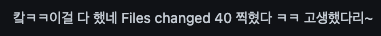

## Facts.

* 드디어 반응형 메서드를 정리했습니다!!
* 토스 슬래시 - 프론트엔드 웹 서비스에서 우아하게 비동기 처리하기 영상을 시청하고 정리했습니다. 
* 토스 슬래시 - 실무에서 바로 쓰는 프론트엔드 클린 코드 영상을 시청하고 정리했습니다. 

## Feelings.

* 드디어!!!!! 드디어!!!!! 몇 주째 미뤄진 반응형 메서드 정리를 끝냈습니다!!! 와아아ㅏㅏ 2월 초에 회의하면서 5개로 쪼개진 반응형 메서드를 3개로 축소하는 걸로 결정이 났었는데 면접과 코테와 시험 등등 여러 가지 일이 겹쳐 3주째 미뤄졌었습니다. 그리고 변경 사항이 꽤 커서 엄두도 안났었는데 오늘 진짜 마음 잡고 다 끝냈습니다. 장하다. 감자

* 반응형 메서드 수정을 오늘 목표로 했기 때문에 다른 계획들은 많이 잡지 않았습니다. 그래서 오전에 영상 2개를 보고 정리했습니다. 

	* [프론트엔드 웹 서비스에서 우아하게 비동기 처리하기](https://www.youtube.com/watch?v=FvRtoViujGg)
		* 기존의 리액트에서 비동기 처리가 힘든 이유에 대해서 명확하게 알게 되었습니다. 
			* 성공하는 경우에만 집중해서 컴포넌트를 구성하기 어렵기 때문입니다. 
			* 2개 이상의 비동기 로직이 개입될 때, 비즈니스 로직은 총 9개 이상의 상태를 다루야 하기 때문에 어렵습니다. 
		* 좋은 코드는 
			* 성공, 실패의 경우를 분리해서 처리할 수 있습니다.
			* 비즈니스 로직을 한눈에 파악할 수 있습니다.  
		* 리액트의 suspense는 좋은 코드를 가능하게 합니다. 컴포넌트는 성공한 경우에만 처리하는 역할에 집중할 수 있도록 하고, 로딩 상태와 에러 상태에 대해서는 외부에 위임하여 동기적인 코드와 큰 차이가 없는 코드를 만들 수 있도록 합니다. 
		* suspense는 대수적 효과를 통해 로직을 선언적으로 작성할 수 있게 합니다. 
			* 대수적 효과 : 어떤 코드 조각을 감싸는 맥락으로 책임을 분리하는 방식

	* [실무에서 바로 쓰는 프론트엔드 클린 코드](https://www.youtube.com/watch?v=edWbHp_k_9Y)
		* 안일한 코드 추가의 함정 
			* 기능을 추가할 때 하나의 목적인 코드가 여기저기 흩뿌려지게 됩니다. -> 변경 점은 하나지만 코드는 엉망진창이 됩니다.
		* 클린 코드 != 짧은 코드, 클린 코드 == 원하는 로직을 빠르게 찾을 수 있는 코드 
			* 원하는 로직을 빠르게 찾으려면 흩뿌려져 있는 코드를 응집도를 높여서 뭉쳐두어야 하고, 단일 책임 원칙을 적용해 함수가 하나의 한 가지 일만 할 수 있도록 쪼개야 합니다.  그리고 함수의 세부 구현 단계가 제각각일 때 추상화 단계를 조정해서 핵심 개념에 필요한 만큰만 노출해야 합니다. 
			* HOW?
				* 당장 몰라도 되는 디테일을 뭉쳐서 추상화 해야 합니다. 로직 파악에 중요한 데이터는 냅두고 데이터를 변경하는 세부 구현을 파악해 추상화된 로직 뒤에 숨깁니다. 
				* 하나의 책임을 갖는 컴포넌트로 분리할 수 있습니다.
				* 중요한 개념만 남기고 나머지를 추상화하여 비슷한 추상화 레벨이 적용되도록 합니다. 
		* 선언적 프로그래밍 
			* 핵심 데이터만 전달받고 세부 구현은 뭉쳐 숨겨두는 개발 스타일 
			* 무엇을 해야 하는지 빠르게 파악이 가능합니다.
			* 무엇만 바꿔서 재사용할 수 있습니다. 

## Future Action Plans.

* leading 프로젝트 개발 시작!!