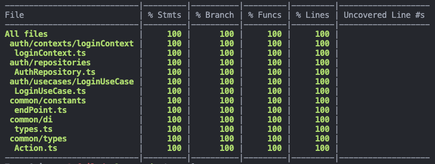

## Facts.

* 루비로 배우는 객체지향 디자인 1장을 읽고 정리했습니다. 
* 리얼 월드
	* 기본적인 ErrorBoundary 컴포넌트를 구현했습니다. 
	* Suspense와 ErrorBoundary를 합친 AsyncBoudary 컴포넌트를 구현했습니다. 
	* 프로젝트에 UseCase 개념을 도입했습니다. 
	* 로그인 관련된 context, repository, useCase 테스트 코드를 작성했습니다. 

## Feelings.

* 루비를 배우는 객체지향을 다시 읽기 시작했습니다. 원래 2장씩 읽으려고 했는데, 러닝 타입스크립트보다 생각할 거리가 많은 것 같아서 하루에 1장씩 읽고 다음주에 끝냅니다. 
	* 9p 디자인 기술에 대해 알고 있지만, 이 기술을 어떻게 적용해야 하는지 잘 알지 못함 
		* 좋은 의도로 지나치게 디자인하는 함정에 빠진다. 
		* 약간의 지식을 함부로 사용하는 것은 위험한 일이다. 
	* 최근에 개발바다에서 본 성급한 추상화 관련된 내용이 생각납니다. 🥲🥲🥲 

* 리얼월드 
	* suspense와 errorboundary를 빨리 직접 구현해보고 싶은 마음에 당장 쓸 곳도 없는데 일단 만들었습니다. 으 반성합니다.  좀 더 제대로 정리한 후에 다시 만져야 겠습니다. 
	* 원래는 context에서 api 통신 관련, 데이터 변경 관련을 모두 처리하는 것으로 설계를 했었는데 생각해 보니 이렇게 구현할 경우 api 통신 로직과 ui 상태 관련 로직이 강하게 결합된다는 것을 알게 되었습니다. 
	* 그래서 통신하는 로직을 UseCase로 분리하고 context에서는 통신 결과에 따라 ui의 상태를 변경하는 작업을 하는 것으로 설계를 변경했습니다. context를 안드로이드에서 viewModel과 비슷한 역할을 하는 것으로 결정했습니다. 
	* 로그인과 관련된 로직에 대한 테스트를 모두 작성했습니다. context와 repository, useCase까지 작성했는데 컴포넌트는 수정이 필요해서 좀 더 생각해보고 짤려고 합니다. 

* 확실히 밤~ 새벽에 집중이 잘 되는 것 같습니다. ㅎㅎ

## Future Action Plans.

* 테스트 코드를 마저 작성하고 회원가입 기능을 구현합니다. 
* 스노클링 프로젝트도 로그인, 회원가입 기능을 구현합니다. 
