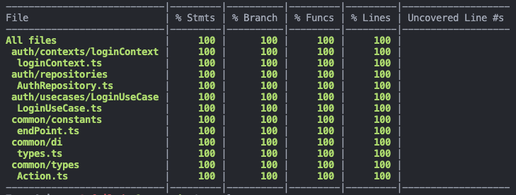

## Facts.

* 루비로 배우는 객체지향 디자인 2장을 읽고 정리했습니다. 
* 리얼월드 
	* 회원가입 기능을 구현하고 테스트 코드를 작성했습니다. 

	
	
* 오랜만에 낮잠 잤습니다.

## Feelings.

* 루비로 배우는 객체지향 디자인을 읽으면서 공감되는 부분이 많았습니다. 😂😂😂 리얼월드 프로젝트를 깔끔한 프로젝트 구조로 만들어 보려고 이것저것 시도해 보고 있는데 아래 두 번째 내용이 많이 공감이 되었습니다. 간단한 기능을 구현하는데도 이렇게 할까 저렇게 할까 고민하는 것 때문에 많은 시간이 걸립니다🥲🥲🥲 
	*  문제는 기술에 대한 지식이 아니라 코드를 구성하고 배치하는 일이다. 우리는 코드를 짤 줄은 알지만 그것들을 어디에 어떻게 놓아야 하는지를 모르고 있다. 
	* 우리가 미래에 어떤 기능이 필요할지 이미 알고 있다면 지금 당장 완벽한 디자인을 선택할 수 있다. 불행히도 우리에게는 그런 정보가 없다. 어떤 일이 생길지 모른다. 그럴듯해 보이는 대안들 사이에서 저울질하다가 시간만 허비하고 결국 아무 근거 없이 하나의 디자인을 선택하지만 결국 잘못된 선택을 할 뿐이다.

* 변경에 유연한 컴포넌트로 구성된 프로젝트를 만들기 원한 건데 컴포넌트 외의 것들에 너무 많이 신경을 쓴 느낌입니다. 다시 정신 차리고 화면에서 컴포넌트가 어떻게 활용되는지 어떻게 분리될 수 있는지 생각하고 개발해야겠습니다.

* 2시쯤에 잠깐 누웠는데 눈 뜨니까 6시가 넘어가 있었습니다... 이전주는 집에서 집중이 잘 안되는 것 같아 내일은 집무실로 가서 작업하려고 합니다.

## Future Action Plans.

* 그래서 일단 빠르게 만들어보고 리팩터링을 하면서 프로젝트를 만들어 나가려고 합니다.
* 프로젝트를 만들 때 필요한 핵심 가치를 어디 적어놓고 개발해야 겠습니다.
* 내일은 스노클링 프로젝트를 위주로 개발을 할 것 같습니다. 
