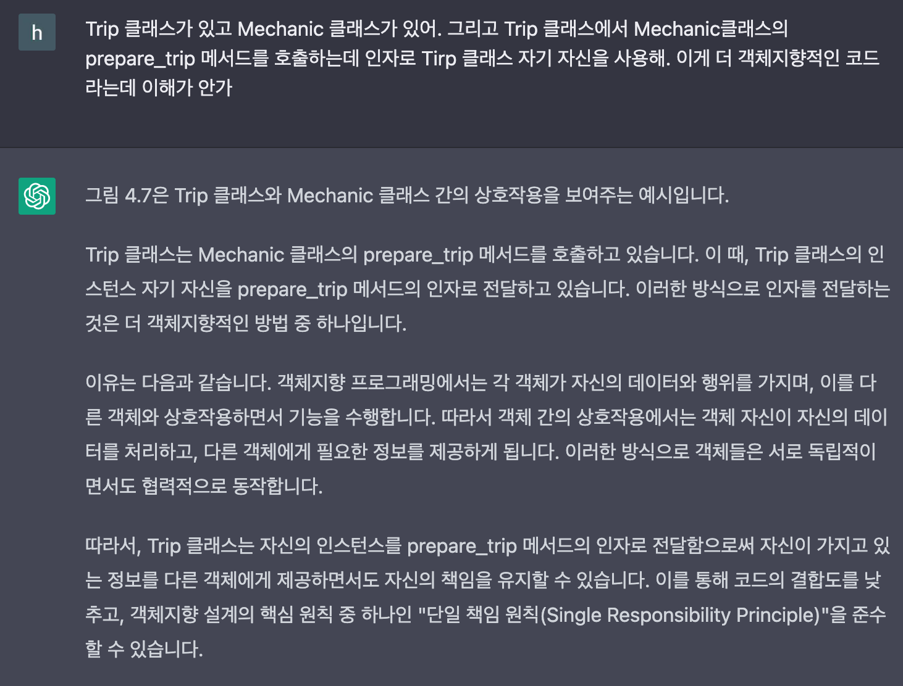
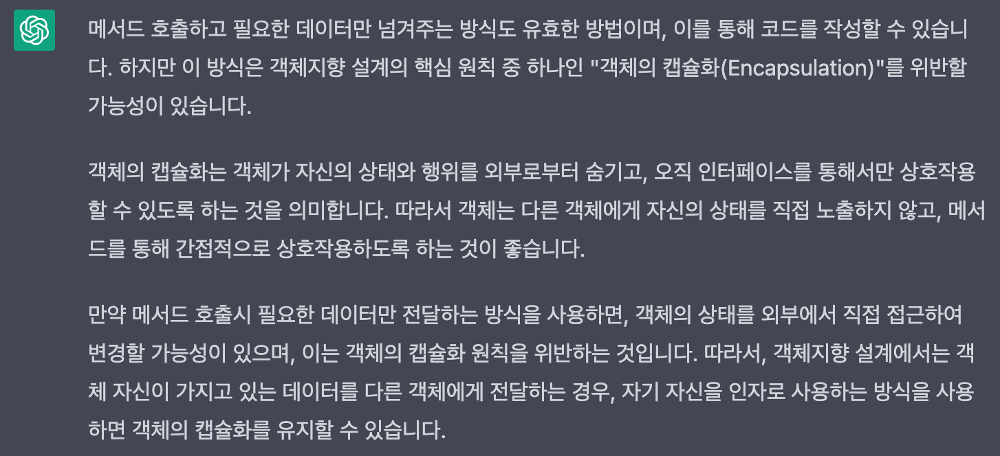
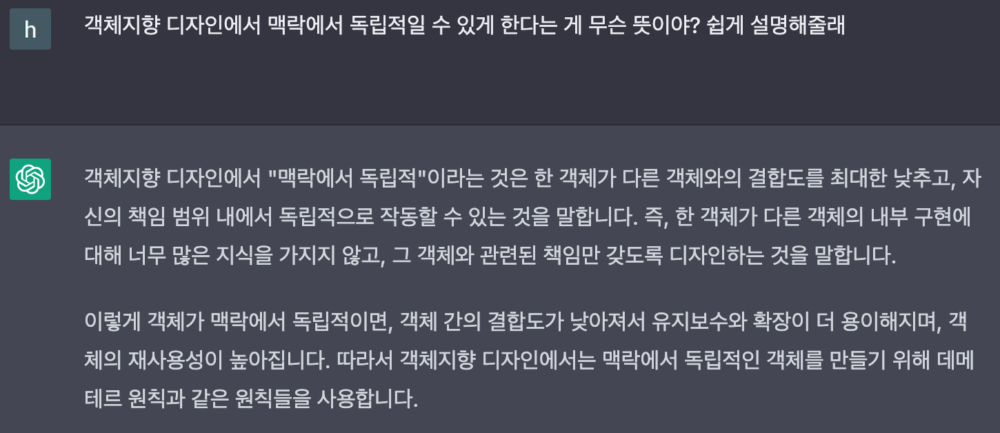

## Facts.

* 루비로 배우는 객체지향 디자인 4장을 읽고 정리했습니다.
* 리얼월드 
	* render prop 개념을 사용해서 LoginForm 컴포넌트를 리팩터링 했습니다. 
* 스노클링 
	* form과 관련된 자잘한 기능을 구현했습니다. 
	* createMailToken, verifyMailToken api 요청을 보내는 메서드를 authRepository 인터페이스에 추가하고 구현했습니다. 

## Feelings.

* 루비로 배우는 객체지향 디자인에서 이해가 안되는 부분이 있었는데 chat gpt에 물어봤더니 명쾌한 답을 얻었습니다. 진짜 짱.... 클래스 A에서 클래스 B에 있는 메서드를 호출할 때 인자로 데이터가 아닌 클래스 A 자기 자신을 넘겨서 이게 왜 책임이 더 명확해지는 걸까, 어느 부분에서 더 객체지향적인 코드가 되는 걸까 이해가 안됐었는데 chat gpt에 물어보니 다음과 같은 답을 얻을 수 있었습니다.

* 퍼블릭 인터페이스를 찾는 과정에서 주어진 맥락에서 독립적일 수 있게 하기도 마찬가지로 이해가 잘 안됐었는데 chat gpt에 물어보니 다음과 같은 답을 얻을 수 있었습니다. 

* 책 내용 이외에 내가 짠 테스트 코드, 아키텍처 등에 대해서도 물어봤는데 생각보다 만족스러운 답을 얻을 수 있었습니다. 진짜... 짱.... 오늘 하루종일 chat gpt에 감탄만 한 것 같습니다. 

* 스노클링
	* 회원가입에 필요한 다른 api를 요청하는 메서드를 구현하고 테스트 코드를 작성했습니다. 테스크 코드를 작성하면서 테스트 코드를 이렇게 짜는 게 맞는건가, 이 테스트가 의미 있는 테스트인가 라는 생각이 들었습니다. 사수님 필요합니다... 다음달은 [단위 테스트 - YES24](http://www.yes24.com/Product/Goods/104084175) 책을 읽어야겠습니다.
	* 회원가입을 위해 기본적으로 필요한 메서드들은 다 구현했는데 이거를 context를 활용하는 커스텀 훅에서 사용할지 아니면 그냥 커스텀 훅에서 사용할지 결정되지 않아 구현을 미루고 있습니다.  저녁에 디코도 보내고 pr에서 멘션도 했는데 아직 답이 없습니다. 답을 달라!

* 리얼월드 
	* 기존에 있던 LoginForm 컴포넌트를 [Render Props – React](https://reactjs.org/docs/render-props.html) 개념을 적용하여 리팩터링 했습니다. Form 공통 컴포넌트를 만들고 hookForm을 사용하는 부분, handleSubmit을 처리하는 부분을 Form 컴포넌트로 이동시켰습니다.  
	* form과 관련돼서 react-hook-form과 컴포넌트가 너무 강하게 결합되어있다는 생각이 들었습니다. 어제 루비로 배우는 객체지향 디자인 책에서 외부에 대한 의존성을 코드 속으로 스며들게 내버려 두지 말자. 라는 내용을 어떻게 적용할 지 고민 해봐야겠습니다. 

## Future Action Plans.

* 이번주는 정신을 잘 못차린 것 같습니다. 내일 주간 회고를 통해서 한 것, 못 한 것을 정리해야겠습니다. 
* 밀린 블로그 포스팅 정리합니다. 🔥