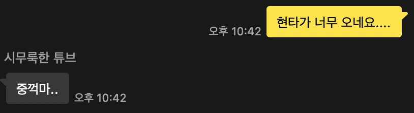
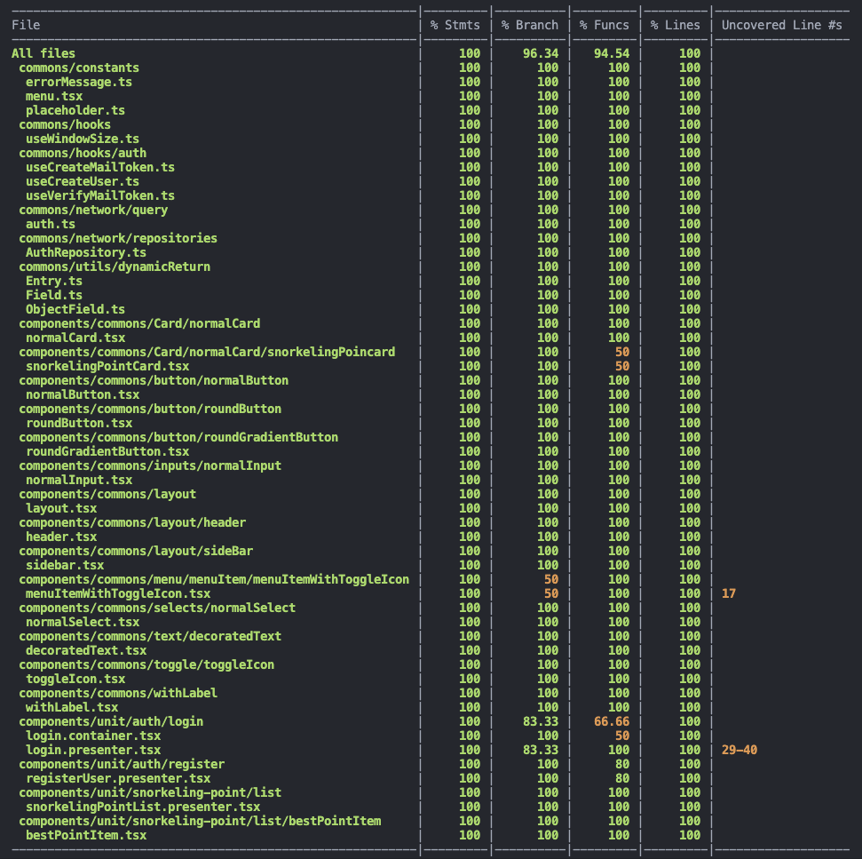

## Facts.

* 루비로 배우는 객체지향 디자인 6장을 읽고 정리했습니다. 
* 오늘 하루 종일 테스트 코드만 짠 것 같습니다. 

## Feelings.

* 오늘은 루비로 배우는 객체지향 디자인에서 상속 부분을 읽고 정리했습니다. 전반적으로 이해가 빠릿빠릿하게 안되네요🥲🥲🥲 눈에 잘 안 들어 옵니다. 내용도 이전에 있던 장들 보다 많은 것 같습니다. 그래도 어찌저찌 정리... 나중에 한 번 더 읽습니다...
* 뭔가 집무실에서 개발을 하는 것보다 집에서 하는 게 더 집중이 잘 되는 것 같습니다. 집무실에 왔다 갔다 하면서 허비하는 시간이 많은 것 같습니다. 또 집순이라 나가기 싫어서 밍기적 거리는 시간도 꽤 되는 것 같습니다. 모니터도 없고.... 밥도 사 먹으러 걸어가야 하고... 흠... 내일은 집에서 해야겠습니다. 가끔씩 집에서도 집중이 안 돼서 누우려고 할 때만 나가야겠습니다.
* 오늘 정말... 회원가입 기능과 관련한 테스크 코드만 하루 종일 짠 것 같습니다.  현타도 너무 왔습니다. 지금 레벨에서 이렇게까지 테스트 코드를 짜는 게 맞는가 싶습니다😂😂 기능 코드 디버깅 보다 테스트 코드 디버깅이 10배 더 오래 걸리는 것 같습니다. 또 무엇을 테스트해야 하는지, 지금 테스트가 맞게 작성되고 있는지에 대한 확신도 없기 때문에 테스트 케이스를 썼다 지웠다 반복하면서 하고 있어서 시간이 오래 걸립니다.🥲 중요한 건 꺾이지 않는 마음.... 

* 그래도 꾸역 꾸역 테스트 코드를 작성했습니다. 

* 오키에 이력서 피드백 요청 글을 올렸었는데 많은 분들이 피드백을 주셨습니다. 

## Future Action Plans.

* 리얼월드 프로젝트는 잠시 접습니다.  스노클링 프로젝트를 빨리 처리하고 실제 서비스 경험이 필요합니다. 
* 블로그 포스팅! 내일은 블로그 포스팅 & 이력서 추가 정리 위주로 작업을 하려고 합니다!