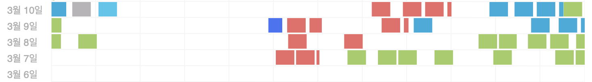

## 시간 사용

* 집무실 왔다갔다 한다고 중간에 비는 시간이 꽤 되는 것 같습니다.
* focus to do 까먹고 안키는 시간도 꽤 있는 것 같습니다.
* 생각보다 집중한 시간이 없네여... 

## Check 
* 프로젝트 
	* 스노클링  
		[ ] 스노클링 로그인, 회원가입 기능 구현  
		[ ] 스노클링 포인트 정보 관련 API 연결  
	- 리얼월드  
		[x] suspense, errorBoundary 구현  
		[ ] 메인 페이지, 아티클 관련 기능 구현  
* 생활  
	[ ] 운동하기  
	[x] TIL 다음날로 넘기지 말기  
* 블로그   
	[ ] 동적 페이지 배포 과정을 정리해서 포스팅  
	[ ] graphql 쿼리문을 동적으로 생성하는 유틸 메서드 구현에 대해서 포스팅  

## 한 일 
* 이번주 뭔가 제대로 한 일이 없네요...
* 프로젝트 
	* 리얼월드
		* 구체적인 것으로 부터 분리를 생각하면서 프로젝트를 구현하다 보니 클린 아키텍처 비스무리하게 프로젝트가 만들어 지고 있습니다;;
		* 유스 케이스 개념을 도입하고 UI상태를 state로 관리하고 내려온 상태에 맞게 동작하도록 컴포넌트를 구현하고 있습니다. 이게 맞나 싶네요.
		* auth repository를 구현하고 테스트 코드를 작성했습니다.
		* render props 개념을 도입해서 LoginFrom 컴포너틑를 리팩터링 했습니다. \
	* 스노클링 
		* httpClient 인터페이스를 만들고 ApolloHttpClient 구현체를 만들었습니다. 
		* auth repository를 구현하고 테스트 코드를 작성했습니다. 

* 루비로 배우는 객체지향 디자인 1,2,3,4장을 읽고 정리했습니다. 
	* 클래스 또는 메서드가 단일 책임을 질 수 있도록 하는 방법에 대해서 배웠습니다.
	* 의존성이 무엇인지 배우고, 의존성 관리를 어떻게 해야 하는지에 대해서 배웠습니다.
	* 클래스가 어떤 퍼블릭 인터페이스를 가져야 하는지에 대해 배웠습니다. 

## 아쉬운 점 
* 체력 관리가 필요한 것 같습니다. 이번주 너무 피곤하네여.
* 기능 구현할 때마다 고민에 너무 많은 시간을 투자하는 것 같습니다. 고민을 시작할 때 focus to do로 시간을 맞춰놓고 그 시간이 넘어가면 그냥 무작정하고 리팩터링 하는 방식으로 프로젝트를 진행해야겠습니다.

> 우리가 미래에 어떤 기능이 필요할지 이미 알고 있다면 지금 당장 완벽한 디자인을 선택할 수 있다. 불행히도 우리에게는 그런 정보가 없다. 어떤 일이 생길지 모른다. 그럴듯해 보이는 대안들 사이에서 저울질하다가 시간만 허비하고 결국 아무 근거 없이 하나의 디자인을 선택하지만 결국 잘못된 선택을 할 뿐이다.

* 중간에 chat gpt를 갖고 노는 시간이 너무 많은 것 같습니다;;

## 앞으로 할 일 
[ ] 운동!!  
[ ] 이번주는 진짜로 포스팅할 거 다 정리합니다. 진짜  
[ ] 각 프로젝트에서 하루에 기능 1개씩을 끝냅니다.   

