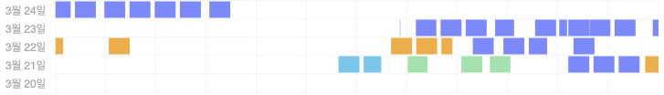
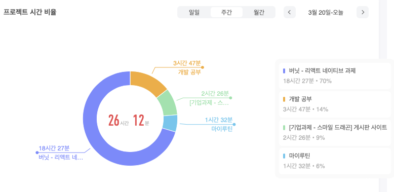

## 시간 사용

* 이번주는 focus to do 까먹고 안킨적이 많아서 시간 사용이 처참하네요…

- 과제 전형
    - 리액트
        - 저번주 수요일에 받은 과제를 월요일에 마무리했습니다. 과제에 사용한 시간을 보니 약 16시간 정도 작업한 것 같습니다. 그중에 리드미 작성에 2시간 26분 실환가요… 그렇게 많은 내용을 적은 것도 아닌데 뭐 하느라 이렇게 시간이 오래 걸린건지 모르겠습니다. 생각이 필요한 작업에 시간이 일반적인 태스크를 처리할 때 필요한 시간보다 더 많이 걸리는 것 같습니다. 딴 짓도 많이 하게 되는 것 같습니다. 집중해서 작업을 컴팩트하게 끝낼 수 있는 조치가 필요합니다.
        - 이메일 본문을 작성하고 예약을 걸어놨어야 하는데 그냥 파일만 첨부하고 보냈습니다…;; 기본을 지키자;;
    - 리액트 네이티브
        - 아으….
        - 리액트 하면 금방한다고 해서 금방할 줄 알았는데 생각보다 시간이 많이 걸렸습니다. 특히 ios, android 별로 프로젝트 설정해 주는 작업에서 시간이 많이 소비된 것 같습니다.
        - icon 패키지 설치하는 데 시간이 많이 걸리는 부분이 제일 킹 받습니다. 리액트 네이티브는 처음 해보는 거라 익숙하지 않은 것도 있지만, 이렇게 할 거면 굳이... 각 플랫폼에서 작업하는 게 더 시간을 단축할 수 있지 않을까 하는 생각이 듭니다.
        - 그나마 다행인 것은 android 플랫폼에서 발생한 에러는 쉽게 디버깅이 되었다는 것…
        - 개발 환경 구축이외에는 코드를 쉽게 작성할 수 있었던 것 같습니다. styled components를 사용하는데 단위에서 조금 해맸지만… 이전에 사용했던 composition 개념도 안먹히는 것 같아서 당황스러웠지만…
- 모듈 시스템 정리
    - 그동안 미뤄왔던 모듈 시스템을 정리했습니다. 원래 수요일 면접 스터디에 발표하려고 했었는데 리액트 네이티브 과제 때문에 면접 스터디가 토요일로 미뤄졌습니다.
    - 글만 읽었을 때 ES의 모듈 시스템은 순환 참조 문제를 일으킬 것 같지 않았는데… 더 확실한 이해를 위해서 순환참조에 대한 테스트를 해봐야 할 것 같습니다.
- 이번 주도 과제들 때문에 공부나 다른 것에 집중하지 못했습니다. 월요일에 보는 과제에서 expo cli 대신 react-native cli를 사용하라고 해서 react-native cli로 환경을 구축했는데 험난합니다… react-native가 원래 그런건지… flutter는 ios, android 셋팅 따로 해줘야 하는 것이 없다고 하던데😂😂😂
- 금요일, 토요일은 오랜만에 쉰 것 같습니다…!

## 앞으로 할 일

- 음… 과제 시간이나 태스크에 걸리는 시간에 대한 메타인지가 낮은 것 같습니다. focus to do를 사용해서 계획했을 때는 그래도 얼추 맞았던 것 같은데 생각으로만 계획하니까 시간을 잘 못잡는 것 같습니다. 계획을 세울 때 그냥 생각만 하지 말고 focus to do를 사용해야 겠습니다.
- 쉬는 시간이 굉장히 중요한 것 같습니다. 2월 중순부터 쉼 없이 계속 태스크들을 처리하니까 지친 느낌입니다. 한 주에 하루라도 푹 쉴 수 있는 날을 만들어야 겠습니다.
- 운동해야 합니다…운동…!!!
    
    
    
- 다음주 월요일은 정리하는 날로 결정!
- 다음주는 꼭 목표한 공부 시간을 달성합니다.