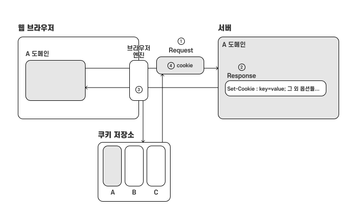
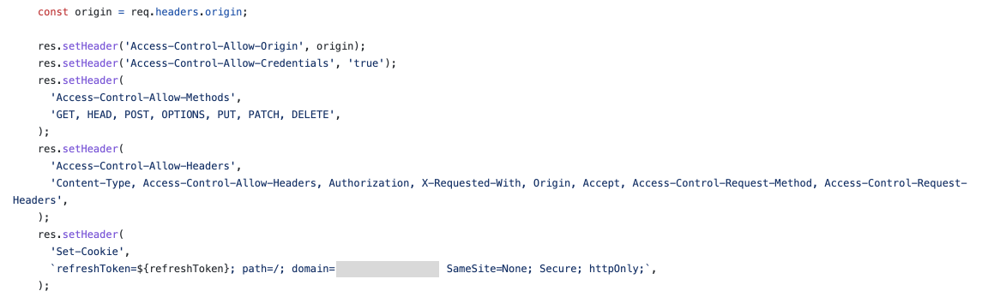
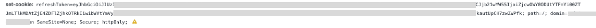
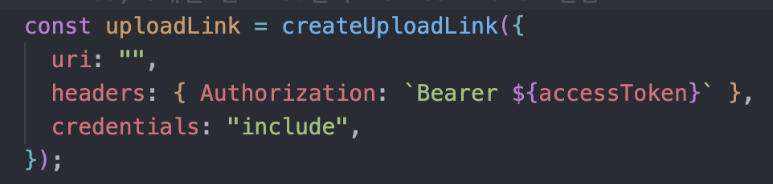

## 전쟁의 서막  

<p align="center">
    
</p>

<br/>  
동기로부터 쿠키에 대한 질문에 날아왔습니다. 쿠키의 domain 속성에 어떤 값을 넣어야 하냐?에 대한 질문이었는데 일단 저희 프로젝트의 서버 코드를 찾아 백엔드 주솟값을 넣는다고 알려줬습니다.

정확히 쿠키가 어떻게 동작하는지에 대한 이해가 없었기 때문에 여러 궁금증이 생겼습니다. 왜 백엔드 주소가 들어가지? 저게 어떤 역할을 하는 속성이지?라는 질문과 함께 쿠키에 대한 공부를 시작했습니다.

공부하는 중간에 domain 옵션에 대한 오해와 오해를 풀어나가는 과정을 기록하고, 쿠키에 대한 기본적인 개념을 정리하고자 합니다.


## 기본 개념 

### 쿠키는 왜 사용하나요?

쿠키를 왜 사용하는지 알기 위해선 먼저 http의 특성을 이해해야 합니다. 

http는 비연결성으로 한 번의 요청-응답으로 연결이 끊기는 특징을 갖고 있습니다. 또 http는 상태를 유지하지 않는 프로토콜입니다. http 통신에서 서버와 클라이언트는 각자 보낸 요청과 응답에 대해서 기억하고 있지 않습니다. 과거에 대한 정보를 갖지 않도록 간단하게 설계됨으로써 http는 많은 데이터를 빠르고, 확실하게 처리하는 범위성을 확보할 수 있게 되었습니다. 

하지만 웹에서 사용자 편의를 위한 여러 작업을 처리하기 시작하면서 상태 저장에 대한 요구가 생기게 되었고, 이러한 요구에 따라 생겨난 것이 쿠키입니다. 쿠기는 사용자를 식별하고 세션을 유지하는 방식 중에서 현재까지 가장 널리 사용하는 방식입니다.

### 쿠키는 어떻게 사용되나요?

쿠키는 주로 서버에서 만들어 response의 헤더에 담아 클라이언트에 전달해 줍니다. 기본 동작은 다음 그림과 같습니다.





1. 클라이언트에서 서버로 첫 요청을 보냅니다. 
2. 서버는 클라이언트의 요청을 처리하고 key, value 형태의 값을 Set-cookie 헤더에 기술합니다. 헤더는 클라이언트로 보내지는 응답 패킷에 설정되어 클라이언트로 보내집니다.
3. 클라이언트 단으로 도착한 응답 패킷은 먼저 브라우저를 거칩니다. 브라우저는 응답 패킷의 헤더에 있는 쿠키 값을 꺼내 브라우저의 쿠키 저장소에 저장해둡니다. 
4. 다시 클라이언트가 서버로 두 번째 요청을 보낼 때 브라우저는 저장해 두었던 쿠키 값을 꺼내 요청 패킷의 헤더에 자동으로 첨부합니다. 

이런 과정을 거쳐 클라이언트로부터 두 번째 요청을 받는 서버는 쿠키를 통해 클라이언트의 정보를 트래킹 할 수 있게 되고, 이 정보를 바탕으로 사용자를 식별하고 세션을 유지합니다.

응답 헤더에 첨부된 쿠키는 브라우저에서 도메인별로 저장합니다. 후에 그 도메인 서버로 요청이 있을 때 해당 도메인의 쿠키 저장소에서 쿠키를 꺼내 요청 패킷의 헤더에 설정합니다. 쿠키 저장소처럼 브라우저는 쿠키 정보를 저장할 책임이 있는데 이 시스템을 `클라이언트 측 상태`라고 합니다. 각 브라우저는 각기 다른 방식으로 쿠키를 저장하는데 대표적으로 크롬은 Cookies라는 SQLite 파일에 쿠키를 저장합니다. 


### 쿠키의 기본적 형태

쿠키는 응답 헤더에 사용될 때, 요청 헤더에 사용될 때 다음과 같은 형태로 사용됩니다.  

* 응답 헤더에서 사용 시 

```javascript
Set-Cookie: 이름=값 ; domain=.example.com ; path=/; Expires=Wed, 21 Oct 2015 07:28:00 GMT; Max-Age=3600; Secure; HttpOnly
Set-Cookie: 이름=값
Set-Cookie: 이름=값
```

* 요청 헤더에서 사용 시 

```javascript
Cookie: <이름>=<값>; <이름>=<값>; <이름>=<값>
```

### 옵션

응답 헤더에 Set-Cookie를 사용하여 쿠키 설정 시 domain, path, expires, max-age, secure, httpOnly, SameSite 옵션을 설정하여 쿠키의 사용 범위, 라이프 타임, 보안 등을 구체적으로 설정할 수 있습니다. 옵션들은 생략 가능합니다.

### 쿠키의 라이프 타임

쿠키의 라이프 타임에 관여하는 옵션에는 Expires와 Max-Age가 있습니다. 두 옵션 모두 값이 있을 때 브라우저는 Max-Age 값을 더 우선시 합니다. 

* Expires : 
    * 쿠키의 최대 생존 시간(수명, HTTP 타임스탬프로 기록. 과거 시간으로 지정할 경우 바로 삭제됨).
    * Expires 옵션 사용 시 반드시 GMT 포맷을 사용해야 합니다. 

```javascript
// 2015년 10월 21일에 쿠키가 만료됨 (삭제)
Expires=Wed, 21 Oct 2015 07:28:00 GMT; 
```

* Max-Age : 
    * 쿠키가 만료될 때 까지의 시간 (초 단위. 0이나 음수 값일 경우 쿠키는 바로 삭제됨)

```javascript
// 1시간 후에 쿠키가 만료됨 (삭제)
Max-Age=3600;
```

쿠키의 라이프 타임은 쿠키의 타입을 나누는 기준이 되기도 합니다.

* 세션 쿠키 (session cookie) : 
    * Expires 또는 Max-Age 옵션이 없는 쿠키 
    * 사용자가 사이트를 탐색할 때, 관련한 설정과 선호 사항들을 저장하는 임시 쿠키. 브라우저를 닫으면 삭제됨.  

    
* 지속 쿠키 (persistent cookie) : 
    * Expires 또는 Max-Age 옵션이 있는 쿠키 
    * 브라우저를 닫아도 쿠키가 삭제되지 않음.


### 쿠키의 범위

쿠키를 공부하면서 가장 헤맸던 부분입니다. 쿠키를 어떤 사이트에서 쓸 수 있는지를 결정하는 옵션인데 쿠키의 기본적인 동작을 생각하지 않고 🍪사용한다!🍪 에만 집중해서 보느라 옵션의 의미를 제대로 파악하지 못했던 것 같습니다. 또 기본적인 용어에 대해서 정확히 알았더라면 좀 더 이해가 빠르지 않았을까 싶습니다.

쿠키의 범위를 결정하는 옵션은 Domain과 Path가 있습니다. 쿠키는 Domain 옵션을 쿠키에 접근할 수 있는 호스트를 결정하고, path를 통해 어떤 경로에서 쿠키 접근을 허용할 것인지 결정합니다. 이 중에서 문제가 되었던 Domain 옵션에 대해서 자세히 정리해 보려고 합니다. 먼저 참고한 사이트 및 자료들에서 Domain 옵션을 어떻게 정의하고 있는지 보겠습니다.

> 쿠키가 적용되어야 하는 호스트를 지정. 지정되어 있지 않으면 현재 문서 URI를 기준으로 적용됩니다만, 서브 도메인을 포함하지 않습니다. 이전의 설계와 달리, 도메인의 선두에 위치한 점들은 무시됩니다. 도메인이 지정되면, 서브도메인들은 항상 포함됩니다.   
>  
> 출저 : MDN

> 서버는 쿠키를 생성할 때 Set-Cookie 응답 헤더에 Domain 속성을 기술해서 어떤 사이트가 그 쿠키를 읽을 수 있는지 제어할 수 있다. 예를 들어 다음 HTTP 응답 헤더는 브라우저가 user='mary17' 이라는 쿠키를 .airtravelbargains.com 도메인을 가지고 있는 모든 사이트에 전달한다는 의미다.
>
> Set-cookie : user="mary17" ; domain=".airtravelbargains.com"
>    
> 만약 사용자가 www.airtravelbargains.com나 specials.airtravelbargains.com 같이 .airtravelbargains.com 으로 끝나는 사이트를 방문하면 다음 Cookie 헤더가 항상 적용될 것이다.   
>
> Cookie : user="mary17"
>  
> 출저 : HTTP 완벽 가이드 - 웹은 어떻게 동작하는가?  

먼저 MDN의 정의를 살펴 보겠습니다. 

* domain : 쿠키가 적용되어야 하는 호스트를 지정

호스트는 어디를 가리키는 말일까요? ~~이거부터 생각해 봤어야 했...~~ 일반적으로 호스트는 네트워크/ 인터넷을 통해 다른 컴퓨터들과 쌍방향 통신이 가능한 컴퓨터. 즉, 네트워크에 연결된 장치를 의미한다고 합니다. 하지만 이 정의는 너무 범위가 넓으니 호스트를 네트워크 요청 헤더에 사용하는 호스트로 범위를 축소해서 생각해보겠습니다. 

> Host 요청 헤더는 서버의 도메인명과 서버가 리스닝하는 TCP 포트를 특정합니다. 포트가 주어지지 않으면, 요청된 서버의 기본 포트를 의미합니다.
>
> 출저 : MDN
 
이렇게 호스트의 의미를 정의하고 나니 좀 더 이해하기 쉬워진 것 같습니다. 네. 일단은 서버 도메인의 주소를 적어줘야 합니다. 

제가 오해한 Domain 옵션의 역할은 쿠키에 접근해서 보는 곳은 클라이언트이니 백엔드 도메인이 아니라 클라이언트의 도메인이 들어가야 하는 거 아닌가?였습니다. 진행되는 프로젝트가 서버와 클라이언트의 도메인 주소가 달랐기 때문에 서버의 도메인으로 값을 설정하면 클라에서는 접근할 수 없는게 아닌가? 근데 그러면 백엔드에서도 사용 못 하는거 아닌가? 라는 생각이 들었습니다.

아으 뭘 오해했는지 적으면서도 헷갈립니다. 

<p align="center">
    
</p>


마음을 가다듬고 우리는 어떻게 다른 도메인의 쿠키를 받아서 저장하고 사용할 수 있는가에 대해서 차근차근 알아보고 정리해 보겠습니다.


## 사전 지식 - 리소스 공유 정책  

서버와 클라이언트의 도메인이 달라 다른 도메인 간의 호출하는 것을 cross-domain이라고 합니다. 이러한 환경에서는 자원을 서로 주고받는 과정이 일반 환경보다 까다롭습니다. 그 이유는 현재 웹상에서 자원을 주고받을 때는 기본적으로 SOP 정책을 따르기 때문입니다.

* SOP (Same-origin policy, 동일 출처 정책) : 동일한 출처의 리소스만 주고 받을 수 있다.

하지만 모든 cross-domain 간의 자원 공유를 막을 수는 없기 때문에 한 가지 제한을 걸어서 cross-domain 간의 자원 공유를 할 수 있도록 하는데 이때 사용되는 매커니즘이 CORS입니다.

* CORS(Cross-Origin Resource Sharing, 교차 출처 리소스 공유) : 다른 출처의 리소스를 주고 받을 수는 있는데 CORS헤더가 있는 리소스만 주고 받을 수 있다.

기본적으로 다른 도메인 간의 자원 공유는 SOP 정책으로 인해 불가하지만 CORS 정책을 만족하는 리소스의 경우 자원 공유를 허용하는 것이 현재 웹에서 리소스를 공유하는 방식입니다.

CORS는 HTTP 헤더를 사용하여 다른 출처에서 해당 자원에 접근할 수 있도록 브라우저에 알려주는 방식으로 동작합니다. 클라이언트에서 도메인이 다른 서버에 원하는 자원을 요청하기 위해서는 먼저 서버에서 해당 자원에 대한 응답 헤더에 Access-Control-Allow-XXX 와 같은 헤더를 설정해야 합니다. 

클라이언트는 서버에 자원을 요청하기도 전에 어떻게 서버의 자원이 접근이 가능한지 불가능한지 알 수 있을까요??

브라우저는 찐 요청을 보내기 전에 HTTP OPTION 메서드를 사용하여 해당 자원에 대한 검증 요청을 보냅니다. 서버는 똑같이 Access-Control-Allow-Origin 헤더가 설정되어 있는 응답을 돌려주게 되고 브라우저는 이 헤더의 값을 보고 클라이언트에서 요청하는 자원이 접근이 가능한지 불가능한지 판단합니다.

이렇게 cross-domain 간의 기본적인 동작이 까다롭기 때문에 쿠키를 설정하는 과정도 까다롭습니다. 특히 쿠키는 민감한 정보를 다루기 때문에 클라이언트에서도, 백엔드에서도 따로 설정이 필요하게 됩니다.

<p align="center">
    
</p>

## 이제 진짜 cross-domain 환경에서 쿠키 주고받기!

### 백엔드 설정

백엔드에서 클라이언트로 쿠키를 담은 헤더를 전달하기 위해서는 아래 사진에 있는 것과 같은 헤더들의 값을 설정해 주어야 합니다. 



이 중에서 특히 중요한 두 개의 헤더에 대해서 자세히 알아보겠습니다.

- Access-Control-Allow-Origin
    - 이 자원에 접근할 수 있는 출처를 지정하여 브라우저가 해당 자원에 접근할 수 있도록 허용하는 헤더입니다.
    - 와일드카드(*)를 사용할 경우 모든 클라이언트에서 해당 자원에 접근할 수 있습니다.
    - 하지만 우리는 클라이언트로 쿠키 값을 전달해 주어야 하기 때문에 와일드카드 대신 자원을 요청한 클라이언트의 도메인을 값으로 설정해 주어야 합니다.
    - 이유는 클라이언트에서 쿠키를 받기 위해 `credentials` 설정을 `include` 값으로 설정하게 되는데 이 때 추가되는 조건이 응답의 Access-Control-Allow-Origin 헤더에 명시적인 값이 있어야 하며, 그 값이 요청한 클라이언트의 도메인과 일치해야 한다는 것입니다.


- Access-Control-Allow-Credentials 
    - 클라이언트의 요청의 자격 증명 모드 (`credentials`)가 `include`일 때, 브라우저들이 응답을 프론트엔드 자바스크립트 코드에 노출할지에 대해 알려줍니다. 클라이언트 요청의 `credentials`가 `include`이고, 서버 응답 헤더의 `Access-Control-Allow-Credentials`의 값이 `true`일 경우에만 브라우저들은 프론트엔드 자바스크립트에 서버의 응답을 노출합니다.
    - 자격 증명들은 쿠키, authorization 헤더들 또는 TLS 클라이언트 인증서입니다.
    - 자격 증명이 있는 `CORS 요청`의 경우, 브라우저가 프론트엔드 js 코드에 응답을 노출하기 위해서는 서버와 클라이언트가 자격 증명 포함을 선택하고 있음을 표시해야 합니다. 
        - 서버 : Access-Control-Allow-Credentials
        - 클라이언트 : 자격 증명 모드 (`credentials`)가 `include` 설정

서버로부터 쿠키가 잘 오는지, 브라우저에 잘 저장되는지 확인하기 위해 테스트를 진행했는데 응답 헤더에는 set-cookie 헤더가 잘 보이지만 브라우저에는 저장이 안 되는 문제가 있었습니다. 그때는 자세히 확인하지 못했는데 지금 생각해 보니 이 헤더들과 관련한 문제 때문에 저장이 안 되었나 싶습니다. 이건 정확한 부분이 아니라서... 그리고 이 값들만 있으면 Domain 옵션을 설정하지 않아도 서버의 도메인이 기본 값으로 설정되기 때문에 정상적으로 동작하지 않을까 싶습니다. 🥲🥲🥲🥲🥲  

공부하면 할수록 나락으로 가는 것 같은 이 기분.... 이것저것 테스트하게 며칠 백엔드 서버를 빌렸으면 좋겠습니다. 

<p align="center">
    
</p>


다시... 눈물 닦고... 백엔드는 헤더 이외에 쿠키를 설정할 때 한 가지 작업을 추가적으로 해주어야 합니다. 할 일이 많네여. 이게 다 도메인이 달라서 그럽니다.

클라이언트와 서버 모두 같은 도메인일 경우 쿠키는 `퍼스트 파티 쿠키 (first-party cookie)`가 되고 클라이언트와 다른 서버 도메인에서 설정한 쿠키는 `서드 파티 쿠키 (third-party cookie)`라고 합니다. 서드 파티 쿠키는 보안적으로 문제가 될 수 있기 때문에 `SameSite`라는 옵션을 사용해서 보안 문제를 해결합니다.

하지만 우리는 클라이언트와 서버의 도메인이 다르기 때문에 SameSite에 보안을 위한 값을 설정할 수 없습니다. 네. `SameSite=None`으로 설정해서 서드 파티 쿠키의 사용을 허용해 주어야 합니다.

SameSite가 None로 설정된 쿠키는 크로스 사이트 요청의 경우에도 항상 전송됩니다. SameSite를 None으로 설정한 쿠키는 추가로 Secure 옵션도 설정해 주어야 합니다. Secure 옵션이 적용되면 해당 쿠키는 https 요청에만 전송되기 때문에 None 값만 있는 것보다 보안 문제를 완화합니다. 크롬에서는 SameSite가 None일 경우 Secure 옵션을 강제로 설정해야 하는 정책을 구현하고 있기 때문에 Secure 옵션이 설정되어 있지 않은 경우 쿠키가 제대로 설정되지 않을 수 있습니다.



자세히 보면 Domain 옵션뒤에 세미 콜론이 없는데 이것 때문에 SameSite 옵션과 Secure 옵션을 크롬에서 인식하지 못해 쿠키가 브라우저에 저장이 안되었던 것 같습니다. 드디어!! 쿠키가 저장 안되는 원인을 찾은 것 같습니다!! 와아아아아ㅏ아악!!!!!!

<p align="center">
    
</p>


### 프론트엔드 설정

프론트는 백엔드에 비해 할 일이 아주 적습니다. 위의 백엔드에서 필요한 헤더 값 설정에서 얘기했듯이 프론트엔드에서 쿠키를 사용하기 위해서는 요청에 자격 증명 모드를 설정해 주어야 합니다. 



apollo-client 사용 시 credential 모드를 설정해 주는 부분입니다. credential 모드는 기본적으로 same-origin으로 동작합니다. 때문에 따로 설정을 해주지 않으면 다른 도메인의 쿠키 또는 인증 정보를 공유할 수 없게 됩니다. 


## 마무리 

아직 찜찜한 부분이 남아 있지만 그래도 쿠키의 기본 동작과 크로스 도메인 환경에서 쿠키를 어떻게 주고받아야 하는지에 대한 설정을 자세히 배울 수 있어서 좋았습니다. 기존에 아무 생각 없이 학원에서 가르쳐준 대로만 사용했는데 이렇게 하나하나씩 뜯어보니 쿠키와 관련해서 백엔드, 프론트 문제를 이전보다는 쉽게 해결할 수 있을 것 같습니다. 굿

<p align="center">
    
</p>

## Ref.
- https://developer.mozilla.org/ko/docs/Web/HTTP/Cookies
- https://developer.mozilla.org/ko/docs/Web/HTTP/Headers/Set-Cookie
- https://developer.mozilla.org/ko/docs/Web/HTTP/Headers/Host
- https://developer.mozilla.org/ko/docs/Web/HTTP/CORS
- https://evan-moon.github.io/2020/05/21/about-cors/
- https://developer.mozilla.org/ko/docs/Web/HTTP/Headers/Access-Control-Allow-Credentials
- https://ko.javascript.info/cookie#ref-210
- https://velog.io/@ooooorobo/%EB%8B%A4%EB%A5%B8-%EB%8F%84%EB%A9%94%EC%9D%B8%EC%97%90-%EC%BF%A0%ED%82%A4-%EC%84%A4%EC%A0%95%ED%95%98%EA%B8%B0
- https://seob.dev/posts/%EB%B8%8C%EB%9D%BC%EC%9A%B0%EC%A0%80-%EC%BF%A0%ED%82%A4%EC%99%80-SameSite-%EC%86%8D%EC%84%B1/


