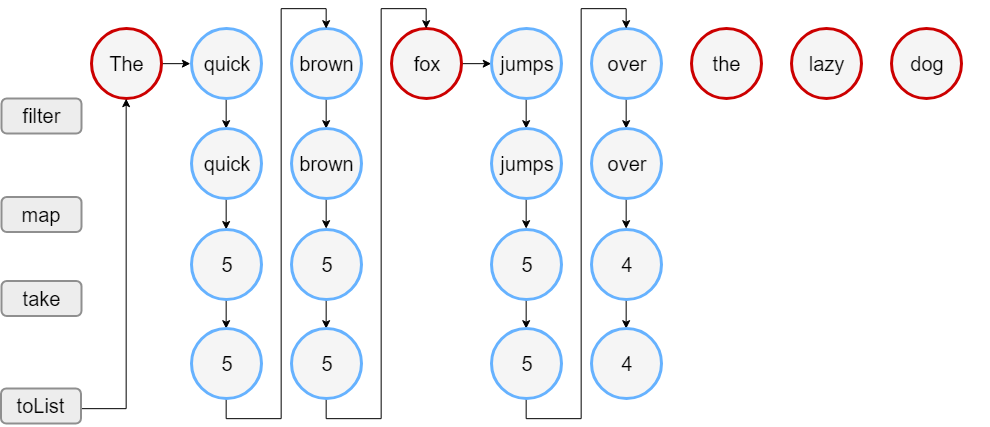

## 1. Sequences는 무엇인가?

* 코틀린 스탠다드 라이브러리에서 제공하는 Collection이 외 Container Type이다. 
* Iterable과 같은 기능을 제공하지만 컬렉션에 대해 여러 처리 과정을 수행하는 데 다른 접근을 사용한다.

### Sequence와 Iterable의 차이 
* 차이점 1 : 중간 결과물의 차이 
    * Iterable : 여러 단계의 연산이 있을 경우, 각 단계마다 중간 결과물을 만든다. 
    * Sequences : 
        * 여러 단계의 처리 과정이 있을 경우, 중간 결과물 없이 원소 하나에 대해 각 단계의 연산을 적용하고 다음 원소에 각 단계의 연산을 진행하는 방식으로 동작한다.
        * 실제 계산이 요구될 때 각 원소에 대해 연산 적용을 시작한다. (지연 계산)
        * 중간 결과물이 없다. 

* 차이점 2 : 연산 적용의 차이
    * Iterable : 
        * 전체 컬렉션에 대해 각 단계의 연산을 적용하고 다음 단계의 연산을 적용한다.
     
    * Sequences : 
        * 원소 하나씩 각 단계의 연산을 적용한다.
        * 원소에 연산을 차례대로 적용하다가 결과가 얻어지면 그 이후의 원소에 대해서는 변환이 이뤄지지 않을 수도 있다.
    

   

### 중간 연산과 최종 연산
* 시퀀스에 대한 연산은 중간 연산과 최종 연산으로 나뉜다.
    * 중간 연산 : 
        * 다른 시퀀스를 반환하는 연산
        * 항상 지연 계산된다.

    * 최종 연산 : 
        * 결과를 반환하는 연산. 
        * 결과 : 최초 컬렉션에 대해 변환을 적용한 시퀀스로부터 일련의 계산을 수행해 얻을 수 있는 컬렉션이나 원소, 숫자 또는 객체 
        * 최종 연산을 호출하면 지연됐던 모든 계산이 수행된다.


## 2. Sequences를 왜 사용하는가?
* Iterable로 사이즈가 큰 컬렉션에 대해 연쇄된 연산을 적용할 경우  중간 결과를 저장하는 컬렉션을 단계마다 만들기 때문에 효율이 떨어진다.
* Sequence로 사이즈가 큰 컬렉션에 대해 연쇄된 연산을 적용할 경우 중간 결과를 저장하는 컬렉션을 생성하지 않기 때문에 성능이 좋아진다.
* 간단 계산이나 작은 컬렉션에 시퀀스를 적용할 경우 오버헤드가 발생할 수 있다.

## 3. Sequences를 어떻게 사용하는가?
### 1. 원소를 사용하여 생성하기 : sequenceOf()
```kotlin
    val numbersSequence = sequenceOf("four", "three", "two", "one")
```
### 2. Iterable로부터 생성하기 : .asSequence()
```kotlin
    val numbers = listOf("one", "two", "three", "four")
    val numbersSequence = numbers.asSequence()
```
### 3. 함수로 생성하기 : generateSequence()
* 값 또는 람다의 결과로 처음 원소를 지정할 수 있다.
* 무한 또는 유한한 시퀀스를 만들 수 있다. 
* 무한 시퀀스 
```kotlin
    val oddNumbers = generateSequence(1) { it + 2 } 
    println(oddNumbers.take(5).toList())
```
* 유한 시퀀스 : 람다에서 null을 반환하면 더 이상 시퀀스 원소를 생성하지 않는다. 
```kotlin
    val oddNumbersLessThan10 = generateSequence(1) { if (it < 8) it + 2 else null }
    println(oddNumbersLessThan10.count())
```
### 4. Chunk로 생성하기 : sequence()
* 원소를 하나씩 또는 임의의 사이즈를 갖는 chunks를 통해 시퀀스를 만들 수 있다.
*  yield()와 yieldAll() 함수를 호출하는 람다를 사용한다.
    * 시퀀스 소비자에게 원소를 반환한다.
    * 소비자에 의해 다음 원소가 요청될 때까지 시퀀스의 실행을 중지시킨다.
```kotlin
    val oddNumbers = sequence {
        yield(1)
        yieldAll(listOf(3, 5))
        yieldAll(generateSequence(7) { it + 2 })
    }
    println(oddNumbers.take(5).toList())
```


## Ref.
* [Kotlin in action](http://www.kyobobook.co.kr/product/detailViewKor.laf?ejkGb=KOR&mallGb=KOR&barcode=9791161750712&orderClick=LEa&Kc=)
* [sequences](https://kotlinlang.org/docs/sequences.html)
* [kotlin-stdlib / kotlin.sequences / Sequence](https://kotlinlang.org/api/latest/jvm/stdlib/kotlin.sequences/-sequence/)


